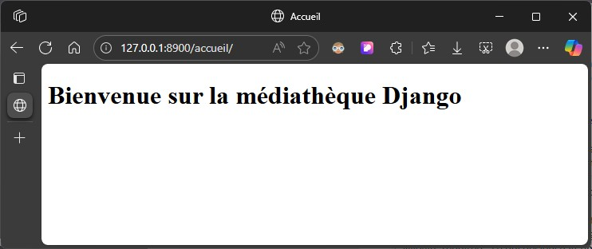

# Rapport de projet – Application Médiathèque Django

| Élément           | Détail                                                                 |
|-------------------|------------------------------------------------------------------------|
| **Nom du projet** | Gestion de médiathèque avec Django                                     |
| **Date**          | Septembre 2025                                                         |
| **Rédacteur**     | `Luc PERARD` / micro-entreprise `PerLucCo`                             |
| **Formation**     | CEF – Développement Web et Web Mobile – Module POO                     |
| **Avancement**    | ✔️ Done : #1, #12, #2 • 🚧 En cours : #3, #4 • ⏳ À venir : #5, #6, #7  |

> Cette rédaction du rapport est incrémentale et les paragraphes absents seront intégrés lors de la réalisation du développement.
> 
> Dans le dépôt GitHub du projet, chaque issue du plan de développement prévoit les sections concernées par la mise à jour du présent document.

---

## Sommaire

- [1. Introduction](#1-introduction)
- [3. Architecture du projet et mise en place](#3-architecture-du-projet-et-mise-en-place)
  - [3.1 Organisation des dossiers](#31-organisation-des-dossiers)
  - [3.2 Plan de développement et réorganisation des issues](#32-plan-de-développement-et-réorganisation-des-issues)
  - [3.4 Couche centrale du projet Django](#34-couche-centrale-du-projet-django)
- [6. Base de données et données de test](#6-base-de-données-et-données-de-test)
  - [6.1 Configuration de la base de données](#61-configuration-de-la-base-de-données)
- [7. Mode d’installation et d’exécution](#7-mode-dinstallation-et-dexécution)
  - [7.1 Prérequis](#71-prérequis)
  - [7.2 Commandes pas à pas](#72-commandes-pas-à-pas)
  - [7.3 URL d'accès et description des interfaces](#73-url-daccès-et-description-des-interfaces)
- [8. Démarche de travail et traçabilité](#8-démarche-de-travail-et-traçabilité)
  - [8.1 Workflow GitHub](#81-workflow-github)
  - [8.3 Difficultés rencontrées et leçons apprises](#83-difficultés-rencontrées-et-leçons-apprises)
- [Annexes](#annexes)
  - [Annexe C – Arborescence du projet](#annexe-c--arborescence-du-projet)
  - [Annexe D - Installation Projet et configuration de l'EDI](#annexe-d---installation-projet-et-configuration-de-ledi)

---

## 1. Introduction

Ce projet s’inscrit dans le cadre du devoir du module Programmation Orientée Objet (POO) avec Python. Il vise à mettre en œuvre une application Django simulant la gestion d’une médiathèque, en respectant des contraintes métier précises.

Les objectifs pédagogiques sont :
- Appliquer les principes de la POO dans un projet concret
- Structurer une application Django avec plusieurs composants
- Implémenter des fonctionnalités métier réalistes
- Mettre en place une stratégie de tests
- Documenter la démarche et livrer un projet complet

Le livrable final comprend :
- Un dépôt GitHub structuré et développé à partir de huit (8) issues
- Un rapport de projet rédigé en Markdown et exporté en PDF

---

## 3. Architecture du projet et mise en place

### 3.1 Organisation des dossiers

Le dépôt est structuré en trois zones distinctes :

- `works/`  
  - `mediatheque/` : projet Django (`manage.py`, `db.sqlite3`, apps…)  
  - `venv/` : environnement virtuel Python  
- `docs/` : documentation fonctionnelle et technique (`README-*.md`, diagrammes…)  
- `delivery/` : livrables finaux (`rapport-projet.md`, `rapport-projet.pdf`)

Cette séparation garantit une clarté immédiate entre le code, la documentation évolutive et les artefacts remis.

### 3.2 Plan de développement et réorganisation des issues

#### 3.2.1 Version initiale

La première mouture du projet s’appuyait sur sept issues linéaires, imaginées pour une unique application Django.

| Issue | Branche associée | Titre de l’issue                                   | Objectif            |
|-------|------------------|----------------------------------------------------|---------------------|
| #1    | MonLucCo/issue1  | Préparation de l’environnement                     | Projet              |
| #2    | MonLucCo/issue2  | Initialisation du projet et configuration centrale | Django, Application |
| #3    | À définir        | Modélisation des entités                           | Application         |
| #4    | À définir        | Développement des vues et logique métier           | Application         |
| #5    | À définir        | Interfaces utilisateur et templates                | Application         |
| #6    | À définir        | Tests et validation                                | Application         |
| #7    | À définir        | Rapport final et livraison                         | Projet              |

Cette organisation a rapidement montré ses limites face au besoin de deux applications métier distinctes.

#### 3.2.2 Version révisée

Sous l’égide de l’issue #12 (Actualisation de la documentation et réorganisation des issues), le plan a été repensé en trois pôles :

| Issue | Parent) | Branche associée | Titre de l’issue                                               | Objectif              |
|-------|---------|------------------|----------------------------------------------------------------|-----------------------|
| #1    |         | MonLucCo/issue1  | Préparation de l’environnement                                 | Projet                |
| #2    |         | MonLucCo/issue2  | Initialisation du projet et configuration centrale             | Django, `mediatheque` |
| #3    |         | MonLucCo/issue3  | Développement de l’application fonctionnelle bibliothécaire    | Métier `bibliotheque` |
| #4    |         | MonLucCo/issue4  | Développement de l’application fonctionnelle membre            | Métier `membre`       |
| #5    |         | MonLucCo/issue5  | Authentification, autorisation et sécurité                     | Couche `mediatheque`  |
| #6    |         | MonLucCo/issue6  | Tests et validation                                            | Application           |
| #7    |         | MonLucCo/issue7  | Rapport final et livraison                                     | Projet                |
| #12   | #1      | MonLucCo/issue12 | Actualisation de la documentation et réorganisation des issues | Projet                |

Ce découpage, effectué avant tout développement, a clarifié les responsabilités de chaque composant :  
- **mediatheque** (application : couche centrale)  
- **bibliothecaire** (application métier : gestion des emprunts et des membres)  
- **membre** (application métier : consultation des médias)  

Il a aussi permis de planifier chaque étape technique avec précision et d’assurer une traçabilité optimale via GitHub.

### 3.4 Couche centrale du projet Django

La couche centrale du projet (mediatheque) est responsable de la configuration globale, du routage, de la vue d’accueil et de la gestion des rôles. Elle agit comme point d’entrée unique, redirigeant les utilisateurs vers l’application correspondant à leur profil.

Définie lors de la réorganisation des issues (cf. issue #12), la couche `mediatheque` sert de point d’entrée unique et assure :

- Configuration globale (`settings.py`) : base de données, langue, timezone  
- Vue d’accueil protégée et redirection selon le rôle utilisateur  
- Routage principal (`urls.py`) pour coordonner les deux sous-applications  
- Gestion des sessions et des permissions pour sécuriser l’accès.

#### 3.4.1 Fonctionnalités et arborescence des fichiers

La couche centrale du projet repose sur l’application `accounts`, qui gère la vue d’accueil du site. 

L’arborescence des fichiers a été organisée selon les conventions Django. Le schéma suivant de cette arborescence présente les dossiers et fichiers principaux utiles pour la mise en place de cette couche centrale du projet. :

```text
works/
└── mediatheque/ 
    ├── accounts/                   # Application de la couche centrale
    │   ├── views.py                # Vue de l'application
    |   ├── urls.py                 # Routage de l'application
    |   └── templates/              # Layouts de l'application
    |       └── accounts/           # Discriminant du layout de l'application
    |           └── accueil.html    # Layout de l'application
    ├── mediatheque/                # Couche centrale du projet
    │   ├── settings.py             # Configurations du projet 
    |   ├── urls.py                 # Routage global du projet
    ├── db.sqlite3                  # BD du projet
    └── manage.py                   # Gestion des commandes de Django
    
```

Cette organisation permet à Django de résoudre automatiquement les templates grâce à la directive `APP_DIRS=True` dans `settings.py`, sans configuration supplémentaire.
Ainsi, cette structure permet une résolution fiable des templates et une séparation claire entre les composants fonctionnels.


#### 3.4.2 Codage de la couche centrale

La vue `accueil` est définie dans `accounts/views.py` et rend le template `accounts/accueil.html`. 

Le routage est assuré par `accounts/urls.py`, inclus dans `mediatheque/urls.py`. Le template est accessible via l’URL racine `/` et `/accueil`.

Le fichier `mediatheque/urls.py` utilise la fonction `include()` pour déléguer la gestion des routes à l’application `accounts`, ce qui permet une meilleure modularité du projet.

```python
# Eléments de code illustratifs du projet

# mediatheque/urls.py
urlpatterns = [
    path('', include('accounts.urls')),
]

# accounts/urls.py
urlpatterns = [
    path('', accueil, name='accueil'),
    path('accueil/', accueil, name='accueil'),
]

# accounts/views.py
def accueil(request):
    return render(request, 'accounts/accueil.html')
```

> ℹ️ **Remarque** : l'utilisation pour le template du nom `accounts/accueil.html` permet à Django d'éviter la collision avec d'autres applications qui auraient un template du même nom (`accueil.html`) en résolvant sans ambiguïté le nom du template. En effet, Django parcourt les applications dans l'ordre défini dans `INSTALLED_APPS`de `settings.py`.

## 6. Base de données et données de test

### 6.1 Configuration de la base de données

La base de données SQLite est configurée dans `settings.py` via le bloc `DATABASES`. Aucune modification spécifique n’a été apportée à ce stade, car aucun modèle métier n’a encore été défini.

Lors de la _préparation de l'environnement_ (`issue #1`), la commande `python manage.py migrate` a permis d’appliquer les migrations par défaut de Django (`auth`, `admin`, etc.).

Lors de l'_initialisation du projet et configuration centrale_ (`issue #2`), l’app `accounts` est enregistrée, mais n’a généré aucune migration (commande `makemigrations accounts`). Ce qui est conforme à l’état actuel du projet.

> Cette section sera complétée lors des issues #3 et #4, qui introduiront les premiers modèles métier.

---

## 7. Mode d’installation et d’exécution

### 7.1 Prérequis

- Python 3.13.7
- pip 25.2
- Environnement virtuel (`venv`)
- Django 5.2.6

Ces versions précises garantissent la reproductibilité et la compatibilité du projet.

### 7.2 Commandes pas à pas

Cette procédure est destinée à toute personne souhaitant tester le projet localement à partir du dépôt GitHub. L'annexe D présente une vue complète des commandes à mener pour l'installation.

Elle permet de :

- Cloner le dépôt contenant le projet
- Activer l’environnement virtuel préconfiguré
- Lancer l’application Django en local
- Configurer l'éditeur (EDI PyCharm ou Visual Studio Code) 

> ℹ️ **Nom du dépôt** : `CEF_POO-Django_Gestion-Mediatheque_Test-version`  
> Ce dépôt contient l’ensemble du projet, y compris le code source, la documentation et les livrables.

> 📁 **Dossier `works/`** : contient le code source et l’environnement virtuel  
> └── `mediatheque/` : dossier du projet Django (avec `manage.py`, `db.sqlite3`, etc.)  
> └── `venv/` : environnement virtuel Python contenant Django et les dépendances

> ⚠️ **Port utilisé** : le serveur Django est lancé sur le port `8900`, car le port `8000` est occupé par Apache sur le poste de développement.

#### 7.2.1 📦 Étapes communes

1. Cloner le dépôt GitHub :

   ```bash
   git clone https://github.com/MonLucCo/CEF_POO-Django_Gestion-Mediatheque_Test-version.git
   cd CEF_POO-Django_Gestion-Mediatheque_Test-version
   ```

2. Se placer dans le dossier de travail :

   ```bash
   cd works
   ```

#### 7.2.2 📦 Étapes spécifiques à un système d'exploitation

1. 🪟 Sous Windows

    ```bash
    # Activer l’environnement virtuel
    venv\Scripts\activate
    
    # Vérifier que Django est bien installé
    python -m django --version
    
    # Se placer dans le projet Django
    cd mediatheque
    
    # Lancer le serveur
    python manage.py runserver
    ```

2. 🐧 Sous Unix/macOS

    ```bash
    # Activer l’environnement virtuel
    source venv/bin/activate
    
    # Vérifier que Django est bien installé
    python3 -m django --version
    
    # Se placer dans le projet Django
    cd mediatheque
    
    # Lancer le serveur
    python3 manage.py runserver
    ```

> ✅ Une fois le serveur lancé, l’application est accessible à l’adresse : [http://127.0.0.1:8000](http://127.0.0.1:8000)

> ℹ️ **Note** : Si le port 8000 est déjà utilisé (par exemple par Apache), vous pouvez spécifier un autre port lors du lancement :  
> `python manage.py runserver 127.0.0.1:8900`  
> L’application sera alors accessible via [http://127.0.0.1:8900](http://127.0.0.1:8900)


#### 7.2.3 📦 Étapes spécifiques à la configuration de l'environnement de développement (EDI)

Il est nécessaire de configurer l'EDI lors de l'utilisation d'un environnement virtuel pour que l'interpréteur Python fonctionne correctement.
Cette configuration ne concerne que l'interpréteur de l'EDI et permet notamment :
- l'exécution directe des scripts Django (`manage.py`)
- l'autocomplétion des modules installés
- la reconnaissance des templates et des blocs dans les fichiers `.html`.

### 7.3 URL d'accès et description des interfaces

Une fois le serveur lancé, l’URL d’accès est :

- [http://127.0.0.1:8900](http://127.0.0.1:8900)
- [http://127.0.0.1:8900/accueil/](http://127.0.0.1:8900/accueil/).

La page d’accueil affiche le contenu du template `accueil.html`, situé dans `accounts/templates/accounts/`. 


Ce fichier doit être personnalisé pour refléter l’identité visuelle du projet ou proposer des liens vers les applications _métier_.

#### 7.3.1 Interface minimale après initialisation

La première version de l’interface est volontairement épurée. Elle permet de valider :

- Le bon fonctionnement du routage
- La résolution correcte du template
- L’affichage du contenu HTML statique

|                          |
|:------------------------------------------------------------------------------------------------------------------:|
| *Figure 1 – Affichage (version initiale - Issue #2) du template `accueil.html` après lancement du serveur Django.* |

> Cette capture montre l’état initial de l’interface après exécution de `python manage.py runserver`.

#### 7.3.2 Interface enrichie (à venir)

Les prochaines issues (#3 et #4) introduiront :

- Des liens vers les applications métier
- Des blocs dynamiques selon le rôle utilisateur
- Une navigation cohérente entre les vues

#### 7.3.3 Interface métier (prévision)

L’interface finale proposera :

- Une page d’accueil personnalisée selon le profil (bibliothécaire ou membre)
- Des accès sécurisés via authentification (issue #5)
- Une navigation entre les modules fonctionnels

---

## 8. Démarche de travail et traçabilité

### 8.1 Workflow GitHub

Le projet utilise GitHub pour assurer la traçabilité du développement et la séparation entre les tâches techniques et la rédaction du rapport.

Le workflow adopté repose sur les principes suivants :
- Une branche principale : `main`
- Des branches de travail nommées selon le schéma :  
  - `MonLucCo/issue[n]/update-technical` pour les développements techniques  
  - `MonLucCo/issue[n]/update-report` pour la rédaction du rapport
  - `MonLucCo/isue[n]/[dénomination-spécifique]` pour des tâches spécifiques
- Chaque issue GitHub (#1 à #7, #12) correspond à une étape du projet
- Les branches sont fusionnées via des `Pull Requests` (PR), puis supprimées une fois validées

> ℹ️ **Note** : Ce workflow n’a pas été appliqué dès le début du projet.  
> Lors du traitement de l’issue #1, l’organisation des branches a évolué progressivement, en parallèle de la prise en main de l’interface de l’EDI PyCharm.  
> Certaines premières branches ne respectent pas entièrement la convention de nommage, ce qui reflète une phase d’apprentissage et d’ajustement.

Ce processus garantit une traçabilité claire entre les tâches, les commits, les issues et les livrables, tout en facilitant les revues de code et la rédaction du rapport.

> ⚠️ **Remarque** : Une branche dédiée à la mise à jour documentaire a été créée pour l’issue #12 : `MonLucCo/issue12/update-documentation`. Cette branche regroupe les modifications du README `/docs/developpement`, du plan du rapport et des titres d’issues. Elle illustre l’importance d’un travail préparatoire structuré avant le développement technique.

### 8.3 Difficultés rencontrées et leçons apprises

#### 8.3.1 Difficulté d'un bon plan de développement

L'origine de ce problème est l'apparition d'une incohérence d'organisation et d'architecture à l'engagement de la réalisation de l'issue #2 selon la version initiale du plan de développement.

La mise à jour des issues a représenté une difficulté notable, notamment pour comprendre la logique de découpage fonctionnel qui distingue :
- une couche centrale d'authentification (médiathèque)
- deux applications métier (bibliothécaire et membre).

Cette étape à la fois d'architecture, d'organisation, de technique a permis de mieux anticiper les tâches techniques à réaliser, en distinguant clairement les rôles métier et les responsabilités de chaque application. Elle a également facilité la rédaction du rapport et la cohérence du projet dans son ensemble.

#### 8.3.2 Difficulté d'une bonne configuration de l'EDI

L'origine de ce problème est l'apparition de modules de Django non reconnus lors du codage de l'app `accounts` de l'issue #2. Il y avait une incohérence entre l'affichage du code (modules non reconnus soulignés dans l'éditeur PyCharm).

La compréhension de ce problème a nécessité de bien comprendre la nécessité d'adapter la configuration de l'éditeur pour qu'il trouve les scripts adaptés à Python et Django qui exploite un environnement virtuel.

Une fois les champs de configuration de l'EDI bien définis, l'interpréteur de l'EDI est en mesure de fonctionner en retrouvant la bonne information et d'apporter son assistance (autocomplétion, reconnaissance modules, navigation dans les templates, suggestions de code).

Cette difficulté m'a permis de mieux comprendre la différence entre les lignes de commande du terminal et le fonctionnement intégré de l'EDI (dans mon cas, c'était PyCharm).

#### 8.3.3 Difficulté d'une bonne identification des templates

L'origine de ce problème est une **erreur 404** rencontrée lors du rendu du template `accueil.html`. Cette erreur était due à une mauvaise structure du dossier `templates`.

En adoptant la convention `app/templates/app/template.html`, la résolution du template a été assurée sans ambiguïté, conformément aux bonnes pratiques Django.

Cette difficulté m'a permis de mieux comprendre la logique de résolution des templates dans Django et d'adopter une convention robuste pour la suite du projet.

---

## Annexes

### Annexe C – Arborescence du projet

```text
CEF_POO-Django_Gestion-Mediatheque_Test-version/
├── works/
│   ├── mediatheque/
│   │   ├── db.sqlite3
│   │   ├── manage.py
│   │   └── ...
│   └── venv/
│       ├── Include/
│       ├── Lib/
│       ├── Scripts/
│       └── pyvenv.cfg
├── docs/
│   ├── architecture/
│   ├── fonctionnel/
│   ├── technique/
│   └── README-dev.md
├── delivery/
│   └── rapport/
│       ├── rapport-projet.md
│       └── rapport-projet.pdf
├── .gitignore
├── LICENSE
├── README.md
└── requirements.txt
```
---

### Annexe D - Installation Projet et configuration de l'EDI

Voici l'ensemble des commandes à réaliser pour installer un projet, puis à configurer l'interpréteur de l'EDI en vue de coder le projet avec plus de facilité.

#### 📦 Partie 1 : Installation du projet Django (from scratch)

##### 🔹 Objectifs :
- Initialiser un projet Django localement
- Préparer l’environnement virtuel
- Installer les dépendances nécessaires

##### 🔹 Étapes :

1. **Cloner le dépôt du projet**
   ```bash
   git clone https://github.com/[utilisateur]/CEF_POO-Django_Gestion-Mediatheque_Test-version.git
   ```

2. **Créer un environnement virtuel**
   ```bash
   python -m venv venv
   ```

3. **Activer l’environnement virtuel**

   - Sous Windows :
     ```bash
     venv\Scripts\activate
     ```
   - Sous macOS/Linux :
     ```bash
     source venv/bin/activate
     ```

4. **Installer Django**
   ```bash
   pip install django
   ```

5. **Vérifier l’installation**
   ```bash
   python -m django --version
   ```

6. **Lancer le serveur Django**
   ```bash
   python manage.py runserver 8900
   ```

> Le port 8900 est utilisé pour éviter les conflits avec Apache (par défaut sur 8000).

---

#### 🖥️ Partie 2 : Configuration locale de l’EDI PyCharm

##### 🔹 Objectifs :
- Synchroniser PyCharm avec l’environnement virtuel
- Activer les fonctionnalités Django (si version Pro)
- Préparer l’environnement de développement

> ℹ️ **Note** : Les étapes sont détaillées pour l'EDI PyCharm qui est utilisé pour le développement du projet. Pour l'EDI VSC, cette configuration est aussi nécessaire et se trouve développée succinctement dans la section suivante.

##### 🔹 Étapes :

1. **Sélectionner l’interpréteur Python**
   - `File > Settings > Project: [nom du projet] > Python Interpreter`
   - ⚙️ > `Add...` > `Add Local Interpreter...`
   - Choisir `Existing environment`
   - Sélectionner : `works/venv/Scripts/python.exe`

2. **Marquer le dossier source**
   - Clic droit sur `/works/mediatheque`
   - `Mark Directory as > Sources Root`

3. **Activer le support Django** *(PyCharm Pro uniquement)*
   - `File > Settings > Languages & Frameworks > Django`
   - Cocher `Enable Django Support`
   - Renseigner :
     - Django project root : `works/mediatheque`
     - Settings : `mediatheque/settings.py`
     - Manage.py : `works/mediatheque/manage.py`
   - Laisser décoché : `Do not use Django test runner`
   - Laisser vide : `Environment variables` (sauf besoin spécifique)
   - Laisser vide ou définir : `Folder pattern to track files` (ex. `*.py:templates/*:static/*`)

---

#### 🧠 Remarque sur Visual Studio Code (VSC)

Si l’EDI utilisé est **VSC au lieu de PyCharm**, la configuration reste nécessaire :

- Sélection de l’interpréteur Python via `Python: Select Interpreter`
- Installation des extensions :
  - **Python** (obligatoire)
  - **Django** (optionnelle mais utile)
- Configuration du dossier racine dans `.vscode/settings.json` si besoin

---
