# Rapport de projet – Application Médiathèque Django

| Élément           | Détail                                                   |
|-------------------|----------------------------------------------------------|
| **Nom du projet** | Gestion de médiathèque avec Django                       |
| **Date**          | Septembre 2025                                           |
| **Rédacteur**     | `Luc PERARD` / micro-entreprise `PerLucCo`               |
| **Formation**     | CEF – Développement Web et Web Mobile – Module POO       |
| **Avancement**    | ✔️ Done : #1, #12, #2, #3, #4, #5, #6 • 🚧 En cours : #7 |

> Cette rédaction du rapport est incrémentale et les paragraphes absents seront intégrés lors de la réalisation du 
> développement.
> 
> Dans le dépôt GitHub du projet, chaque issue du plan de développement prévoit les sections concernées par la mise à 
> jour du présent document.

---

## Sommaire

- [1. Introduction](#1-introduction)

- [2. Reprise et refactoring du code existant](#2-reprise-et-refactoring-du-code-existant)  
  - [2.1 Analyse du code fourni](#21-analyse-du-code-fourni)  
  - [2.2 Erreurs identifiées et correctifs appliqués](#22-erreurs-identifiées-et-correctifs-appliqués)  
  - [2.3 Refactoring POO](#23-refactoring-poo)  
    - [2.3.1 Hiérarchie des entités du modèle](#231-hiérarchie-des-entités-du-modèle)  
    - [2.3.2 Structure des fichiers d’application](#232-structure-des-fichiers-dapplication)  
    - [2.3.3 Routage fonctionnel par cas d’usage (UC)](#233-routage-fonctionnel-par-cas-dusage-uc)  
  - [2.4 Justification des choix de conception](#24-justification-des-choix-de-conception)

- [3. Architecture du projet et mise en place](#3-architecture-du-projet-et-mise-en-place)  
  - [3.1 Organisation des dossiers](#31-organisation-des-dossiers)  
  - [3.2 Plan de développement et réorganisation des issues](#32-plan-de-développement-et-réorganisation-des-issues)  
    - [3.2.1 Version initiale](#321-version-initiale)  
    - [3.2.2 Version révisée](#322-version-révisée)  
    - [3.2.3 Version finale](#323-version-finale)  
  - [3.3 Environnement de développement (venv, dépendances…)](#33-environnement-de-développement-venv-dépendances)  
    - [3.3.1 Structure technique](#331-structure-technique)  
    - [3.3.2 Installation des dépendances](#332-installation-des-dépendances)  
    - [3.3.3 Exécution des tests](#333-exécution-des-tests)  
  - [3.4 Couches de l’application Médiathèque](#34-couches-de-lapplication-médiathèque)  
    - [3.4.1 Application `accounts`](#341-application-accounts)  
    - [3.4.2 Application `bibliothecaire`](#342-application-bibliothecaire)
    - [3.4.3 Application `consultation`](#343-application-consultation)
    - [3.4.4 Synthèse des couches](#344-synthèse-des-couches)
    - [3.4.5 Configuration et routage](#345-configuration-et-routage)
      - [3.4.5.1 Configuration centrale de l'application `mediatheque`](#3451-configuration-centrale-de-lapplication-mediatheque)
      - [3.4.5.2 Fonctionnalités et arborescence des fichiers](#3452-fonctionnalités-et-arborescence-des-fichiers)
      - [3.4.5.3 Résolution du routage et identification des templates](#3453-résolution-du-routage-et-identification-des-templates)
      - [3.4.5.4 Configuration et exploitation des Logs](#3454-configuration-et-exploitation-des-logs)

- [4. Implémentation des fonctionnalités](#4-implémentation-des-fonctionnalités)  
  - [4.1 Application bibliothécaire](#41-application-bibliothécaire)  
    - [4.1.1 Gestion des membres (CRUD)](#411-gestion-des-membres-crud)  
      - [4.1.1.1 Modélisation – Codes partiels (structure, Méthodes et Propriétés)](#4111-modélisation---code-partiel-de-la-structure-et-des-méthodes-et-propriétés-du-modèle)
      - [4.1.1.2 Codage d'une fonctionnalité métier](#4112-codage-dune-fonctionnalité-métier)
      - [4.1.1.3 Navigation fonctionnelle pour les membres](#4113-navigation-fonctionnelle-pour-les-membres)
    - [4.1.2 Gestion des médias (CRU[D])](#412-gestion-des-médias-crud)  
      - [4.1.2.1 Modélisation – typage différé et cycle de vie](#4121-modélisation--typage-différé-et-cycle-de-vie)  
      - [4.1.2.2 Vues et formulaires - Héritage de vue pour les médias typés](#4122-vues-et-formulaires---héritage-de-vue-pour-les-médias-typés)
      - [4.1.2.3 Navigation fonctionnelle pour les médias](#4123-navigation-fonctionnelle-pour-les-médias)
    - [4.1.3 Gestion des emprunts et retours](#413-gestion-des-emprunts-et-retours)  
      - [4.1.3.1 Modélisation de l'emprunt – contraintes métier](#4131-modélisation-de-lemprunt--contraintes-métier)  
      - [4.1.3.2 Vue des emprunts – vérification des règles métier et parcours UX multiples](#4132-vues-des-emprunts--vérification-des-règles-métier-et-parcours-ux-multiples)  
      - [4.1.3.3 Vues des retours](#4133-vues-des-retours)
      - [4.1.3.4 Marquage des retards](#4134-marquage-des-retards)
      - [4.1.3.5 Navigation fonctionnelle pour les emprunts](#4135-navigation-fonctionnelle-pour-les-emprunts)
    - [4.1.4 Gestion des Jeux de plateau](#414-gestion-des-jeux-de-plateau)
  - [4.2 Application Consultation (consultation des supports)](#42-application-consultation-consultation-des-supports)
    - [4.2.1 Rôle et objectifs](#421-rôle-et-objectifs)
    - [4.2.2 Entités principales](#422-entités-principales)
    - [4.2.3 Fonctionnalités implémentées](#423-fonctionnalités-implémentées)
    - [4.2.4 Templates associés](#424-templates-associés)
    - [4.2.5 Tests associés](#425-tests-associés)
    - [4.2.6 Indicateurs et perspectives](#426-indicateurs-et-perspectives)
  - [4.3 Contraintes métiers respectées](#43-contraintes-métiers-respectées)
    - [4.3.1 Contrainte 1 – Limite de 3 emprunts simultanés par membre](#431-contrainte-1--limite-de-3-emprunts-simultanés-par-membre)
    - [4.3.2 Contrainte 2 – Durée maximale d’un emprunt : 7 jours](#432-contrainte-2--durée-maximale-dun-emprunt--7-jours)
    - [4.3.3 Contrainte 3 – Blocage des membres en retard](#433-contrainte-3--blocage-des-membres-en-retard)
    - [4.3.4 Contrainte 4 – Jeux de plateau non empruntables](#434-contrainte-4--jeux-de-plateau-non-empruntables)
  - [4.4 Authentification - gestion des rôles et des Logs](#44-authentification---gestion-des-rôles-et-des-logs)
    - [4.4.1 Rôle principal](#441-rôle-principal)
    - [4.4.2 Fonctionnalités liées à l'authentification](#442-fonctionnalités-liées-à-lauthentification)
    - [4.4.3 Fonctionnalités liées à la gestion des Logs](#443-fonctionnalités-liées-à-la-gestion-des-logs)
    - [4.4.4 Tableau des accès aux menus par rôle](#444-tableau-des-accès-aux-menus-par-rôle)
      - [4.4.4.1 Menus accessibles pour superuser (SUPER) et staff (STAFF)](#4441-menus-accessibles-pour-superuser-super-et-staff-staff)
      - [4.4.4.2 Menus accessibles pour BibGestion (GESTION) et BibAdmin (ADMIN)](#4442-menus-accessibles-pour-bibgestion-gestion-et-bibadmin-admin)
      - [4.4.4.3 menus accessibles  pour MEMBRE (anonyme)](#4443-menus-accessibles--pour-membre-anonyme)

- [5. Qualité du code et stratégie de tests](#5-qualité-du-code-et-stratégie-de-tests)
  - [5.1 Logs et monitorage](#51-logs-et-monitorage)
    - [5.1.1 Tableau des fonctions tracées par logs](#511-tableau-des-fonctions-tracées-par-logs)
  - [5.2 Tests unitaires Django](#52-tests-unitaires-django)
  - [5.3 Exécution automatisée des tests](#53-exécution-automatisée-des-tests)

- [6. Base de données et données de test](#6-base-de-données-et-données-de-test)  
  - [6.1 Schéma des modèles et migration](#61-schéma-des-modèles-et-migration)
  - [6.2 Jeu de données via fixtures ou script](#62-jeu-de-données-via-fixtures-ou-script)
  - [6.3 Exemple d’insertion et requêtes de vérification](#63-exemple-dinsertion-et-requêtes-de-vérification)

- [7. Mode d’installation et d’exécution](#7-mode-dinstallation-et-dexécution)  
  - [7.1 Prérequis](#71-prérequis)  
  - [7.2 Commandes pas à pas](#72-commandes-pas-à-pas)  
    - [7.2.1 Étapes communes](#721--étapes-communes)  
    - [7.2.2 Étapes spécifiques à un système d'exploitation](#722--étapes-spécifiques-à-un-système-dexploitation)  
    - [7.2.3 Étapes spécifiques à la configuration de l'environnement de développement (EDI)](#723--étapes-spécifiques-à-la-configuration-de-lenvironnement-de-développement-edi)  
   - [7.3 URL d’accès et description des interfaces](#73-url-daccès-et-description-des-interfaces)  
    - [7.3.1 Interface minimale après initialisation](#731-interface-minimale-après-initialisation)
    - [7.3.2 Interface enrichie (à venir)](#732-interface-enrichie-à-venir)
    - [7.3.3 Interface métier (prévision)](#733-interface-métier-prévision)

- [8. Démarche de travail et traçabilité](#8-démarche-de-travail-et-traçabilité)  
  - [8.1 Traçabilité du développement : GitHub et main-courante technique](#81-traçabilité-du-développement--github-et-main-courante-technique)
    - [8.1.1 Workflow GitHub](#811-workflow-github)
    - [8.1.2 Principe de la main-courante technique](#812-principe-de-la-main-courante-technique)
  - [8.2 Table de traçabilité – Issues, fichiers, tests et livrables](#82-table-de-traçabilité--issues-fichiers-tests-et-livrables)
  - [8.3 Difficultés rencontrées et leçons apprises](#83-difficultés-rencontrées-et-leçons-apprises)
    - [8.3.1 Plan de développement et organisation](#831-plan-de-développement-et-organisation)
    - [8.3.2 Configuration de l’EDI](#832-configuration-de-ledi)
    - [8.3.3 Résolution des templates](#833-résolution-des-templates)
    - [8.3.4 Authentification et sécurité](#834-authentification-et-sécurité)
    - [8.3.5 Gestion des logs](#835-gestion-des-logs)

- [9. Conclusion et perspectives](#9-conclusion-et-perspectives)
  - [9.1 Bilan des compétences acquises](#91-bilan-des-compétences-acquises)
  - [9.2 Améliorations futures](#92-améliorations-futures)
  - [9.3 Bilan sur la démarche et le recul acquis](#93-bilan-sur-la-démarche-et-le-recul-acquis)
  - [9.4 Synthèse générale et conclusion](#94-synthèse-générale-et-conclusion)

- [Annexes](#annexes)
  - [Annexe A – Extraits de code clés](rapport-projet_annexe-a.md)
  - [Annexe B - Logs d’exécution et de tests](rapport-projet_annexe-b.md)
  - [Annexe C - Diagrammes (UML, séquence)](rapport-projet_annexe-c.md)
  - [Annexe D – Arborescence du projet](rapport-projet_annexe-d.md)  
  - [Annexe E – Installation projet et configuration de l’EDI](rapport-projet_annexe-e.md)
  - [Annexe F – Main‑courante technique et difficultés](rapport-projet_annexe-f.md)

---

## 1. Introduction

Ce projet s’inscrit dans le cadre du devoir du module Programmation Orientée Objet (POO) avec Python. Il vise à mettre 
en œuvre une application Django simulant la gestion d’une médiathèque, en respectant des contraintes métier précises.

Les objectifs pédagogiques sont :
- Appliquer les principes de la POO dans un projet concret.
- Structurer une application Django avec plusieurs composants.
- Implémenter des fonctionnalités métier réalistes.
- Mettre en place une stratégie de tests.
- Documenter la démarche et livrer un projet complet.

Le livrable final comprend :
- Un dépôt GitHub structuré et développé à partir de huit (8) issues.
- Un rapport de projet rédigé en Markdown et exporté en PDF.

---

## 2. Reprise et refactoring du code existant

### 2.1 Analyse du code fourni

Le code initial du projet, fourni en début de devoir, présentait une structure Django minimale sans séparation claire 
des responsabilités métier (modèle, routes, vues, templates).  
Les modèles étaient partiellement définis, les vues absentes, et les templates non organisés.

Cette base a servi de point de départ pour :
- identifier les entités métier pertinentes (`Media`, `Livre`, `Membre`, etc.).
- structurer les fichiers selon les principales conventions Django (`models.py`, `urls.py`, `views.py`, `forms.py`, 
`/templates/`, etc.)
- initier une démarche orientée objet de _refactoring_, avec :
  - le choix de reprendre le plus possible de termes identifiés.
  - éviter les répétitions en exploitant l'héritage.
  - structurer le code avec les principales conventions de nommage des fichiers `.py`.

### 2.2 Erreurs identifiées et correctifs appliqués

Plusieurs erreurs ont été relevées dans le code initial :
- Modèles non typés ou mal (pas) hérités (`Livre`, `Dvd`, `Cd` sans lien avec `Media`).
- Champs manquants ou mal nommés (`annee_edition`, `statut`).
- Absence de logique métier (aucune méthode pour gérer les emprunts ou les retours).

Les correctifs ont été appliqués dans les premières étapes de l’issue #3 :
- refonte des modèles avec héritage multi-table.
- ajout de méthodes métier (`peut_emprunter`, `marquer_retards`) centralisées dans le modèle d'entité.
- structuration :
  - des routes pour chaque vue.
  - des vues et des formulaires.
  - des templates et des conditions liées aux contextes.
  - des tests unitaires (didiés à la navigation, aux entités, aux vues, aux fonctions) et des jeux de données (fixtures).

### 2.3 Refactoring POO

Le refactoring a permis de mettre en œuvre une modélisation orientée objet complète, structurée autour de trois axes :

---

#### 2.3.1 Hiérarchie des entités du modèle

La modélisation repose sur une hiérarchie multi-niveaux cohérente, centrée sur deux racines abstraites : `Support` et 
`Utilisateur`.

```text
Support
├── Media
│   ├── Livre
│   ├── Dvd
│   └── Cd
└── JeuDePlateau

Utilisateur
├── Membre
└── Bibliothecaire
```

- `Support` regroupe tous les objets consultables. Seuls les `Media` sont empruntables.
- `Media` peut être typé (`Livre`, `Dvd`, `Cd`) ou non typé (`media_type = NON_DEFINI`).
- `JeuDePlateau` hérite directement de `Support`. Un jeu n’est jamais empruntable.
- `Utilisateur` permet d’unifier les rôles. `Membre` et `Bibliothecaire` ont des vues et des permissions distinctes.
- `Emprunt` relie un `Membre` à un `Media`, avec un cycle de vie métier (`EN_COURS`, `RETARD`, `RETOURNE`).

---

#### 2.3.2 Structure des fichiers d’application

Chaque application suit la convention Django, avec une séparation stricte des responsabilités :

| Fichier              | Rôle                                                                 |
|----------------------|----------------------------------------------------------------------|
| `models.py`          | Définition des entités métier, propriétés et méthodes métier         |
| `views.py`           | Vues génériques ou spécialisées, logique de contexte                 |
| `forms.py`           | Formulaires personnalisés avec validations métier                    |
| `urls.py`            | Routage fonctionnel par UC (Use Case)                                |
| `templates/`         | Templates HTML organisés par entité et par type de vue               |
| `tests_blocs/`       | Dossier de tests segmenté par thème (`test_entites_media.py`, etc.)  |
| `fixtures/`          | Jeux de données `.json` pour tests et développement                  |

> 📌 Cette organisation permet une lisibilité immédiate, une maintenance facilitée et une extensibilité maîtrisée.

> 🔗 Cette organisation est illustrée dans la section 
> [3.4.5.2 – Arborescence des fichiers](#3452-fonctionnalités-et-arborescence-des-fichiers), qui présente la structure 
> réelle du projet `mediatheque/`.

---

#### 2.3.3 Routage fonctionnel par cas d'usage (UC)

Chaque fonctionnalité métier est associée à une URL unique, définie dans `urls.py`.  
Le routage est structuré par entité (`media`, `membre`, `emprunt`) et par action (`ajouter`, `modifier`, `rendre`, etc.).

Exemple de synthèse pour l’entité `Emprunt` :

| Vue métier              | URL associée                          | Vue Django                    |
|-------------------------|---------------------------------------|-------------------------------|
| Liste des emprunts      | `/bibliothecaire/emprunts/`           | `EmpruntListView`             |
| Création d’un emprunt   | `/bibliothecaire/emprunts/ajouter/`   | `EmpruntCreateView`           |
| Retour depuis un membre | `/membres/<pk>/rendre/`               | `EmpruntRendreFromMembreView` |
| Confirmation du retour  | `/emprunts/<pk>/retour/confirmation/` | `EmpruntRetourConfirmView`    |
| Marquage des retards    | `/bibliothecaire/emprunts/retard/`    | `EmpruntRetardView`           |

> 📌 Cette granularité permet de tester chaque UC indépendamment, de tracer les erreurs, et de documenter les 
> transitions métier.

> 🔗 La mise en œuvre technique du routage est détaillée dans la section 
> [3.4.1 – Codage de la couche centrale](#341-application-accounts), avec les extraits de `urls.py` et 
> `views.py`.

---

### 2.4. Justification des choix de conception

Les choix de conception ont été guidés par les objectifs suivants :

- **Extensibilité** : 
  - l’héritage multi-niveaux permet d’ajouter facilement de nouveaux types de supports, de médias ou d’utilisateurs.
  - l'utilisation rigoureuse des fichiers structurels (`models.py`, `urls.py`, `views.py`, `tests.py`, etc.) de 
  l'application `Python`.
  - la définition de structures spécifiques pour :
    - les **templates** : dossier (ie. `/templates/bibliothecaire/medias/` distinguant deux niveaux (applicatif, sujet) 
    pour définir le fichier HTML.
    - les **fixtures** : dossier (ie `/fixtures/`) distinguant des jeux de données (fichiers JSON) et des scenarii.
    - les **tests** : dossier `Python` (ie. `/tests_blocs/`) contenant les fichiers de tests spécifiques à chaque thème 
    testé (ie. `test_admin.py`, `test_entites_medias.py`, `test_uc_create_emprunt.py`).
- **Clarté métier** : 
  - la séparation entre `Media` et `JeuDePlateau` héritant de `Support` reflète les règles d’emprunt d'un **média** et 
  de consultation d'un **support de la médiathèque**. 
  - chaque vue associée à une URL fonctionnelle unique pour cas d'usage (UC - Use Case), gère son **contexte métier**.
  - les **règles métier** sont validées dans le **formulaire** de la vue.
  - l'accès à une **information métier** (ie. `is_consultable`, `est_empruntable`, `est_en_retard`) d'une entité 
  (`Media`, `Membre`, `Emprunt`) est centralisé dans les `propriétés` du modèle de l'entité.
  - l'application d'une `action métier` (ie. `marquer_retard()`, `enregistrer_retour()`, `activer_emprunteur()`, 
  `rendre_disponible()`) sur une entité (`Media`, `Membre`, `Emprunt`) est centralisée dans les **méthodes** du modèle 
  de l'entité.
- **Typage différé** : 
  - un `Media` peut être créé sans type, puis typé ultérieurement (`Livre`, `Dvd`, `Cd`).
- **Cycle de vie explicite** : 
  - chaque entité possède des statuts et des transitions métier documentées dans `devALCBib.md`.
- **Testabilité** : 
  - chaque entité et chaque UC est testée de manière unitaire et fonctionnelle.

---

## 3. Architecture du projet et mise en place

### 3.1 Organisation des dossiers

Le dépôt est structuré en trois zones distinctes :

- `works/`  
  - `mediatheque/` : projet Django (`manage.py`, `db.sqlite3`, apps…)  
  - `venv/` : environnement virtuel Python  
- `docs/` : documentation fonctionnelle et technique (`README-*.md`, diagrammes…)  
- `delivery/` : livrables finaux (`rapport-projet.md`, `rapport-projet.pdf`)

Cette séparation garantit une clarté immédiate entre le code, la documentation évolutive et les artefacts remis.

### 3.2 Plan de développement et réorganisation des issues

Le plan de développement du projet a été défini dès l’amorce du projet, puis révisé à plusieurs étapes clés pour 
s’adapter aux besoins métier et techniques.  
Il est structuré autour des outils GitHub (`issues`, `branches`, `Pull Requests`) et documenté dans le dépôt public du 
projet.  
Trois versions successives ont été formalisées :
- une version initiale linéaire.
- une version révisée par application métier.
- une version finale optimisée pour la livraison.

#### 3.2.1 Version initiale

La première mouture du projet s’appuyait sur sept issues linéaires, imaginées pour une unique application Django.

|  Issue  |  Branche associée  | Titre de l’issue                                   | Objectif            |
|:-------:|:------------------:|----------------------------------------------------|---------------------|
|   #1    |  MonLucCo/issue1   | Préparation de l’environnement                     | Projet              |
|   #2    |  MonLucCo/issue2   | Initialisation du projet et configuration centrale | Django, Application |
|   #3    |     À définir      | Modélisation des entités                           | Application         |
|   #4    |     À définir      | Développement des vues et logique métier           | Application         |
|   #5    |     À définir      | Interfaces utilisateur et templates                | Application         |
|   #6    |     À définir      | Tests et validation                                | Application         |
|   #7    |     À définir      | Rapport final et livraison                         | Projet              |

Cette organisation a rapidement montré ses limites face au besoin de deux applications métier distinctes.

#### 3.2.2 Version révisée

Sous l’égide de l’issue #12 (Actualisation de la documentation et réorganisation des issues), le plan a été repensé en 
trois pôles :

|  Issue  |  Parent  | Branche associée | Titre de l’issue                                               | Objectif              |
|:-------:|:--------:|------------------|----------------------------------------------------------------|-----------------------|
|   #1    |          | MonLucCo/issue1  | Préparation de l’environnement                                 | Projet                |
|   #2    |          | MonLucCo/issue2  | Initialisation du projet et configuration centrale             | Django, `mediatheque` |
|   #3    |          | MonLucCo/issue3  | Développement de l’application fonctionnelle bibliothécaire    | Métier `bibliotheque` |
|   #4    |          | MonLucCo/issue4  | Développement de l’application fonctionnelle membre            | Métier `membre`       |
|   #5    |          | MonLucCo/issue5  | Authentification, autorisation et sécurité                     | Couche `mediatheque`  |
|   #6    |          | MonLucCo/issue6  | Tests et validation                                            | Application           |
|   #7    |          | MonLucCo/issue7  | Rapport final et livraison                                     | Projet                |
|   #12   |    #1    | MonLucCo/issue12 | Actualisation de la documentation et réorganisation des issues | Projet                |

Ce découpage, effectué avant tout développement, a clarifié les responsabilités de chaque composant :  
- **mediatheque** (application : couche centrale)  
- **bibliothecaire** (application métier : gestion des emprunts et des membres)  
- **membre** (application métier : consultation des médias)  

Il a aussi permis de planifier chaque étape technique avec précision et d’assurer une traçabilité optimale via GitHub.

#### 3.2.3 Version finale

Lors de la conclusion de l'issue #3 (Développement fonctionnel Bibliothécaire), le plan a été optimisé en association 
avec la documentation technique liée aux développements.

|  Issue  |  Parent  | Branche associée | Titre de l’issue                                               | Objectif                      |
|:-------:|:--------:|------------------|----------------------------------------------------------------|-------------------------------|
|   #1    |          | MonLucCo/issue1  | Préparation de l’environnement                                 | Projet                        |
|   #2    |          | MonLucCo/issue2  | Initialisation du projet et configuration centrale             | Django, `mediatheque`         |
|   #3    |          | MonLucCo/issue3  | Développement de l’application fonctionnelle bibliothécaire    | Métier `bibliotheque`         |
|   #4    |          | MonLucCo/issue4  | Développement de l’application fonctionnelle de consultation   | Métier `consultation`         |
|   #5    |          | MonLucCo/issue5  | Applications, Authentification, autorisation et sécurité       | Applications et sécurité      |
|   #6    |          | MonLucCo/issue6  | Finition applications (UX, affichages), Tests et validation    | Applications UX et validation |
|   #7    |          | MonLucCo/issue7  | Rapport final et livraison                                     | Projet                        |
|   #12   |    #1    | MonLucCo/issue12 | Actualisation de la documentation et réorganisation des issues | Projet                        |

Cette version finale du plan de développement reflète la segmentation fonctionnelle du projet :
- les issues #3 et #4 développent les fonctionnalités métier de chaque application (`bibliothecaire`, `consultation`).
- l’issue #5 intègre les fonctions dans les applications avec gestion des rôles et sécurité.
- l’issue #6 finalise l’UX, les validations et les tests.
- l’issue #7 prépare la livraison et le rapport final.

Les documents techniques (`devMC.md`, `devTests.md`, etc.) de développement sont désormais nommés selon leur fonction 
transverse et maintenus dans `/docs/developpement/dev-docs/`.

### 3.3 Environnement de développement (venv, dépendances…)

L’environnement de développement repose sur Python 3.13.7 et Django 5.2.6, avec un environnement virtuel (`venv`) activé 
localement.

#### 3.3.1 Structure technique

- Le dossier `works/` contient :
  - le projet Django `mediatheque/` avec ses applications (`accounts`, `bibliothecaire`, `consultation`)
  - l’environnement virtuel `venv/` avec les dépendances installées via `pip`
- Le fichier `requirements.txt`, situé à la racine du dépôt, permet de restaurer les dépendances si nécessaire.

> Le fichier `requirements-rapport.txt` situé dans le dossier du rapport est une copie pour archivage et livraison de la 
> configuration de l'environnement. Ce fichier n'a que l'utilité d'indiquer la configuration de réinstallation.

#### 3.3.2 Installation des dépendances

Les dépendances ont été installées manuellement via :

```bash
pip install django
```

Aucune bibliothèque externe (ex : `Faker`, `Coverage`) n’a été utilisée dans ce projet.

Le fichier `requirements.txt` de réinstallation est installé manuellement via :

```bash
pip freeze > requirements.txt
```

La réinstallation pour recréer l'environnement via :

```bash
pip install -r requirements.txt
```

> 🔗 L'arborescence du projet est détaillée dans la section 
> [Annexe D – Arborescence du projet](rapport-projet_annexe-d.md), pour le positionnement du fichier 
> `requirements.txt` avec la recopie pour archive de livraison.

#### 3.3.3 Exécution des tests

Les tests unitaires et fonctionnels ont été exécutés avec la commande suivante :

```bash
python manage.py test >devReport.txt 2>&1 -v 2
```

- Le fichier `devReport.txt` (ou `devReport.md`) regroupe les résultats complets des tests.
- Le niveau de verbosité `-v 2` permet d’afficher les noms des tests exécutés.
- Les erreurs éventuelles sont redirigées dans le même fichier (`2>&1`).

> 📌 Cette configuration garantit la reproductibilité du projet et facilite la validation des fonctionnalités métier.

---

### 3.4 Couches de l’application Médiathèque

La médiathèque est structurée en plusieurs sous‑applications, chacune correspondant à une **couche fonctionnelle** 
distincte.  
Cette organisation permet de séparer les responsabilités, de clarifier les rôles métier et de faciliter la maintenance.

---

#### 3.4.1 Application `accounts`
- **Rôle** : gérer les utilisateurs, l’authentification et l’attribution des rôles (bibliothécaire vs membre).  
- **Entités principales** : `User`, `Profile`.  
- **Fonctions** :
  - Connexion / déconnexion
  - Gestion des permissions et des profils
- **Tests associés** : vérification des accès de base et des erreurs de navigation.

---

#### 3.4.2 Application `bibliothecaire`
- **Rôle** : fournir au bibliothécaire les outils de gestion interne de la médiathèque.  
- **Entités principales** :
  - `Media` et ses sous‑types (`Livre`, `Dvd`, `Cd`)
  - `Membre`
  - `Emprunt`
  - `JeuDePlateau`
- **Fonctions** :
  - CRUD complet sur les entités
  - Transitions métier (retard, suppression logique, typage des médias)
  - Indicateurs de gestion affichés sur l’accueil
- **Tests associés** : T‑NAV‑05 à 31, T‑FUN‑20 à 45.

---

#### 3.4.3 Application `consultation`
- **Rôle** : interface de consultation destinée aux membres de la médiathèque.  
- **Entités principales** : `Support` (vue combinée des médias et jeux).  
- **Fonctions** :
  - Affichage filtré des supports consultables ou disponibles
  - Page d’accueil avec CTA “Voir les supports consultables”
  - Persistance du filtrage dans les formulaires
- **Tests associés** : T‑NAV‑32 à 37, T‑FUN‑46 à 51.

---

#### 3.4.4 Synthèse des couches
- **Accounts** : gestion des profils et rôles utilisateurs.  
- **Bibliothécaire** : gestion métier interne (supports, membres, emprunts, jeux).  
- **Consultation** : interface publique des membres pour consulter les supports.  
- **Administration (Django Admin)** : support technique transversal, détaillé en section 4.4.

> Cette structuration en couches applicatives garantit une séparation claire des responsabilités, une meilleure 
> extensibilité et une cohérence documentaire entre les sections 4.1 à 4.4.

---

#### 3.4.5 Configuration et routage

Le projet Médiathèque repose sur une configuration explicite des routes et des namespaces pour séparer les 
responsabilités :

- **Inclusion des sous‑applications** :  
  Dans `mediatheque/urls.py`, chaque application est incluse avec un namespace dédié :  
  - `accounts` → gestion des utilisateurs et profils  
  - `bibliothecaire` → gestion interne de la médiathèque  
  - `consultation` → interface publique des membres  

- **Namespaces et reverse()** :  
  Les vues sont appelées via des noms qualifiés (`bibliothecaire:jeu_detail`, `consultation:supports`) afin d’éviter les 
collisions et de garantir la clarté documentaire.

- **Organisation des routes** :  
  - `/bibliothecaire/...` → CRUD complet et indicateurs de gestion  
  - `/consultation/...` → affichage filtré des supports et accueil membre  
  - `/accounts/...` → authentification et gestion des profils  

- **ROOT_URLCONF** :  
  Le fichier `mediatheque/urls.py` centralise la configuration et sert de point d’entrée unique pour l’ensemble du 
projet.

- **Logs applicatifs** :  
  La configuration `LOGGING` dans `settings.py` définit des handlers pour la console et pour un fichier `mediatheque.log`.  
  Un fichier séparé `mediatheque_test.log` est utilisé automatiquement lors de l’exécution des tests afin de préserver 
le fichier opérationnel. Les logs permettent de tracer les événements critiques (connexion, déconnexion, accès refusé ou 
accordé).

> Cette organisation garantit une séparation claire entre les couches applicatives et facilite la maintenance et les 
> tests.

---

##### 3.4.5.1 Configuration centrale de l'application `mediatheque`

La couche centrale du projet (mediatheque) est responsable de la configuration globale, du routage, de la vue d’accueil 
et de la gestion des rôles. Elle agit comme point d’entrée unique, redirigeant les utilisateurs vers l’application 
correspondant à leur profil.

Définie lors de la réorganisation des issues (cf. issue #12), la couche `mediatheque` sert de point d’entrée unique et 
assure :

- Configuration globale (`settings.py`) : base de données, langue, timezone, logging.  
- Vue d’accueil protégée et redirection selon le rôle utilisateur.  
- Routage principal (`urls.py`) pour coordonner les deux sous-applications.  
- Gestion des sessions et des permissions pour sécuriser l’accès. 
- Configuration des logs applicatifs pour tracer les événements critiques.

---

##### 3.4.5.2 Fonctionnalités et arborescence des fichiers

La couche centrale du projet repose sur l’application `accounts`, qui gère la vue d’accueil du site. Les couches 
fonctionnelles reposent sur les applications `bibliothecaire` et `consultation` qui sont distinctes. 

L’arborescence des fichiers a été organisée selon les conventions Django. Le schéma suivant de cette arborescence 
présente les dossiers et fichiers principaux utiles pour la mise en place de cette couche centrale du projet et des 
couches fonctionnelles.

```text
works/
└── mediatheque/
    │ 
    ├── accounts/                   # Application centrale : authentification, accueil, gestion des rôles
    │   ├── views.py                # Vues de connexion/déconnexion et accueil
    │   ├── urls.py                 # Routage des comptes (login/logout, accueil)
    │   ├── tests_blocs/            # Tests UC liés aux comptes, sécurité et logs
    │   └── templates/              # Templates spécifiques à l'application accounts
    │       └── accounts/           # Répertoire discriminant pour éviter les collisions
    │           └── accueil.html    # Template d'accueil de l'application accounts
    │
    ├── bibliothecaire/             # Application métier : gestion interne de la médiathèque
    │   ├── admin.py                # Configuration du site d'administration Django
    │   ├── decorator.py            # Décorateurs de sécurité et restrictions d'accès
    │   ├── mixins.py               # Mixins pour factoriser la logique des vues
    │   ├── models.py               # Modèles métier (Media, Membre, Emprunt, JeuDePlateau)
    │   ├── forms.py                # Formulaires métier (création, mise à jour, emprunt)
    │   ├── views.py                # Vues métier (CRUD, emprunts, retours, indicateurs)
    │   ├── urls.py                 # Routage des fonctionnalités bibliothécaire
    │   ├── tests.py                # Tests techniques de base
    │   ├── tests_blocs/            # Tests UC (médias, membres, emprunts, jeux, retards)
    │   └── templates/              # Templates spécifiques à l'application bibliothécaire
    │       └── bibliothecaire/     # Répertoire discriminant
    │           └── accueil.html    # Template d'accueil de l'application bibliothécaire
    │
    ├── consultation/               # Application métier : interface publique de consultation
    │   ├── views.py                # Vues de consultation des supports
    │   ├── urls.py                 # Routage de l'application consultation
    │   ├── tests_blocs/            # Tests UC de consultation
    │   └── templates/              # Templates spécifiques à l'application consultation
    │       └── consultation/       # Répertoire discriminant
    │           └── accueil.html    # Template d'accueil de l'application consultation
    │
    ├── mediatheque/                # Couche centrale du projet
    │   ├── common/                 # Modules communs
    │   │   └── logging.py          # Structuration des messages de logs
    │   ├── templates/              # Templates globaux
    │   │   └── base.html           # Layout principal partagé par toutes les applications
    │   ├── settings.py             # Configuration globale du projet (DB, langue, timezone, logs)
    │   └── urls.py                 # Routage global du projet (ROOT_URLCONF)
    │
    ├── db.sqlite3                  # Base de données SQLite du projet
    ├── mediatheque.log             # Fichier des logs opérationnels
    ├── mediatheque_test.log        # Fichier des logs générés lors des tests
    └── manage.py                   # Commandes de gestion Django
```

Cette organisation permet à Django de résoudre automatiquement les templates grâce à la directive `APP_DIRS=True` dans 
`settings.py`, sans configuration supplémentaire.  
Elle garantit aussi une séparation claire entre les composants fonctionnels et une traçabilité fiable via les fichiers 
de logs.

---

##### 3.4.5.3 Résolution du routage et identification des templates

Le projet Médiathèque repose sur une configuration explicite des routes et des templates afin d’éviter toute collision 
entre les différentes applications (`accounts`, `bibliothecaire`, `consultation`).  
Django fournit deux mécanismes essentiels pour garantir cette séparation :

- **Namespaces pour les routes**  
  Chaque application est incluse dans `mediatheque/urls.py` avec un namespace (`accounts`, `bibliothecaire`, 
`consultation`).  
  Cela permet d’appeler les vues avec des noms qualifiés (`bibliothecaire:jeu_detail`, `consultation:supports`) et 
d’éviter les conflits entre des vues portant le même nom dans des applications différentes.

  Exemple :
  ```python
  # mediatheque/urls.py
  urlpatterns = [
      path('accounts/', include(('accounts.urls', 'accounts'), namespace='accounts')),
      path('bibliothecaire/', include(('bibliothecaire.urls', 'bibliothecaire'), namespace='bibliothecaire')),
      path('consultation/', include(('consultation.urls', 'consultation'), namespace='consultation')),
  ]
  ```

- **Identification des templates par répertoire discriminant**  
  Les templates sont placés dans des sous‑répertoires portant le nom de l’application (`accounts/accueil.html`, 
`bibliothecaire/accueil.html`, `consultation/accueil.html`).  
  Grâce à l’option `APP_DIRS=True` dans `settings.py`, Django recherche automatiquement les templates dans chaque 
application.  
  Cette organisation garantit qu’un fichier `accueil.html` de `accounts` ne peut pas entrer en collision avec un fichier 
`accueil.html` de `bibliothecaire`.  

  Exemple :
  ```python
  # accounts/views.py
  def accueil(request):
      return render(request, 'accounts/accueil.html')
  ```

- **Résolution centralisée par ROOT_URLCONF**  
  Le fichier `mediatheque/urls.py` agit comme point d’entrée unique et délègue la gestion des routes à chaque 
application via `include()`.  
  Cette approche assure une modularité maximale et une cohérence documentaire : chaque application gère ses propres 
routes et templates, tout en étant intégrée dans un schéma global.

> 🔹 En résumé : l’utilisation combinée des **namespaces** pour les routes et des **répertoires discriminants** pour les 
> templates permet d’éviter toute collision entre les applications de la Médiathèque.  
> Cette organisation garantit une résolution fiable des vues et des templates, tout en facilitant la maintenance et 
> l’extensibilité du projet.

---

##### 3.4.5.4 Configuration et exploitation des Logs

La configuration des logs est définie dans `settings.py` et repose sur le module standard `logging` de Python.  
Elle assure une traçabilité des événements critiques et une séparation entre logs opérationnels et logs de tests.

- **Handlers configurés** :
  - `console` : affichage en direct des événements.
  - `file` : écriture dans `mediatheque.log` pour les événements opérationnels.
  - `test_file` : écriture dans `mediatheque_test.log` lors de l’exécution des tests.

- **Détection du mode test** :
  - Si la commande `python manage.py test` est exécutée, les handlers basculent automatiquement vers `test_file`.
  - Cela évite de polluer le fichier opérationnel avec des traces de tests.

- **Messages générés par l’application** :
  - `[LOGIN]` lors d’une connexion réussie.
  - `[LOGOUT]` lors d’une déconnexion.
  - `[ACCESS_DENIED]` lors d’un refus d’accès.
  - `[ACCESS_GRANTED]` lors d’un accès accordé.

- **Exploitation des logs du serveur Django** :
  - Le logger `django.server` est configuré pour écrire également dans les fichiers de logs.
  - Chaque requête HTTP est tracée avec son URL, sa méthode (`GET`, `POST`), son code de retour (`200`, `302`, `403`…), 
  et le module concerné.
  - Exemple de ligne générée :
    ```
    [02/Dec/2025 12:55:06] [INFO] <accounts.views> "POST /login/ HTTP/1.1" 302 0 : [LOGIN] utilisateur=testbib_gestion
    ```
  - Ces traces permettent de corréler les événements applicatifs (LOGIN, LOGOUT, ACCESS_DENIED, ACCESS_GRANTED) avec les 
  URLs réellement appelées, offrant une vision complète du comportement du système.

- **Impacts techniques** :
  - Les logs sont utilisés dans les tests UC‑LOGS (`T‑LOG‑01` à `T‑LOG‑05`) pour valider la traçabilité.
  - La classe `LoginRequiredTestCase` déclenche les vues réelles afin de générer les logs.
  - La lecture ciblée du fichier (`read_last_log_line()`) permet de vérifier chaque événement indépendamment.
  - Les logs du serveur enrichissent la traçabilité en ajoutant le contexte HTTP (URL, méthode, code retour).

> 📌 Cette configuration garantit une traçabilité fiable, une séparation claire entre environnement opérationnel et 
> tests, et prépare l’extension future (rotation, segmentation par rôle, supervision).

---

## 4. Implémentation des fonctionnalités

Cette section présente les fonctionnalités métier développées dans les applications `bibliothecaire` et `consultation`.  
Chaque fonctionnalité est associée à un cas d’usage (UC), une vue dédiée, un formulaire métier et des tests validés.  
Les principes métier sont décrits ici, avec des extraits de code illustratifs. Les détails techniques complets sont 
disponibles dans les documents `devAFBib.md`, `devMC.md`, `devTests.md`.

---

### 4.1 Application bibliothécaire

L’application `bibliothecaire` regroupe les fonctionnalités de gestion des membres, des supports empruntables (`Media`) 
et des emprunts.  
Elle repose sur une modélisation orientée objet, un typage différé des médias, et un cycle de vie métier explicite.

---

#### 4.1.1 Gestion des membres (CRUD)

Les membres sont modélisés par la classe `Membre`, héritant de `Utilisateur`.  
Ils peuvent être créés, modifiés, consultés et supprimés via des vues Django.

---

##### 4.1.1.1 Modélisation - code partiel de la structure et des méthodes et propriétés du modèle

Pour définir un membre, l'entité `Membre` hérite de l'entité abstraite `Utilisateur` qui définit un nom (champ `name`) 
et une méthode de classe `count_total()` qui permet de compter tous les **utilisateurs** enregistrés.

```python
class Utilisateur(models.Model):
    name = models.CharField(max_length=100)

    class Meta:
        abstract = True

    @classmethod
    def count_total(cls):
        return cls.objects.count()
```

Par héritage, un membre se définit avec un nom (champ `name`) et une méthode de classe `count_total()` qui lui permet de 
compter tous les **Membres** enregistrés.

Pour gérer chaque membre, il est nécessaire de connaître et faire évoluer son **statut** qui est défini par plusieurs 
états modélisés par les valeurs possibles d'une variable d'état **StatutMembre**. Trois états sont ainsi définis pour 
préciser le cycle de vie d'un membre de la médiathèque.

```python
class StatutMembre(models.IntegerChoices):
    MEMBRE     = 0, 'Non abonné'
    EMPRUNTEUR = 1, 'Abonné'
    ARCHIVE    = 2, 'Supprimé'

```

La gestion de chaque membre s'effectue avec son nom et son statut, ainsi que les informations de situations (d'états) 
associées permettant de connaître complètement ses caractéristiques :
- est-il un membre (cf. `is_membre`) ou un membre-emprunteur (cf. `is_emprunteur`) ?
- nombre d'emprunts en attente de restitution ?
- peut-il emprunter (cf. `peut_emprunter`) ?
- peut-on supprimer ce membre (cf. `peut_etre_supprime`) ?

Pour maîtriser la situation, il est nécessaire de pouvoir modifier les états de chaque membre. Il s'agit alors 
d'utiliser des méthodes spécifiques pour réaliser les modifications en respectant les règles métier.
Le code réduit du modèle membre présente les actions :
- permettre au membre d'emprunter (activer, mettre le **statut** à l'état **emprunteur**) : cf. `activer_emprunteur()`.
- supprimer le membre de la gestion (mettre le **statut** à l'état **supprimé**) : cf. `supprimer_membre_emprunteur()`.

```python
class Membre(Utilisateur):
    statut = models.IntegerField(
        choices=StatutMembre.choices,
        default=StatutMembre.MEMBRE
    )
    ...
    @property
    def is_membre(self):
        return self.statut == StatutMembre.MEMBRE

    @property
    def is_emprunteur(self):
        return self.statut == StatutMembre.EMPRUNTEUR
    ...
    def peut_emprunter(self):
        return (
                self.is_emprunteur
                and not ( self.is_max_emprunt or self.is_retard )
                )
    
    def peut_etre_supprime(self):
        return self.is_min_emprunt and not self.is_supprime
    ...
    def activer_emprunteur(self):
        if self.is_membre:
            self.statut = StatutMembre.EMPRUNTEUR
            self.save()
            return self.is_emprunteur
        return False

    def supprimer_membre_emprunteur(self):
       if self.peut_etre_supprime():
            self.statut = StatutMembre.ARCHIVE
            self.save()
            return self.is_supprime
        return False
```

Ainsi la modélisation encapsule la situation d'état et réalise les modifications de situation en assurant l'application 
des règles métier en agissant indirectement sur les champs d'information du membre.

La description ci-après fournie la liste exhaustive de la modélisation de la gestion d'état d'un membre. Elle est issue 
de la documentation technique de l'analyse des fonctionnalités du développement de l'application Bibliothécaire 
(`devAFBib.md`).

```MD
**Entité**
- Hérite de `Utilisateur(models.Model)`.

**Propriétés**
- `is_membre` → True si le membre est standard (`MEMBRE`).
- `is_emprunteur` → True si le membre est abonné (`EMPRUNTEUR`).
- `is_supprime` → True si le membre est supprimé (`ARCHIVE`)
- `is_retard` → True si le nombre de retards dépasse `MAX_RETARDS`.
- `is_max_emprunt` → True si le nombre d’emprunts en cours atteint `MAX_EMPRUNTS`.
- `is_min_emprunt` → True si aucun emprunt en cours.
- `nb_emprunts_en_cours` → Nombre d’emprunts actifs (`EN_COURS` ou `RETARD`).
- `nb_retards` → Nombre d’emprunts en retard

**Méthodes**
- `count_total()` → **Méthode de classe**, Retourne le nombre total d'enregistrements.
- `count_emprunteur()` → **Méthode de classe**, Retourne le nombre total de membres-emprunteurs.
- `generer_compte(nom_utilisateur)` → **Méthode de classe**, génère un identifiant unique basé sur le nom et l’année.
- `peut_emprunter()` → Retourne True si le membre est autorisé à emprunter selon les règles métier.
- `peut_etre_supprime()` → Retourne True si le membre peut être supprimé logiquement.
- `activer_emprunteur()` → Active le statut emprunteur si le membre est standard.
- `supprimer_membre_emprunteur()` → Supprime logiquement le membre (statut = `ARCHIVE`).
- `get_emprunts_actifs()` → Retourne les emprunts actifs (EN_COURS ou RETARD) associés à ce membre. Si aucun emprunt, retourne `None`.
```

---

##### 4.1.1.2 Codage d'une fonctionnalité métier

La fonctionnalité métier est définie à partir d'une vue, héritière d'une classe`models.View`. Il existe des classes 
génériques pour réaliser les différentes fonctionnalités (CRUD) de base à partir de la modélisation de Django 
(`models`). Il s'agit notamment de :
- Create : `models.CreateView`.
- Read : `models.DetailView`.
- Update : `models.UpdateView`.
- Delete : `models.DeleteView`.

Pour illustrer le codage d'une fonction métier, la vue `MembreCreateView` définie dans le fichier structurel Python 
`views.py` permet d’ajouter un membre. Cette vue appelle un **modèle**, un **formulaire** et un **template** pour 
assurer le rendu de la fonction :

```python
class MembreCreateView(CreateView):
    model = Membre
    form_class = MembreForm
    template_name = "bibliothecaire/membres/membre_form.html"

    def get_context_data(self, **kwargs):
        context = super(MembreCreateView, self).get_context_data(**kwargs)
        ... définition des données de contexte de la vue
        return context

    def form_valid(self, form):
        form.instance.statut = StatutMembre.MEMBRE
        ... définition des conditions métier de validation du formulaire
        return super(MembreCreateView, self).form_valid(form)

    def get_success_url(self):
        return reverse('bibliothecaire:membre_detail', kwargs={'pk': self.object.pk})

```

La vue gère avec ses méthodes les actions suivantes :
- `get_context_data()` : acquisition des données de contexte pour l'affichage du template.
- `form_valid()` : validation (ou invalidation) du formulaire soumis (ici, formulaire de saisie du nom du nouveau 
membre).
- `get_success_url()` : redirection de navigation en cas de succès (validation). Ici, l'UX prévoit la redirection vers 
la fiche de détail du membre créé.  

> L'ensemble des fonctions métiers fait l'objet :
> - d'une définition technique dans le document d'analyse des fonctionnalités de l'application Bibliothécaire.
> - d'un plan de tests fonctionnels (T-FUN) de chaque cas d'usage fonctionnel.
>> 📄 Voir `devAFBib.md` §3.2.1 et `devTests.md` T-FUN-11 à T-FUN-20.
>
> Associé à ce document, l'ensemble des états (cycle de vie - noté LC pour LifeCycle) est décrit pour chaque entité.
>> 📄 Voir `devALCBib.md` §1 à §6 pour la description d'ensemble **`Membre`, `Media`, `Emprunt`** et cf. §7 pour les 
>> aspects spécifiques à chaque entité. 
>

---

##### 4.1.1.3 Navigation fonctionnelle pour les membres

Pour implémenter la fonctionnalité relative à un **membre**, chaque fonction métier (UC) modélisée par une **Vue**, est 
associée à une **URL** spécifique et unique définie dans le fichier structurel Python `urls.py`.

La définition ci-après présente la liste exhaustive des navigations fonctionnelles autorisées pour les membres dans 
l'application Bibliothécaire.

```Python
app_name = 'bibliothecaire'

urlpatterns = [
    ... URLs des autres entités
    # Membres
    path('membres/', views.MembreListView.as_view(), name='membre_list'),
    path('membres/liste', views.MembreEnGestionView.as_view(), name='membre_list_gestion'),
    path('membres/liste/emprunteurs', views.MembreEmprunteursView.as_view(), name='membre_list_emprunteurs'),
    path('membres/liste/supprimes', views.MembreArchivesView.as_view(), name='membre_list_archives'),
    path('membres/ajouter/', views.MembreCreateView.as_view(), name='membre_create'),
    path('membres/ajouter/emprunteur', views.MembreCreateEmprunteurView.as_view(), name='membre_create_emprunteur'),
    path('membres/<int:pk>/', views.MembreDetailView.as_view(), name='membre_detail'),
    path('membres/<int:pk>/modifier/', views.MembreUpdateView.as_view(), name='membre_update'),
    path('membres/<int:pk>/activer/emprunteur', views.MembreActivateEmprunteurView.as_view(), name='membre_activate_emprunteur'),
    path('membres/<int:pk>/supprimer/', views.MembreDeleteView.as_view(), name='membre_delete'),
    path("membres/<int:pk>/emprunter", EmpruntCreateFromMembreView.as_view(), name="membre_emprunter"),
    path("membres/<int:pk>/rendre/", EmpruntRendreFromMembreView.as_view(), name="membre_rendre"),
]
```

L'ensemble des liens des templates exploite les noms (`name`) de chaque route (`path`) pour activer la vue à la 
fonctionnalité métier recherché. Constituant ainsi l'UX de l'application Bibliothécaire pour le Membre de la 
médiathèque.

---

#### 4.1.2 Gestion des médias (CRU[D])

La gestion des supports empruntables repose sur une modélisation à trois niveaux :  
- `Support` : niveau de base pour la consultation.  
- `Media` : niveau intermédiaire pour l’emprunt.  
- `Livre`, `Dvd`, `Cd` : niveaux spécifiques typés.

Ce choix peut sembler complexe à première lecture, notamment en raison de l’introduction du niveau intermédiaire `Media` 
avec typage différé.  
Mais il répond à une exigence métier forte : **éviter les répétitions** et **centraliser les règles d’emprunt** dans une 
seule entité.

Une modélisation à deux niveaux (`Support` → `Livre/Dvd/Cd`) aurait conduit à dupliquer les propriétés et les méthodes 
métier dans chaque sous-type.  
En introduisant `Media` comme vecteur d’état, on distingue clairement :
- les supports consultables (`Support`).
- les supports empruntables (`Media`).
- les spécificités typées (`Livre`, `Dvd`, `Cd`).

Cette architecture permet :
- une factorisation des règles métier (`est_empruntable`, `rendre_disponible`, etc.).
- une extension facile vers d’autres types (`JeuDePlateau`, `Magazine`, etc.).
- une compatibilité avec le typage différé, utile pour les cas d’usage progressifs.

> 📌 Cette complexité apparente est maîtrisée par la structuration du modèle et les fonctionnalités métier associées.  
> Elle est documentée dans `devAFBib.md` §3.3.1.2 et validée par les tests fonctionnels (`devTests.md`, UC-MEDIA).

---

##### 4.1.2.1 Modélisation – typage différé et cycle de vie

Le champ `media_type` permet de distinguer les types de média :

```python
    TYPE_CHOICES = [
        ('NON_DEFINI', 'Non défini'),
        ('LIVRE', 'Livre'),
        ('DVD',   'DVD'),
        ('CD',    'CD'),
    ]
```

> Cette modélisation correspond à la première version développée et validée dans le projet.  
> Elle aurait pu être optimisée en utilisant une classe `models.IntegerChoices`, à l’image de `StatutMembre`, pour 
> simplifier la gestion des types.  
> Cependant, par souci de traçabilité et de cohérence avec les étapes précédentes, j’ai choisi de ne pas refactorer ce 
> code validé.  
> Ce choix me permet de mesurer l’évolution progressive de ma compréhension de Django et des principes de la POO tout au 
> long du développement.

La classe `Media` encapsule les règles métier :

```python
class Media(Support):
    disponible   = models.BooleanField(default=False)
    theme        = models.CharField(max_length=200)
    media_type   = models.CharField(
        max_length=12,
        choices=TYPE_CHOICES,
        default='NON_DEFINI',
        help_text="Type de média. 'NON_DEFINI' si aucun sous-type n'est instancié."
    )
    
    @property
    def est_empruntable(self):
        return self.is_typed() and self.is_consultable and self.is_disponible

    def rendre_disponible(self):
        ... évaluation des conditions métier retournant False en situation invalide
        self.disponible = True
        self.save()
        return True
```
Ainsi la modélisation encapsule la situation d'état et réalise les modifications de situation en assurant l'application 
des règles métier en agissant indirectement sur les champs d'information du média.

La description ci-après fournie la liste exhaustive de la modélisation de la gestion d'état d'un média. Elle est issue 
de la documentation technique de l'analyse des fonctionnalités du développement de l'application Bibliothécaire 
(`devAFBib.md`).

###### Pour l'objet générique `Média` :

```MD
**Entité `Media`**
- Hérite de `Support(models.Model)`.

**Propriétés**
- `is_disponible` → True si le média est disponible.
- `is_consultable` → True si le média est consultable.
- `est_empruntable` → True si le média est empruntable (éligible à un emprunt).
- `est_archivable` → True si le média est archivable (peut être supprimé de la gestion).
- `est_emprunte` → True si le média est emprunté.
- `est_archive` → True si le média est retiré de la gestion (archive).

**Méthodes**
- `count_total()` → **Méthode de classe**, Retourne le nombre total d'enregistrements.
- `count_empruntes()` → **Méthode de classe**, Retourne le nombre d'emprunts actifs (_en cours_ et _en retard_).
- `count_retards()` → **Méthode de classe**, Retourne le nombre d'emprunts actifs en retard.
- `is_typed()` → True si un sous-type réel est instancié (`Livre`, `Dvd`, `Cd`).
- `is_typage_incomplete()` → True si `media_type` est défini mais aucun sous-type instancié.
- `get_real_instance()` → Retourne l’instance réelle du sous-type si elle existe, sinon l’objet `Media` lui-même.
- `mutate_to_typed()` → Crée dynamiquement le sous-type à partir du champ `media_type`.
- `get_update_url_name()` → Retourne le nom de route Django pour la mise à jour selon le type.
- `get_typage_url_name()` → Retourne le nom de route Django pour le typage selon le type.
- `get_emprunt_actif()` → Retourne l'emprunt actif (EN_COURS ou RETARD) associé à ce média. Si aucun emprunt, retourne `None`.
- `rendre_disponible(force=False)` → Rend le média disponible s’il est typé. Si déjà disponible, ne fait rien sauf si 
`force=True`.
```

###### Pour les objets spécifiques : `Livre`, `Dvd`, `Cd`.

```MD
**Entité**
- Hérite de `Media`.

**Propriétés**
- `is_disponible` → True si le média est disponible.
- `is_consultable` → True si le média est consultable.
- `is_empruntable` → True si le média est empruntable (éligible à un emprunt).
- `is_archivable` → True si le média est archivable (peut être supprimé de la gestion).
- `is_emprunte` → True si le média est emprunté.
- `is_archive` → True si le média est retiré de la gestion (archive).

**Méthodes**
- `count_total()` → **Méthode de classe**, Retourne le nombre total d'enregistrements.
- `count_empruntes()` → **Méthode de classe**, Retourne le nombre d'emprunts actifs.
- `count_retards()` → **Méthode de classe**, Retourne le nombre d'emprunts actifs en retard.
- `get_specific_fields()` → Retourne la liste des champs spécifiques à chaque sous-type :
  - `Livre` → `['auteur', 'nb_page', 'resume']`.
  - `Dvd` → `['realisateur', 'duree', 'histoire']`.
  - `Cd` → `['artiste', 'nb_piste', 'duree_ecoute']`.
```

---

##### 4.1.2.2 Vues et formulaires - Héritage de vue pour les médias typés

###### Exemple pour la création d'un média non typé

La création d’un média (non typé) est assurée par une vue générique `CreateView` :

```python
class MediaCreateView(CreateView):
    model = Media                                               # <-- entité du modèle
    form_class = MediaForm                                      # <-- formulaire concerné
    template_name = 'bibliothecaire/medias/media_form.html'     # <-- template associé à la vue
    success_url = reverse_lazy('bibliothecaire:media_list')     # <-- URL de navigation en cas de validation

    def get_context_data(self, **kwargs):...                    # <-- contexte de la vue (spécifique au média non typé)

    def form_valid(self, form):...                              # <-- validation métier (à la soumission du formulaire)
```

Le formulaire `MediaForm` permet de préciser les champs concernés pour les vues de création (CreateMediaView) et de 
modification (UpdateMediaView) d'un média non typé. Il s'agit d'exposer le champ `media_type` lors de la modification et 
de le masquer lors de la création. 

```python
    class Meta:
        model = Media
        fields = [
            'name', 'annee_edition', 'theme', 
            'media_type',    # media_type est exposé selon 'is_update'
            # consultable et disponible sont fixés dans la vue
        ]
        labels = {
            'name':'Titre du média',
            'annee_edition':"Année d'édition",
            'theme':'Thématique',
            'media_type' : 'Type de média',
        }

    def __init__(self, *args, **kwargs):
        is_update = kwargs.pop('is_update', False)          # <-- initialise la variable avec le dictionnaire du contexte
        super(MediaForm, self).__init__(*args, **kwargs)

        if is_update != True:
            self.fields.pop('media_type', None)             # <-- retire le champ (contexte de création)
```

###### Exemple pour la création d'un média typé

La création d'un média (typé : `Livre`, `Dvd`, `Cd`) est assurée par une vue héritée de **MediaCreateView**.

Le nom de la classe de la vue porte l'intitulé du type du _média typé_, car il s'agit du niveau spécifique du modèle. 
L'exemple est donné pour le type `Livre`.

```python
class MediaCreateLivreView(MediaCreateView):        # <-- Vue héritée de la vue du média non typé
    form_class = LivreForm                          # <-- formulaire concerné (spécifique au média typé)

    def get_context_data(self, **kwargs):...        # <-- contexte de la vue (spécifique)

    def form_valid(self, form):...                  # <-- validation métier (à la soumission du formulaire)
```

Le formulaire `LivreForm` permet de préciser les champs hérités et spécifiques du média typé.

```python
class LivreForm(forms.ModelForm):
    class Meta:
        model = Livre
        fields = [
            'name', 'annee_edition', 'theme', 'consultable',
            'auteur', 'nb_page', 'resume', 
            # disponible est fixé dans la vue
            # media_type est fixé dans la vue
        ]
```

###### Documentation technique associée aux médias

> L'ensemble des fonctions métiers des entités `Media`, `Livre`, `Dvd` et `Cd` fait l'objet :
> - d'une définition technique dans le document d'analyse des fonctionnalités de l'application Bibliothécaire.
> - d'un plan de tests fonctionnels (T-FUN) de chaque cas d'usage fonctionnel.
>> 📄 Voir `devAFBib.md` §3.1.1 et `devTests.md` T-FUN-01 à T-FUN-10.
>
> Associé à ce document, l'ensemble des états (cycle de vie - noté LC pour LifeCycle) est décrit pour chaque entité.
>> 📄 Voir `devALCBib.md` §1 à §6 pour la description d'ensemble **`Membre`, `Media`, `Emprunt`** et cf. §7 pour les 
>> aspects spécifiques à chaque entité. 
>

---

##### 4.1.2.3 Navigation fonctionnelle pour les médias

Pour implémenter la fonctionnalité relative à un **média**, chaque fonction métier (UC) modélisée par une **Vue**, est 
associée à une **URL** spécifique et unique définie dans le fichier structurel Python `urls.py`.

La définition ci-après présente la liste exhaustive des navigations fonctionnelles autorisées pour les médias dans 
l'application Bibliothécaire.

```Python
app_name = 'bibliothecaire'

urlpatterns = [
    ... URLs des autres entités
    # Media (Livre, Dvd, Cd)
    # Listes
    path('medias/', views.MediaListView.as_view(), name='media_list'),
    path('medias/consultables/', views.MediaListConsultableView.as_view(), name='media_list_consultables'),
    path('medias/disponibles/', views.MediaListDisponibleView.as_view(), name='media_list_disponibles'),
    path('medias/types/', views.MediaListByTypeView.as_view(), name='media_list_by_type'),
    path('medias/non-types/', views.MediaNonTypeListView.as_view(), name='media_list_non_types'),
    # Détails
    path('medias/<int:pk>/', views.MediaDetailView.as_view(), name='media_detail'),
    # Création
    path('medias/ajouter/', views.MediaCreateView.as_view(), name='media_create'),
    path('medias/ajouter/livre', views.MediaLivreCreateView.as_view(), name='media_create_livre'),
    path('medias/ajouter/dvd', views.MediaDvdCreateView.as_view(), name='media_create_dvd'),
    path('medias/ajouter/cd', views.MediaCdCreateView.as_view(), name='media_create_cd'),
    # Mise à jour - Typage
    path('medias/<int:pk>/modifier/', views.MediaUpdateView.as_view(), name='media_update'),
    path('medias/<int:pk>/modifier/livre/', views.MediaTypageLivreView.as_view(), name='media_typage_livre'),
    path('medias/<int:pk>/modifier/dvd/', views.MediaTypageDvdView.as_view(), name='media_typage_dvd'),
    path('medias/<int:pk>/modifier/cd/', views.MediaTypageCdView.as_view(), name='media_typage_cd'),
    # Mise à jour - Média typé
    path('medias/<int:pk>/livre/modifier/', views.LivreUpdateView.as_view(), name='media_update_livre'),
    path('medias/<int:pk>/dvd/modifier/', views.DvdUpdateView.as_view(), name='media_update_dvd'),
    path('medias/<int:pk>/cd/modifier/', views.CdUpdateView.as_view(), name='media_update_cd'),
    # Transverse - Transaction Emprunt
    path("medias/<int:pk>/emprunter", EmpruntCreateFromMediaView.as_view(), name="media_emprunter"),
    path("medias/<int:pk>/rendre/", EmpruntRendreFromMediaView.as_view(), name="media_rendre"),
    # Transverse - Transaction Annulation - Rollback
    path('medias/<int:pk>/annuler_typage/', views.MediaCancelTypingView.as_view(), name='media_cancel_typing'),
]
```

L'ensemble des liens des templates exploite les noms (`name`) de chaque route (`path`) pour activer la vue à la 
fonctionnalité métier recherché. Constituant ainsi l'UX de l'application Bibliothécaire pour le Membre de la 
médiathèque.

---

#### 4.1.3 Gestion des emprunts et retours

Les emprunts (et les retours) sont modélisés par la classe `Emprunt` qui relie un `Membre` (champ `emprunteur`) à un 
`Media` (champ `media`).  
Le cycle de vie est modélisé par des statuts (`EN_COURS`, `RETARD`, `RENDU`) du champ `statut` et des dates (champs : 
`date_emprunt`, `date_retour`).

Un emprunt est soit créé, soit rendu.
L'ensemble des emprunts fait l'objet d'une évaluation de situation : le **marquage d'une situation de retard**.
Le rendu d'un emprunt génère une modification en base pour le média concerné et une évolution de situation pour le 
membre impliqué.

---

##### 4.1.3.1 Modélisation de l'emprunt – contraintes métier

La modélisation de l'entité `Emprunt` se caractérise par trois contraintes :
- la gestion individualisée des dates, l'emprunt et le rendu, qui sont automatiquement enregistrée lors de la demande du 
Bibliothécaire.
- la gestion individualisée  des relations externes avec les médias et les membres-emprunteurs, qui est définie par le 
Bibliothécaire.
- la gestion globalisée du statut des emprunts qui est réalisée automatiquement par l'application ou manuellement par le
Bibliothécaire.

L'extrait ci-après du code de la modélisation explicite les principes des déclarations des gestions individualisées.

```python
class StatutEmprunt(models.IntegerChoices):     # <-- valeur des états du statut d'un emprunt
    RETARD   = 0, 'En retard'
    EN_COURS = 1, 'En cours'
    RENDU    = 2, 'Rendu'

class Emprunt(models.Model):
    DELAI_EMPRUNT = 7 #jours                    # <-- variable interne au modèle (contrainte métier)
    media = models.ForeignKey(
        Media, on_delete=models.CASCADE,        # <-- liaison avec le Media       
        related_name='emprunts'                 # <-- nom de la relation Emprunt-Media
    )
    emprunteur = models.ForeignKey(
        Membre, on_delete=models.CASCADE,       # <-- liaison avec le Membre
        related_name='emprunts'                 # <-- nom de la liaison Emprunt-Membre
    )
    date_emprunt = models.DateField(auto_now_add=True)
    date_retour  = models.DateField(null=True, blank=True)
    statut       = models.IntegerField(
        choices=StatutEmprunt.choices,
        default=StatutEmprunt.EN_COURS
    )
    ...
    @property
    def date_retour_prevu(self):                # <-- estimation de la date de retour (calcul dynamique)
        return self.date_emprunt + timedelta(days=self.DELAI_EMPRUNT)

    @property
    def est_en_retard(self):                    # <-- évaluation dynamique de la situation de retard
        return self.statut == StatutEmprunt.EN_COURS and self.date_retour_prevu < date.today()
    ...
    def enregistrer_retour(self):
        if not self.media.rendre_disponible():      # <-- actualisation évaluée du Media
            # ... messages d'information de cette situation
            return False
        self.date_retour = date.today()         # <-- actualisation de la date de Emprunt
        self.statut = StatutEmprunt.RENDU       # <-- actualisation du statut de Emprunt
        self.save()                             # <-- finalisation de la transaction par enregistrement
        return True
```

Pour la gestion globalisée de `Emprunt`, le modèle définit les méthodes de classe pour :
- le **bilan de gestion** (les comptages avec le nombre d'emprunts enregistrés, en cours et en retard).
- le **marquage des emprunts en retard** (action et résultat structuré du marquage).

```python
class Emprunt(models.Model):
    # ...
    @classmethod
    def count_total(cls):
        return cls.objects.count()

    @classmethod
    def count_en_cours(cls):
        return cls.objects.filter(statut=StatutEmprunt.EN_COURS).count()

    @classmethod
    def count_en_retard(cls):
        return cls.objects.filter(statut=StatutEmprunt.RETARD).count()

    @classmethod
    def marquer_retard(cls):            # <-- l'action de marquage retourne un résultat structuré des traitements 
        aujourd_hui = date.today()
        date_seuil_retard = aujourd_hui - timedelta(days=cls.DELAI_EMPRUNT)

        emprunts_en_cours = list(cls.objects.filter(statut=StatutEmprunt.EN_COURS)) # <-- recherche globale des "en cours"
        emprunts_marques = []

        for emprunt in emprunts_en_cours:
            if emprunt.est_en_retard:                   # <-- identification individualisée de l'emprunt en retard
                emprunt.statut = StatutEmprunt.RETARD   # <-- marquage individualisé de l'emprunt identifié
                emprunt.save()                          # <-- enregistrement de la transaction de marquage
                emprunts_marques.append(emprunt)        # <-- mémorisation de l'emprunt marqué

        nb = len(emprunts_marques)
        if nb > 0:
            date_premier_retard = emprunts_marques[0].date_retour_prevu     # <-- première date marquée
            date_dernier_retard = emprunts_marques[-1].date_retour_prevu    # <-- dernière date marquée
        else:
            date_premier_retard = None
            date_dernier_retard = None

        message = {                                     # <-- message d'information pour l'UX
            "tag": "success" if nb > 0 else "warning",
            "text": (f"{nb} emprunt{'s' if nb != 1 else ''} marqué{'s' if nb != 1 else ''} comme en retard."
                     if nb > 0 else "Aucun emprunt marqué comme en retard")
        }

        return {                                # <-- résultat structuré des actions de marquage des emprunts en retard
            "date_du_jour": aujourd_hui,                    # <-- date de l'action
            "date_seuil_retard": date_seuil_retard,         # <-- date du seuil de marquage du retard
            "date_premier_retard": date_premier_retard,     # <-- date du premier emprunt marqué en retard 
            "date_dernier_retard": date_dernier_retard,     # <-- date du dernier emprunt marqué en retard
            "emprunts_en_cours": emprunts_en_cours,         # <-- ensemble des emprunts en cours avant le marquage
            "emprunts_marques": emprunts_marques,           # <-- ensemble des emprunts marqué en retard
            "message": message                              # <-- message d'information pour l'UX
        }
```

Ainsi la modélisation de `Emprunt` encapsule la situation d'état et réalise les modifications de situation en assurant 
l'application des **règles métier pour la création, le retard et le rendu** :
- La création et le rendu agissent **directement sur la disponibilité du média** associé.
- La création, le rendu et le retard agissent **indirectement sur la situation du membre** associé en modifiant le 
statut de l'emprunt. 

La description ci-après fournie la liste exhaustive de la modélisation de la gestion d'état d'un emprunt. Elle est issue 
de la documentation technique de l'analyse des fonctionnalités du développement de l'application Bibliothécaire 
(`devAFBib.md`).

```MD
**Entité**
- Hérite de `models.Model`.

**Propriétés**
- `date_retour_prevu` → Date prévue du retour (calculée dynamiquement avec `DELAI_EMPRUNT`).
- `est_en_retard` → True si l’emprunt est en retard par rapport à `date_retour_prevu`.
- `est_a_rendre` → True si l’emprunt est à rendre.

**Méthodes**
- `count_total()` → **Méthode de classe**, Retourne le nombre total d'enregistrements.
- `count_en_cours()` → **Méthode de classe**, Retourne le nombre total d'emprunts non-rendus et dans les délais (en cours).
- `count_en_retard()` → **Méthode de classe**, Retourne le nombre total d'emprunts non-rendus et hors délais (en retard).
- `enregistrer_retour()` → Retourne True si : média rendu disponible vérifié, puis met à jour la date, le statut, et la 
disponibilité.
- `marquer_retard()` → **Méthode de classe**, parcourt les emprunts en cours et marque ceux en retard.
```

---

##### 4.1.3.2 Vues des emprunts – vérification des règles métier et parcours UX multiples

Les emprunts présentent la particularité d'être _créés_ ou _rendus_ selon différents parcours métier. Cette particularité 
qui est présentée pour la création, est réalisée de la même façon pour le rendu en proposant les parcours d'UX 
suivants :
- agir (créer ou rendre) sur l'emprunt **en sélectionnant le membre et le média**.
- **à partir de la fiche d'un membre**, sélectionner le média pour agir sur l'emprunt.
- **à partir de la fiche d'un média**, sélectionner le membre pour agir sur l'emprunt.

---

###### Exemple pour la création d'un emprunt - sélection du membre et du média

La création d'un Emprunt est réalisé à partir de la vue `EmpruntCreateView` qui permet avec le formulaire `EmpruntForm` 
d'associer un membre et un média.

```python
class EmpruntCreateView(CreateView):    # <-- hérite du modèle générique de création
    model = Emprunt
    form_class = EmpruntForm
    template_name = "bibliothecaire/emprunts/emprunt_form.html"

    def form_valid(self, form):...              # <-- vérification des règles métier et redirection selon la validité

class EmpruntForm(forms.ModelForm):
    class Meta:
        model = Emprunt
        fields = ["emprunteur", "media"]
        labels = {
            "emprunteur": "Membre emprunteur",
            "media": "Média à emprunter",
        }

    def __init__(self, *args, **kwargs):        # <-- initialisation du contenu des champs du formulaire
        super().__init__(*args, **kwargs)

        # Tri des membres : nom puis compte
        self.fields["emprunteur"].queryset = Membre.objects.order_by("name", "compte")  # <-- sélection du membre

        # Tri métier des médias : nom puis type (CD > DVD > LIVRE > NON_DEFINI)
        media_queryset = Media.objects.annotate(type_priority=Case(...)).order_by("name", "-type_priority")

        self.fields["media"].queryset = media_queryset              # <-- sélection du média
``` 

Cette association **membre-media** avec la date du jour engage la vérification pour l'enregistrement d'un emprunt en 
cours.

Pour que cette association soit valide, le formulaire rend à la vue les données du membre et du média sélectionnés. 

La méthode `form_valid()` de la vue vérifie les règles métier de l'emprunt :
- que le membre est abonné (`statut == EMPRUNTEUR`).
- qu’il n’a pas atteint la limite maximale des emprunts autorisés.
- qu’il n’est pas en retard pour un des emprunts non-rendus.
- que le média est empruntable.

```python
class EmpruntCreateView(CreateView):
    model = Emprunt
    form_class = EmpruntForm
    template_name = "bibliothecaire/emprunts/emprunt_form.html"

    def form_valid(self, form):
        emprunt = form.save(commit=False)          # <-- report de la sauvegarde de l'enregistrement de l'emprunt
        membre = emprunt.emprunteur
        media = emprunt.media

        erreurs = []

        if not membre.peut_emprunter():...          # <-- messages d'erreur pour l'UX : membre ne peut pas emprunter

        if not media.est_empruntable:...            # <-- messages d'erreur pour l'UX : média n'est pas empruntable

        if erreurs:                                 # <-- messages d'erreur identifié 
            for msg in erreurs:
                messages.error(self.request, msg)
            return self.form_invalid(form)          # <-- sélection invalide. retour au formulaire

        emprunt.save()   # <-- enregistrement par défaut (date_emprunt et statut) de l'emprunt avec les valeurs sélectionnées
        media.disponible = False                    # <-- modification du média pour le rendre indisponible
        media.save()                                # <-- enregistrement du média
        messages.success(self.request, f"Emprunt enregistré : {membre.name} → {media.name} ({media.media_type})")
        return redirect("bibliothecaire:emprunt_list")          # <-- redirection vers la vue lors de la validation
```

Pour illustrer l'UX du Bibliothécaire, voici l'affichage du template `emprunt_form.html` avec les données sélectionnées 
du formulaire `EmpruntForm` pour l'emprunt du livre **Django Unleashed** par le _membre-emprunteur_ **Martin** qui a 
déjà **2 emprunts non-rendus**.

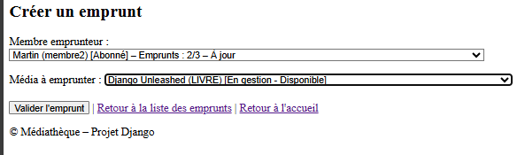

> L'affichage des informations du membre et du média (`Membre.__str__()` et `Media.__str__()`) sont exprimées avec une 
> description technique et métier pour faciliter la compréhension de la situation. Ces informations sont calculées 
> dynamiquement et reflètent l'état de la base.

La validation de l'emprunt, déclenchée par le clic du bouton **Valider l'emprunt** (soumission du formulaire), conduit à 
la création de l'emprunt (liste ordonnée par date d'emprunt). Cette création réalisée, l'application affiche la liste
des emprunts. L'interface affiche le message de succès en rappelant le nouvel emprunt créé pour l'UX du Bibliothécaire.

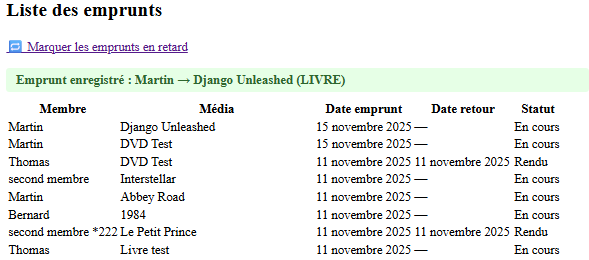

> Un choix invalide (ie. : membre bloqué, média indisponible, etc. aurait déclenché un retour au formulaire avec le 
> message d'erreur adapté pour l'UX du Bibliothécaire.). Le tableau suivant illustre des cas invalides.
> > |                    Membre bloqué (quota)                    |                     Média indisponible                      | Membre bloqué (retard)                                       |
> > |:-----------------------------------------------------------:|:-----------------------------------------------------------:|--------------------------------------------------------------|
> > | 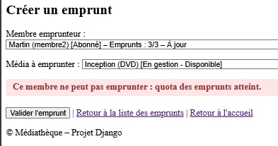 | 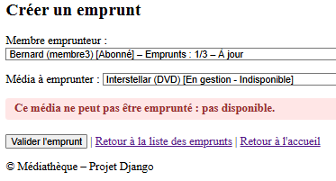 | 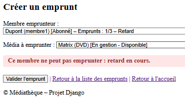 |
> 
> La validation prévoit les cas d'invalidité cumulative en indiquant l'ensemble des messages d'erreur pour l'UX du 
> Bibliothécaire.
> > |                  Accumulation d'invalidité                  |                  Forumlaire incomplet                   |
> > |:-----------------------------------------------------------:|:-------------------------------------------------------:|
> > | 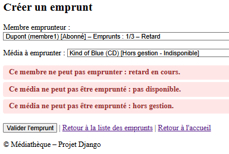 | 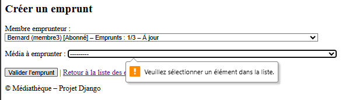 |
> 

---

###### Exemple de création d'un emprunt à partir d'un membre emprunteur

La vue de création d'un **emprunt à partir d'un membre** `EmpruntCreateFromMembreView` hérite de la vue de création d'un 
emprunt `EmpruntCreateView`. Cet héritage permet de bénéficier des mêmes règles métier de validation, formulaire et 
template.

Le code de la vue doit ajouter des méthodes pour réaliser la gestion des différents éléments du contexte, afin :
- d'initialiser les données connues (Membre) : la méthode `get_initial()`.
- de réattribuer les données connues aux champs du formulaire : la méthode `dispatch()`.
- d'organiser le formulaire (état des champs, apparence...) : la méthode `get_form()`.
- d'organiser les données du _contexte de la vue_ pour le contrôle du template : la méthode `get_context_data()`.

L'exemple de code est basé sur un contexte métier précis : **le membre est connu et il peut emprunter**.

```Python
class EmpruntCreateFromMembreView(EmpruntCreateView):
    def dispatch(self, request, *args, **kwargs):
        self.membre = get_object_or_404(Membre, pk=kwargs["pk"])  # <-- Données réattribuées
        return super().dispatch(request, *args, **kwargs)

    def get_initial(self):
        return {"emprunteur": self.membre}                  # <-- Donnée initiale

    def get_form(self, form_class=None):
        form = super().get_form(form_class)
        form.fields["emprunteur"].initial = self.membre     # <-- Chargement du champ de sélection
        form.fields["emprunteur"].disabled = True           # <-- champ inactivé pour figer le contenu
        return form

    def get_context_data(self, **kwargs):
        context = super().get_context_data(**kwargs)
        context["membre"] = self.membre                     # <-- Apparence des textes du template
        context["is_from_membre"] = True                    # <-- Apparence des messages du template
        return context
```

Le formulaire `EmpruntForm` est initialisé avec le champ `Emprunteur` du membre sélectionné. L'apparence du template 
`emprunt_form.html` est adaptée pour signaler le contexte.

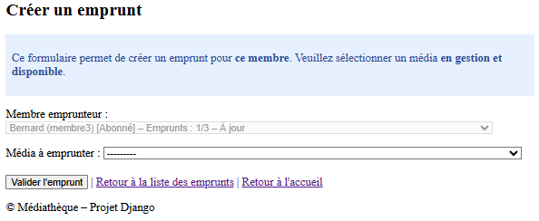

---

###### Exemple de création d'un emprunt à partir d'un média disponible

La vue de création d'un **emprunt à partir d'un média** `EmpruntCreateFromMediaView` hérite de la vue de création d'un 
emprunt `EmpruntCreateView`. Cet héritage permet de bénéficier des mêmes règles métier de validation, formulaire et 
template.

Le code de la vue doit ajouter des méthodes pour réaliser la gestion des différents éléments du contexte, afin :
- d'initialiser les données connues (Media **typé**) : la méthode `get_initial()`.
- de réattribuer les données connues aux champs du formulaire : la méthode `dispatch()`.
- d'organiser le formulaire (état des champs, apparence...) : la méthode `get_form()`.
- d'organiser les données du _contexte de la vue_ pour le contrôle du template : la méthode `get_context_data()`.

L'exemple de code est basé sur un contexte métier précis : **le média est connu et il est disponible**.

```Python
class EmpruntCreateFromMediaView(EmpruntCreateView):
    def dispatch(self, request, *args, **kwargs):
        self.media = get_object_or_404(Media, pk=kwargs["pk"]).get_real_instance()  # <-- Données réattribuées
        return super().dispatch(request, *args, **kwargs)

    def get_initial(self):
        return {"media": self.media}                    # <-- Donnée initiale

    def get_form(self, form_class=None):
        form = super().get_form(form_class)
        form.fields["media"].initial = self.media       # <-- Chargement du champ de sélection
        form.fields["media"].disabled = True            # <-- champ inactivé pour figer le contenu
        return form

    def get_context_data(self, **kwargs):
        context = super().get_context_data(**kwargs)
        context["media"] = self.media                   # <-- Apparence des textes du template
        context["is_from_media"] = True                 # <-- Apparence des messages du template
        return context
```

Le formulaire `EmpruntForm` est initialisé avec le champ `Emprunteur` du membre sélectionné. L'apparence du template 
`emprunt_form.html` est adaptée pour signaler le contexte.


---

###### Documentation technique associée aux emprunts

> L'ensemble des fonctions métiers l'entité `Emprunt` fait l'objet :
> - d'une définition technique dans le document d'analyse des fonctionnalités de l'application Bibliothécaire.
> - d'un plan de tests fonctionnels (T-FUN) de chaque cas d'usage fonctionnel.
>> 📄 Voir `devAFBib.md` §3.3.1 et `devTests.md` T-FUN-21 à T-FUN-41.
>
> Associé à ce document, l'ensemble des états (cycle de vie - noté LC pour LifeCycle) est décrit pour chaque entité.
>> 📄 Voir `devALCBib.md` §1 à §6 pour la description d'ensemble **`Membre`, `Media`, `Emprunt`** et cf. §7 pour les 
>> aspects spécifiques à chaque entité. 
>

---

##### 4.1.3.3 Vues des Retours

Les retours peuvent être initiés (origine du parcours) depuis :
- la liste des emprunts.
- la fiche du membre.
- la fiche du média.

La vue de **rendu d'un emprunt** diffère selon le parcours :
- sélection de l'emprunt à rendre : `EmpruntRendreView`.
- pour un _membre-emprunteur_, sélection de l'emprunt ou du média : `EmpruntRendreFromMembreView`.
- pour un _média emprunté_, rendre l'emprunt : `EmpruntRendreFromMembreView`.

Chacune de ces trois vues conduit, après validation de la configuration sélectionnée (Emprunt-Membre-Media), à la vue de 
confirmation du rendu de l'emprunt `EmpruntRetourConfirmView`. La confirmation du Bibliothécaire déclenche 
l'enregistrement du retour d'emprunt.

---

###### Vue de la confirmation - Etape finale de la transaction de rendu

La vue de confirmation permet à l'utilisateur de s'assurer que les informations sélectionnées sont correctes avant 
d'engager les actions définitives d'enregistrement du retour de l'emprunt et de rendre disponible le média emprunté.

Le contexte de cette vue est une définition complète de l'emprunt (identification univoque).

Cette vue présente donc la caractéristique d'avoir un affichage établi et figé à partir des données du contexte, 
**l'emprunt sélectionné**, en considérant que :
- la validation est une confirmation pour engager l'enregistrement (la validation des règles métier est déjà réalisée). 
- l'annulation de cette confirmation doit rediriger vers la vue à l'origine du parcours UX.

Le code de la vue doit ajouter des méthodes pour réaliser la gestion de ces différents éléments du contexte, afin :
- d'initialiser les données connues (Membre) : la méthode `get()` et `get_form_kwargs()`.
- de gérer le traitement de validation du formulaire : la méthode `form_valid()`.
- de gérer la redirection après validation : la méthode `get_success_url`.
- d'organiser l'URL d'annulation dans le template : la méthode `get_context_data()`.

```Python
class EmpruntRetourConfirmView(SingleObjectMixin, FormView):    # <-- Mixin pour ajouter la methode get() à la classe FormView
    model = Emprunt
    form_class = EmpruntRetourForm
    template_name = "bibliothecaire/emprunts/emprunt_retour_confirm.html"

    def get(self, request, *args, **kwargs):                # <-- permet d'accéder à l'objet Emprunt
        self.object = self.get_object()
        return super().get(request, *args, **kwargs)

    def get_form_kwargs(self):
        kwargs = super().get_form_kwargs()
        kwargs["instance"] = self.get_object()
        return kwargs

    def get_success_url(self):      # <-- redirection selon le parcours UX
        origine_key = self.request.session.pop("origine_retour", "rendre")  # <-- Contexte de vue à partir du contexte de session
        if origine_key == "media":
            return reverse("bibliothecaire:media_detail", kwargs={"pk": self.get_object().media.pk})    # <-- redirection pour média
        elif origine_key == "membre":
            return reverse("bibliothecaire:membre_detail", kwargs={"pk": self.get_object().emprunteur.pk})  #<-- redirection pour membre
        return reverse("bibliothecaire:emprunt_list")       # redirection pour aucune origine particulière

    def get_context_data(self, **kwargs):   # <-- contexte des données d'affichage : gestion du code du lien d'annulation
        context = super().get_context_data(**kwargs)
        # Calcul explicite de l’URL de retour pour le template
        origine_key = self.request.session.get("origine_retour", "rendre")
        if origine_key == "media":
            context["url_retour"] = reverse("bibliothecaire:media_detail", kwargs={"pk": self.get_object().media.pk})
        elif origine_key == "membre":
            context["url_retour"] = reverse("bibliothecaire:membre_detail", kwargs={"pk": self.get_object().emprunteur.pk})
        else:
            context["url_retour"] = reverse("bibliothecaire:emprunt_rendre")
        return context                               # <-- le contexte contient dans son dictionnaire l'URL d'annulation (url_retour)

    def form_valid(self, form):
        emprunt = self.get_object()
        if emprunt.enregistrer_retour():    # <-- enregistrement en base du retour de l'emprunt
            media = emprunt.media
            membre = emprunt.emprunteur
            messages.success(self.request, f"Emprunt rendu : {membre.name} → {media.name} ({media.media_type})")
        else:
            messages.warning(self.request, "Cet emprunt ne peut pas être rendu.")
        return redirect(self.get_success_url())     # <-- redirection systématique vers l'URL de fin de transaction avec un message d'UX
```

> Le mixin `SingleObjectMixin` est indispensable pour toute **vue de confirmation métier liée à un objet**, lorsqu’on 
utilise `FormView`. Cette particularité d'architecture a fait l'objet d'une description détaillée dans la main-courante 
(`devMC.md` §9.25) lors du développement.
> 
> Il permet de respecter la séparation des responsabilités :
> - le formulaire reste statique.
> - la logique métier reste dans la vue.
> - l’accès aux données reste encapsulé.

---

###### Exemple du rendu d'un emprunt - Formulaire adapté à la sélection d'un emprunt

La vue de rendu d'un **emprunt** `EmpruntRendreView` hérite de la vue générique `FormView`. Cet héritage permet de 
générer un formulaire de sélection avec son template.

Le code de la vue doit ajouter des méthodes pour réaliser la gestion des différents éléments du contexte, afin :
- d'organiser les données du _contexte de la vue_ pour le contrôle du template : la méthode `get_context_data()`.
- d'organiser la validation du formulaire (la redirection vers la confirmation) : la méthode `get_form()`.

L'exemple de code est basé sur un contexte métier précis : **les emprunts listés sont à rendre**.

```Python
class EmpruntRendreView(FormView):
    form_class = EmpruntRendreForm                                  # <-- formulaire de sélecton d'emprunt à rendre
    template_name = "bibliothecaire/emprunts/emprunt_form.html"     # <-- template pour la sélection de l'emprunt à rendre

    def get_context_data(self, **kwargs):                           # <-- contexte des données d'affichage du template
        context = super().get_context_data(**kwargs)
        context["is_rendre"] = True                                 # <-- contexte explicite du rendu (se distingue de la création)
        return context

    def form_valid(self, form):
        emprunt = form.cleaned_data["emprunt"]                      # <-- récupération de l'instance d'emprunt
        return redirect("bibliothecaire:emprunt_retour_confirm", pk=emprunt.pk)     # <-- redirection vers la confirmation de l'emprunt choisi
```

Le formulaire `EmpruntRendreForm` est initialisé pour les champs de sélection `Emprunt`, `Emprunteur` et `Media`. Cette 
initialisation filtre pour chaque champ la liste des instances potentiellement concernées par un rendu :
- les emprunts non rendus. Ce champ est actif à la sélection d'un choix.
- les membres ayant aux moins un emprunt. Ce champ est un champ d'information.
- les médias (en gestion) indisponibles. Ce champ est un champ d'information.

```Python
class EmpruntRendreForm(forms.Form):
    emprunt = forms.ModelChoiceField(
        queryset=Emprunt.objects.exclude(statut=StatutEmprunt.RENDU),       # <-- filtre les emprunts non-rendus
        label="Emprunt à rendre"
    )

    media = forms.ModelChoiceField(
        queryset=Media.objects.filter(disponible=False),                    # <-- filtre les médias indisponibles
        label="Média emprunté",
        required=False,                                                     # <-- exclu de la validation du formulaire
        disabled=True                                                       # <-- champ non actif
    )

    emprunteur = forms.ModelChoiceField(
        queryset=Membre.objects.filter(
            emprunts__statut__in=[StatutEmprunt.EN_COURS, StatutEmprunt.RETARD]
        ).distinct(),                                                       # <-- filtre les membres avec un emprunt
        label="Membre emprunteur",
        required=False,                                                     # <-- exclu de la validation du formulaire
        disabled=True                                                       # <-- champ non actif
    )
```

L'apparence du template `emprunt_form.html` **commun pour la création et le rendu** est adaptée pour signaler le 
contexte de rendu.

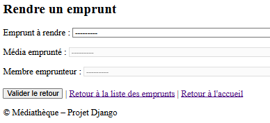

L'affichage du template et son comportement sont gérés par les données du contexte de la vue (`is_rendre`, 
`is_from_membre`, `is_from_media`, `is_rendre_membre`) :

```html
                   <-- Menu de la page
                                         <-- Début du contenu de la page
  
    <h2>Rendre un emprunt</h2>                              <-- Titre de la page de rendu
  
    <h2>Créer un emprunt</h2>                               <-- Titre de la page de création
  

  
    <div id="emprunt_membre_info" class="info"> ... </div>          <-- message contexte UX : création à partir d'un membre
  
  
    <div id="emprunt_media_info" class="info"> ... </div>           <-- message contexte UX : création à partir d'un média
   
  
    <div id="emprunt_rendre_membre_info" class="info"> ... </div>   <-- message contexte UX : rendu à partir d'un membre
  

  <form method="post">
    
    {{ form.as_p }}                                                 <-- champs du Formulaire

     ...                                <-- message d'information UX

    <div>
       <button type="submit">Valider le retourl'emprunt </button>
       
            <a href="{{ url_retour }}">Retour à la fiche du membre</a>
       
            <a href="">Retour à la liste des emprunts</a>
       
       <a href="">Retour à l'accueil</a>
    </div>

    
        <script> ... </script>                                      <-- cohérence dynamique des champs du formulaire
    
  </form>
                                              <-- Début du contenu de la page
```


La liste de sélection ne contient que des emprunts à rendre.

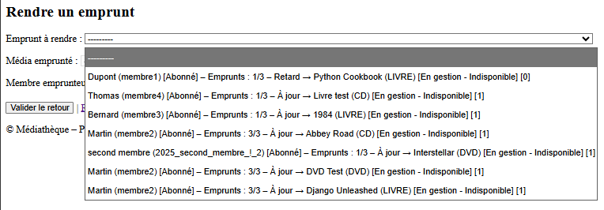

Pour améliorer la fluidité de l'UX des rendus, le template `emprunt_form.html` prévoit un script JavaScript (côté 
navigateur) pour synchroniser dynamiquement les champs `emprunt`, `membre` et `media`.

```html
    <script>
        document.addEventListener("DOMContentLoaded", function () {
          const empruntSelect = document.getElementById("id_emprunt");
          const mediaSelect = document.getElementById("id_media");
          const emprunteurSelect = document.getElementById("id_emprunteur");

          const empruntData = {
            
              "{{ emprunt.id }}": {
                "media": "{{ emprunt.media.id }}",
                "emprunteur": "{{ emprunt.emprunteur.id }}"
              },
            
          };

          const mediaData = {
            
              
                
                  "{{ media.id }}": "{{ emprunt.id }}",
                
              
            
          };

          
            
              // Cas UC-RETOUR-03 : sélection croisée
              mediaSelect.addEventListener("change", function () {
                const selectedMedia = mediaSelect.value;
                if (mediaData[selectedMedia]) {
                  empruntSelect.value = mediaData[selectedMedia];
                }
              });

              empruntSelect.addEventListener("change", function () {
                const selectedEmprunt = empruntSelect.value;
                if (empruntData[selectedEmprunt]) {
                  mediaSelect.value = empruntData[selectedEmprunt].media;
                }
              });
            
              // Cas UC-RETOUR-01 : sélection d’un emprunt
              empruntSelect.addEventListener("change", function () {
                const selected = empruntSelect.value;
                if (empruntData[selected]) {
                  mediaSelect.value = empruntData[selected].media;
                  emprunteurSelect.value = empruntData[selected].emprunteur;
                }
              });
            
          
        });
    </script>
```

---

###### Exemple du rendu d'un emprunt - Formulaire adapté à la sélection d'un membre

La vue de création d'un **emprunt à partir d'un membre** `EmpruntRendreFromMembreView` hérite de la vue de création d'un 
emprunt `EmpruntCreateView`. Cet héritage permet de bénéficier des mêmes règles métier de validation, formulaire et 
template.

Le code de la vue doit ajouter des méthodes pour réaliser la gestion des différents éléments du contexte, afin :
- d'initialiser les données connues (Membre) : la méthode `get_initial()`.
- de réattribuer les données connues aux champs du formulaire : la méthode `dispatch()`.
- d'organiser le formulaire (état des champs, apparence...) : la méthode `get_form()`.
- d'organiser les données du _contexte de la vue_ pour le contrôle du template : la méthode `get_context_data()`.

L'exemple de code est basé sur un contexte métier précis : **le membre est connu et il peut emprunter**.

```Python
class EmpruntRendreFromMembreView(FormView):
    form_class = EmpruntRendreFromMembreForm
    template_name = "bibliothecaire/emprunts/emprunt_form.html"

    def dispatch(self, request, *args, **kwargs):
        self.membre = get_object_or_404(Membre, pk=kwargs["pk"])        # <-- initialisation de l'instance du Membre
        self.emprunts_actifs = self.membre.get_emprunts_actifs()        # <-- initialisation de l'instance des Médias

        if not self.emprunts_actifs.exists():                           # <-- situation d'erreur technique (cas d'un accès direct par URL)                       
            messages.warning(request, "Ce membre n’a aucun emprunt actif à rendre.")
            return redirect("bibliothecaire:membre_detail", pk=self.membre.pk)

        request.session["origine_retour"] = "membre"                # <-- configuration du contexte de session (URLs sans argument)

        if self.emprunts_actifs.count() == 1:                       # < court-circuit , si le membre n'a qu'un seul emprunt
            emprunt = self.emprunts_actifs.first()
            return redirect("bibliothecaire:emprunt_retour_confirm", pk=emprunt.pk)     # redirection vers la confirmation

        return super().dispatch(request, *args, **kwargs)

    def get_form_kwargs(self):                                      # <-- lie le formulaire avec les données
        kwargs = super().get_form_kwargs()
        kwargs["membre"] = self.membre
        kwargs["emprunts"] = self.emprunts_actifs
        kwargs["medias"] = [e.media for e in self.emprunts_actifs]
        return kwargs

    def get_context_data(self, **kwargs):                           # <-- actualise le contexte de contrôle de l'affichage
        context = super().get_context_data(**kwargs)
        context["membre"] = self.membre
        context["emprunts"] = self.emprunts_actifs
        context["is_rendre"] = True
        context["is_rendre_membre"] = True

        origine = self.request.session.get("origine_retour")
        if origine == "membre":                           # <-- actualise le lien du template pour le retour à la fiche du membre
            context["url_retour"] = reverse("bibliothecaire:membre_detail", kwargs={"pk": self.membre.pk})
        else:
            context["url_retour"] = reverse("bibliothecaire:emprunt_list")

        return context

    def form_valid(self, form):
        emprunt = form.cleaned_data["emprunt"]
        if emprunt.enregistrer_retour():                    # <-- enregistrement en base du retour de l'emprunt
            ...
        else:
            ...
        return redirect(self.get_success_url())             # <-- redirection à la validation

    def get_success_url(self):                              # <-- définition de l'URL de redirection à la validation
        origine = self.request.session.pop("origine_retour", None)
        if origine == "membre":
            return reverse("bibliothecaire:membre_detail", kwargs={"pk": self.membre.pk})
        return reverse("bibliothecaire:emprunt_list")
```

---

###### Exemple du rendu d'un emprunt - Formulaire adapté à la sélection d'un média

La vue de création d'un **emprunt à partir d'un média** `EmpruntRendreFromMediaView` hérite de la vue générique 
élémentaire `View`. Cet héritage permet d'exploiter les mécanismes de gestion d'une vue pour rediriger vers la vue de 
confirmation d'un emprunt.

Le contexte est initialisé en utilisant la méthode `get_emprunt_actif()` qui vérifie les règles métier tout en 
fournissant l'instance de l'emprunt associé au média sélectionné.

Cette vue agit comme un point d’entrée UX vers la transaction de retour.  
Elle vérifie qu’un emprunt actif existe pour le média sélectionné, initialise le contexte de session, et redirige vers 
la vue de confirmation.  
En cas d’absence d’emprunt, elle affiche un message UX et retourne à la fiche du média.

```Python
class EmpruntRendreFromMediaView(View):
    def get(self, request, pk):
        media = get_object_or_404(Media, pk=pk)
        emprunt = media.get_emprunt_actif()                     # <-- récupère l’emprunt actif associé au média, si existant

        if emprunt:                                             # <-- validation de l'emprunt concerné par le rendu
            request.session["origine_retour"] = "media"         # <-- utilisé pour déterminer la redirection après confirmation
            return redirect("bibliothecaire:emprunt_retour_confirm", pk=emprunt.pk)     # <-- redirection pour la confirmation

        messages.warning(request, f"Aucun emprunt actif trouvé pour ce média)")     # <-- message UX si aucun emprunt actif n’est trouvé
        return redirect("bibliothecaire:media_detail", pk=media.pk)     # <-- retour à la fiche média en cas d’échec de la recherche d’emprunt
```

---

##### 4.1.3.4 Marquage des retards

Les retards sont marqués automatiquement à la connexion (page d'accueil) ou via une vue dédiée :
- `AccueilBibliothecaireView` : action quotidienne unique et mémorisée.
- `EmpruntRetardView` : action forcée manuelle.

---

###### Marquage manuel des retards - Vue dédiée

La vue de **marquage de retard** `EmpruntRetardView` hérite de la vue de générique `TemplateView`. Cet héritage permet 
d'afficher le template des résultats de l'opération de marquage des emprunts constaté en retard.

Cette vue n'utilise pas de formulaire et exploite directement la méthode de classe de `marquer_emprunt()` de l'entité 
`Emprunt` (cf. [modélisation Emprunt](#4131-modélisation-de-lemprunt--contraintes-métier)) qui rend un résultat 
structuré (dictionnaire) permettant de mettre à jour les données du template.

```python
class EmpruntRetardView(TemplateView):
   template_name = 'bibliothecaire/emprunts/emprunt_retard_result.html'

    def get_context_data(self, **kwargs):             # <-- récupération des données du contexte pour l'affichage
        context = super().get_context_data(**kwargs)
        resultat = Emprunt.marquer_retard()               # <-- marquage des enregistrements d'emprunt en retard

        context.update(resultat)                          # <-- injecte toutes les clés du dictionnaire dans le contexte
        tag = resultat["message"]["tag"]                  # <-- exploitation du dictionnaire de résultat pour les tags de message
        text = resultat["message"]["text"]                # <-- exploitation du dictionnaire de résultat pour les textes de message

        if tag == "success":
            messages.success(self.request, text)          # <-- messages métier de succès du marquage d'au moins un emprunt
        elif tag == "warning":
            messages.warning(self.request, text)          # <-- message métier d'avertissement d'aucun retard constaté
        else:
            messages.info(self.request, text)             # <-- fallback : exploitation d'autres tags de message
        return context
```

Le template `emprunt_retard_result.html` inclut un template spécifique `emprunt_retard_marque_table.html` pour afficher 
la table listant les emprunts marqués. Cette inclusion permettra de réutiliser ce dernier template pour le traitement de 
[marquage automatisé](#marquage-automatique-des-retards---action-quotidienne-unique-et-mémorisée).

Le code du template de la vue exploite les résultats disponibles dans le contexte de la vue.

```html


  <h2>Marquage des emprunts en retard</h2>

  <p><strong>Date du jour :</strong> {{ date_du_jour }}</p>
  <p><strong>Date seuil de retard :</strong> {{ date_seuil_retard }}</p>
  <p><strong>Nombre d’analyse (emprunts en cours) :</strong> {{ emprunts_en_cours|length }} </p>

  
  <ul class="messages">
    
      <li class="{{ message.tags }}">{{ message }}</li>
    
  </ul>
  

  
    

    
        <p>Le retard est marqué pour le {{ date_premier_retard }}.</p>
    
        <p>Les retards sont marqués entre le {{ date_premier_retard }} et le {{ date_dernier_retard }}.</p>
    
  

  <p><a href="">Retour à la liste des emprunts</a></p>

```

Le tableau suivant présente l'affichage obtenu dans les deux situations de marquage.

| Marquage manuel avec résultat | Marquage manuel avec aucun retard |
|:---:|:---:|
|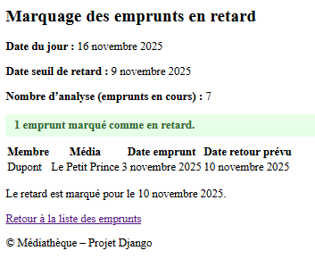|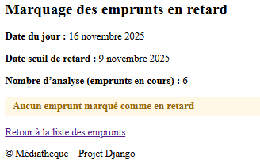|

---

###### Marquage automatique des retards - Action quotidienne unique et mémorisée

La vue de **marquage des retards** est la vue d'accueil `AccueilBibliothecaireView` de l'application Bibliothécaire. 
Cette vue permet d'afficher la situation de gestion de la médiathèque et de marquage quotidien des retards.

La vue `AccueilBibliothecaireView` hérite de la vue générique `TemplateView` pour l'affichage template statique de 
situation. Elle gère le contexte :
- de navigation de la session grâce à l'héritage de la classe spécifique au projet (cf. Difficulté 17 et Difficulté 24 
du développement du projet), `OrigineSessionMixin`.
- des données stockées :
  - dans le **contexte de session** pour les résultats du **marquage quotidien des retards**.
  - dans le **contexte de vue** pour la gestion de l'affichage des **indicateurs de gestion**.


```Python
class AccueilBibliothecaireView(OrigineSessionMixin, TemplateView):
    template_name = 'bibliothecaire/accueil.html'

    origine_key = 'accueil'

    def post(self, request, *args, **kwargs):...            # <-- Traitement du commutateur d'affichage des emprunts marqués

    def get_context_data(self, **kwargs):                   # <-- gestion des contextes de session et de vue
        context = super().get_context_data(**kwargs)

        # Déclenchement automatique du marquage des retards
        today = date.today()
        last_check = self.request.session.get("retard_last_check_date")     # <-- injection de la dernière date de marquage
        if last_check != str(today):                                        # <-- vérification de l'action quotidienne
            # Actualisation du contexte de session (action quotidienne unique)
            self.request.session.pop("retard_message", None)                # <-- contexte de session, réinitialisation du message
            self.request.session.pop("emprunts_marques_ids", None)          # <-- contexte de session, réinitialisation des index des marques
            
            resultat = Emprunt.marquer_retard()                             # <-- action de marquage des retards
            
            self.request.session["retard_last_check_date"] = str(today)     # historisation pour une action quotidienne unique
            self.request.session["retard_message"] = resultat["message"]["text"]    # historisation du message
            self.request.session["emprunts_marques_ids"] = [e.id for e in resultat["emprunts_marques"]]     # historisation des index

        # Actualisation du contexte de la vue à partir du contexte de session
        context["retard_message"] = self.request.session.get("retard_message")
        ids = self.request.session.get("emprunts_marques_ids", [])                          # <-- index historisés
        context["emprunts_marques"] = Emprunt.objects.filter(id__in=ids) if ids else []     # <-- reconstitution  avec les index

        # Affichage conditionnel
        context["affiche_table"] = self.request.session.get("affiche_table", False)         # <-- gestion de l'affichage des emprunts marqués

        # Indicateurs de gestion 
        context["nb_medias_total"] = Media.count_total()            # <-- exploitation des méthodes de classe des entités
        ...
        return context
```
Le template `accueil.html` gère l'affichage :
- des messages et le bouton de commutation.
- des résultats selon l'état du bouton commutateur.
- des indicateurs de gestion.

```html



  <h2>Bienvenue dans l’espace Bibliothécaire</h2>
  <p>Utilisez le menu ci-dessus pour accéder aux fonctionnalités.</p>

                     
    <ul class="messages">
      <li class="success">
          {{ retard_message }}              <-- affiche du message d'UX
          
            <form method="post">            <-- formulaire POST pour la commutation d'affichage
                
                
                    ...                     <-- gestion du bouton "commutateur" d'affichage de la table des résultats
                
            </form>
          
      </li>
    </ul>
  

  
    <div style="margin-top:20px;">
        <h3>📌 Emprunts marqués comme en retard</h3>
                <-- template de résultat des marquages
    </div>
  

  <h3>📊 Situation de la médiathèque</h3>
  <table id="situation-mediatheque"> ... </table>                 <-- affichage des indicateurs de gestion


```

Chaque clic sur le bouton commutateur déclenche un rafraîchissement de la vue avec la méthode post() de la vue.

|                       commutateur On                        |                      commutateur Off                       |
|:-----------------------------------------------------------:|:----------------------------------------------------------:|
| 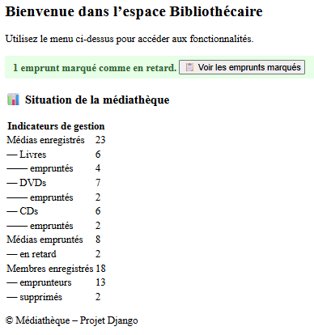 | 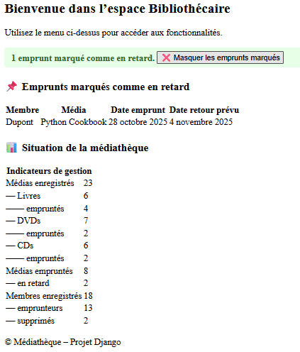 |

---

##### 4.1.3.5 Navigation fonctionnelle pour les emprunts

Pour implémenter la fonctionnalité relative à un **emprunt**, chaque fonction métier (UC) modélisée par une **Vue**, est 
associée à une **URL** spécifique et unique définie dans le fichier structurel Python `urls.py`.

La définition ci-après présente la liste exhaustive des navigations fonctionnelles autorisées pour les emprunts dans 
l'application Bibliothécaire. Les navigations liées aux transactions à partir d'un membre ou d'un média sont rappelées 
pour la complétude des routes nécessaires pour exploiter toutes les fonctionnalités liées à une emprunt 

```Python
app_name = 'bibliothecaire'

urlpatterns = [
    ... URLs des autres entités
    # Emprunts
    path('emprunts/', views.EmpruntListView.as_view(), name='emprunt_list'),
    path('emprunts/retards/', views.EmpruntRetardView.as_view(), name='emprunt_retard'),
    path('emprunts/ajouter/', views.EmpruntCreateView.as_view(), name='emprunt_create'),
    path("emprunts/rendre/", EmpruntRendreView.as_view(), name="emprunt_rendre"),
    path("emprunts/<int:pk>/retour/confirmation/", EmpruntRetourConfirmView.as_view(), name="emprunt_retour_confirm"),

    # Transverse - Transaction Emprunt
    path("medias/<int:pk>/emprunter", EmpruntCreateFromMediaView.as_view(), name="media_emprunter"),
    path("medias/<int:pk>/rendre/", EmpruntRendreFromMediaView.as_view(), name="media_rendre"),
    path("membres/<int:pk>/emprunter", EmpruntCreateFromMembreView.as_view(), name="membre_emprunter"),
    path("membres/<int:pk>/rendre/", EmpruntRendreFromMembreView.as_view(), name="membre_rendre"),

]
```

> 📌 Chaque fonctionnalité est associée à une URL unique (cf. section [2.3.3](#233-routage-fonctionnel-par-cas-dusage-uc)) 
> et validée par des tests documentés dans `devReport.md`.

L'ensemble des liens des templates exploite les noms (`name`) de chaque route (`path`) pour activer la vue à la 
fonctionnalité métier recherché. Constituant ainsi l'UX de l'application Bibliothécaire pour les emprunts de la 
médiathèque.

---

#### 4.1.4 Gestion des Jeux de plateau

La gestion des **Jeux de plateau** constitue une extension des fonctionnalités offertes au profil Bibliothécaire.  
Elle permet d’administrer un type de support supplémentaire, en cohérence avec les médias déjà présents (livres, DVD, 
CD).

---

**Rôle et objectifs :**
- Offrir un CRUD complet sur les jeux de plateau.
- Permettre au bibliothécaire de créer, modifier, consulter et lister les jeux disponibles.
- Intégrer les jeux dans les indicateurs de gestion affichés sur l’accueil.

**Entités principales :**
- `JeuDePlateau` : modèle dédié avec attributs spécifiques :
  - `categorie` (ex. : famille, stratégie, coopération)
  - `duree_partie` (en minutes)
  - `nb_joueur_min` et `nb_joueur_max`
  - `age_min`
  - `consultable` et `disponible` (hérités de `Support`)

**Fonctionnalités implémentées :**
- **Création** : via `JeuCreateView` et le formulaire `JeuDePlateauForm`.
- **Modification** : via `JeuUpdateView` avec pré-remplissage des champs.
- **Liste** : via `JeuListView`, affichant tous les jeux enregistrés.
- **Détail** : via `JeuDetailView`, présentant une fiche complète du jeu.

**Templates associés :**
- `jeu_form.html` : création et modification.
- `jeu_list.html` : liste des jeux.
- `jeu_detail.html` : fiche détaillée.

**Tests associés :**
- **Navigation** : T‑NAV‑28 à T‑NAV‑31 (accès liste, détail, création, modification).
- **Fonctionnel** : T‑FUN‑42 à T‑FUN‑45 (création valide, modification, liste cliquable, indicateurs accueil).

**Indicateurs de gestion :**
- Nombre total de jeux enregistrés.
- Nombre de jeux consultables.
- Intégration dans la page d’accueil du Bibliothécaire pour une vision globale des supports.

> 🔹 La gestion des jeux de plateau complète l’offre de la médiathèque en diversifiant les supports disponibles et en 
> renforçant la cohérence documentaire et fonctionnelle du projet.

---

### 4.2 Application Consultation (consultation des supports)

L’application **Consultation** est destinée aux membres de la médiathèque.  
Elle leur permet d’accéder à une interface simple et claire pour consulter les supports disponibles (médias et jeux de 
plateau), sans possibilité de modification ou de gestion interne.

> 🔹 L’application Consultation complète le cycle métier de la médiathèque en offrant aux membres une interface claire 
> et filtrée pour accéder aux supports disponibles, tout en respectant la séparation stricte des rôles entre gestion et 
> consultation.

---

#### 4.2.1 Rôle et objectifs
- Offrir une interface publique de lecture des supports.
- Permettre aux membres de filtrer les supports selon leur type ou leur disponibilité.
- Garantir une séparation stricte entre les fonctions de gestion (réservées au bibliothécaire) et les fonctions de 
consultation.

**Exemple (UX) de rendu de cette consultation** :

- Accueil de l'application `Consultation` :  
    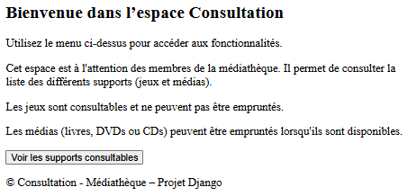
- Liste des supports consultables :  
    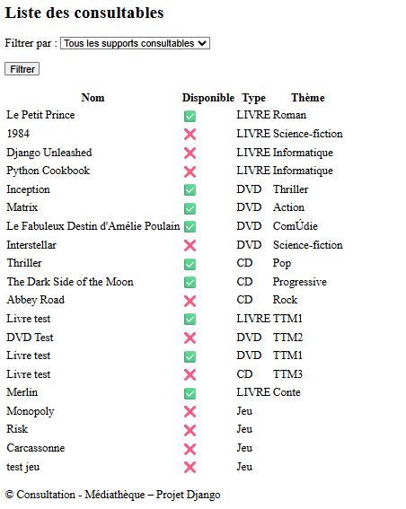
- Liste des médias empruntables :  
    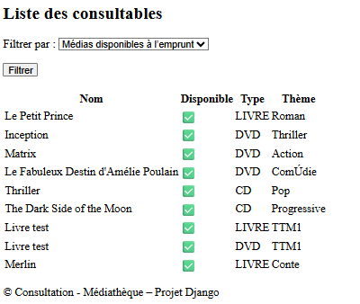
- Affichage si aucun support consultable :  
    

---

#### 4.2.2 Entités principales
- **Support** : entité abstraite regroupant les médias (`Livre`, `Dvd`, `Cd`) et les jeux de plateau (`JeuDePlateau`).
- Les attributs essentiels (`consultable`, `disponible`) permettent de filtrer les supports affichés.

---

#### 4.2.3 Fonctionnalités implémentées
- **Accueil Consultation** :  
  - Vue `AccueilConsultationView`  
  - Template `accueil.html`  
  - Route `/consultation/`  
  - Affiche un message d’accueil et un bouton CTA “Voir les supports consultables”.

- **Liste des supports** :  
  - Vue `SupportListView` avec formulaire `SupportFilterForm`  
  - Template `supports_list.html`  
  - Routes :
    - `/consultation/supports/` → tous les supports consultables
    - `/consultation/supports/medias/` → uniquement les médias
    - `/consultation/supports/jeux/` → uniquement les jeux de plateau
    - `/consultation/supports/medias/disponibles` → uniquement les médias disponibles
    - `/consultation/supports/vide` → cas technique de liste vide (test UX)

- **Filtrage et persistance** :  
  - Le formulaire conserve le filtre sélectionné lors du rechargement de la page.  
  - Les résultats affichés sont cohérents avec les critères choisis.

---

#### 4.2.4 Templates associés
- `accueil.html` : page d’accueil avec CTA.  
- `supports_list.html` : affichage des supports filtrés.  
- Organisation des templates dans le répertoire `consultation/`.

---

#### 4.2.5 Tests associés
- **Navigation** : T‑NAV‑32 à T‑NAV‑37 (accès accueil, liste des supports, filtrage par type, cas liste vide).  
- **Fonctionnel** : T‑FUN‑46 à T‑FUN‑51 (filtrage médias/jeux, supports disponibles, persistance du filtre, CTA accueil).

---

#### 4.2.6 Indicateurs et perspectives
- L’application Consultation ne propose pas de détail individuel des supports (non demandé dans le sujet).  
- Les fonctionnalités actuelles couvrent le besoin minimal de consultation.  
- Une évolution future pourrait intégrer :
  - Une fiche détaillée par support.
  - Des options de recherche avancée.
  - Une ergonomie enrichie pour les membres.

---

### 4.3 Contraintes métiers respectées

Le développement de l’application `bibliothecaire` a été guidé par les contraintes métier énoncées dans le cahier des 
charges.

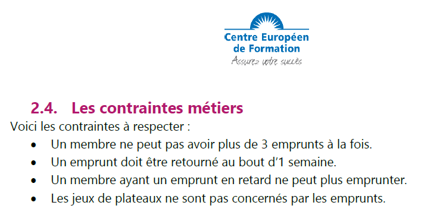

> ✅ Toutes les contraintes métier ont été **modélisées explicitement**, **centralisées dans les entités métier**, 
> et **testées** dans les cas d’usage correspondants.  
> Cette approche garantit la robustesse du système et la conformité aux règles de gestion de la médiathèque.

---

##### 4.3.1 Contrainte 1 – Limite de 3 emprunts simultanés par membre

Un membre ne peut pas avoir plus de trois emprunts actifs (statuts `EN_COURS` ou `RETARD`).  
Cette règle est implémentée dans la propriété `is_max_emprunt` du modèle `Membre`, et vérifiée dans la méthode 
`peut_emprunter()` :

```python
MAX_EMPRUNTS = 3

@property
def nb_emprunts_en_cours(self) -> int:
    return self.emprunts.filter(statut__in=[StatutEmprunt.EN_COURS, StatutEmprunt.RETARD]).count()

@property
def is_max_emprunt(self):
    return self.nb_emprunts_en_cours >= MAX_EMPRUNTS

def peut_emprunter(self):
    return self.is_emprunteur and not (self.is_max_emprunt or self.is_retard)
```

---

##### 4.3.2 Contrainte 2 – Durée maximale d’un emprunt : 7 jours

La date de retour prévue est automatiquement fixée à 7 jours après la date d’emprunt.  
La propriété `est_en_retard` du modèle `Emprunt` permet de détecter les retards :

```python
DELAI_EMPRUNT = 7 #jours

@property
def date_retour_prevu(self):
    return self.date_emprunt + timedelta(days=self.DELAI_EMPRUNT)

@property
def est_en_retard(self):
    return self.statut == StatutEmprunt.EN_COURS and self.date_retour_prevu < date.today()
```

---

##### 4.3.3 Contrainte 3 – Blocage des membres en retard

Un membre ayant au moins un emprunt en retard est bloqué pour tout nouvel emprunt.  
Cette règle est intégrée dans la propriété `is_retard` du modèle `Membre`, utilisée dans `peut_emprunter()` :

```python
MAX_RETARDS = 0

def nb_retards(self):
    return self.emprunts.filter(statut=StatutEmprunt.RETARD).count()

@property
def is_retard(self):
    return self.nb_retards > self.MAX_RETARDS

def peut_emprunter(self):
    return self.is_emprunteur and not (self.is_max_emprunt or self.is_retard)
```

Le [marquage des retards](#4134-marquage-des-retards) est effectué automatiquement à la connexion ou via une vue dédiée.

---

##### 4.3.4 Contrainte 4 – Jeux de plateau non empruntables

Les jeux de plateau (`JeuDePlateau`) héritent directement de `Support` et ne sont pas considérés comme des `Media`.
Seuls les `Media` peuvent constituer un emprunt. Ainsi la définition de `Emprunt` empêche l'emprunt d'un jeu de 
plateau :

```python
class JeuDePlateau(Support):...
    
class Media(Support):...

class Emprunt(models.Model):
    media      = models.ForeignKey(
        Media,                                      # <-- exclusion structurelle des jeux de plateau
        on_delete=models.CASCADE,
        related_name='emprunts'
    )
    emprunteur = models.ForeignKey(
        Membre,
        on_delete=models.CASCADE,
        related_name='emprunts'
    )
    ...
```

---

### 4.4 Authentification - gestion des rôles et des Logs

#### 4.4.1 Rôle principal

L’application `accounts` gère l’authentification des utilisateurs et l’attribution des rôles.  
Deux profils métier sont distingués :
- **Bibliothécaire** (`BibGestion`, `BibAdmin`) : accès aux vues internes de gestion.
  - `BibGestion` : **gestionnaire Bibliothécaire** ayant accès aux **fonctionnalités primordiale** du projet :
    - créer un membre-emprunteur. 
    - afficher la liste des membres. 
    - mettre à jour un membre. 
    - supprimer un membre. 
    - afficher la liste des médias. 
    - créer un emprunt pour un média disponible. 
    - ajouter un média. 
    - rentrer un emprunt.
  - `BibAdmin` : **administrateur Bibliothécaire** ayant accès à l'**ensemble des fonctionnalités disponibles** de 
  l'application Bibliothécaire
- **Membre** : accès limité à la consultation publique.

---

#### 4.4.2 Fonctionnalités liées à l'authentification

- Connexion via `CustomLoginView` et déconnexion via `CustomLogoutView`.
- Redirection automatique selon le rôle (accueil Bibliothécaire ou Consultation).
- Affichage conditionnel du menu (Connexion/Déconnexion).
- Gestion des refus d’accès avec page dédiée `403.html` (page de redirection).

---

##### 4.4.2.1 Fonctionnalités complémentaires

- **Issue #5** :
  - Mise en place des accès restreints et des rôles techniques (`Superuser`, `Staff`).
  - Tests UC‑SECURITE (`T‑SEC‑01` à `T‑SEC‑05`) validés.
  - Intégration des logs applicatifs (connexion, déconnexion, accès refusé/accordé).
- **Issue #6** :
  - Enrichissement des logs métiers (création d’emprunt, retour, ajout de média).
  - Rotation et segmentation des fichiers de logs.
  - UX améliorée pour la gestion des rôles et permissions.

---

##### 4.4.2.2 Impacts techniques

- Classe de tests `LoginRequiredTestCase` :
  - Connexion automatique du compte BibGestion.
  - Helpers `login_as(role, url=True)` et `logout(url=True)` pour déclencher les vues réelles.
  - Enum `RoleTest` pour simplifier les connexions (Gestion, Admin, Superadmin, Staff).
- Configuration `LOGGING` :
  - Fichier `mediatheque.log` pour l’application.
  - Fichier `mediatheque_test.log` pour les tests.
- Tests UC‑LOGS (`T‑LOG‑01` à `T‑LOG‑05`) validés, garantissant la traçabilité des événements critiques.

---

#### 4.4.3 Fonctionnalités liées à la gestion des Logs

La gestion des logs est une fonctionnalité transversale qui complète l’authentification et la sécurité.  
Elle permet de tracer les événements critiques et de fournir une base de validation pour les tests UC‑LOGS.

- **Objectifs principaux** :
  - Assurer la traçabilité des actions sensibles (connexion, déconnexion, accès refusé ou accordé).
  - Garantir une séparation claire entre logs opérationnels (`mediatheque.log`) et logs de tests 
  (`mediatheque_test.log`).
  - Offrir une base extensible pour un suivi métier et technique.

- **Fonctionnalités implémentées (Issue #5)** :
  - Configuration `LOGGING` avec handlers console et fichier.
  - Détection automatique du mode test pour basculer sur `mediatheque_test.log`.
  - Ajout de messages `[LOGIN]`, `[LOGOUT]`, `[ACCESS_DENIED]`, `[ACCESS_GRANTED]` dans les vues critiques.
  - Tests UC‑LOGS (`T‑LOG‑01` à `T‑LOG‑05`) validés, confirmant l’écriture correcte des événements.

- **Fonctionnalités prévues (Issue #6)** :
  - Journalisation des actions métier (création d’emprunt, retour, ajout de média).
  - Rotation des fichiers de logs et politique de conservation.
  - Segmentation des logs par rôle (BibGestion vs BibAdmin).
  - Intégration future avec une solution de supervision (ELK, Graylog, Sentry).

- **Impacts techniques** :
  - Les logs sont utilisés comme outil de validation dans les tests fonctionnels.
  - La classe `LoginRequiredTestCase` a été enrichie pour déclencher les vues réelles et générer les logs.
  - La lecture ciblée du fichier de logs (dernière ligne) permet de valider chaque événement indépendamment.

> 📌 La gestion des logs constitue une **fonction transversale** : elle relie directement la couche `accounts` 
> (authentification) aux applications métier (`bibliothecaire`, `consultation`) et assure une traçabilité complète des 
> accès.

---

#### 4.4.4 Tableau des accès aux menus par rôle

La logique d’authentification et de gestion des rôles se traduit directement dans les menus applicatifs.  
Le tableau ci‑dessous synthétise les accès des menus autorisés ou refusés en fonction des profils (SUPER, STAFF, 
BibGestion, BibAdmin, Membre).

✅ = accès autorisé  
❌ = accès refusé

| Id | Application    | Menu                       |    Entité    | Route                                              | SUPER | STAFF | GESTION | ADMIN | MEMBRE |
|----|----------------|----------------------------|:------------:|----------------------------------------------------|:-----:|:-----:|:-------:|:-----:|:------:|
| 1  | médiathèque    | accueil médiathèque        |   __app__    | accounts:accueil                                   |   ✅   |   ✅   |    ✅    |   ✅   |   ✅    |
| 2  | médiathèque    | espace bibliothécaire      |   __app__    | bibliothecaire:accueil                             |   ✅   |   ✅   |    ✅    |   ✅   |   ✅    |
| 3  | médiathèque    | espace consultation        |   __app__    | consultation:accueil                               |   ✅   |   ✅   |    ✅    |   ✅   |   ✅    |
| 4  | médiathèque    | espace administration      |   __app__    | admin:index                                        |   ✅   |   ✅   |    ❌    |   ❌   |   ❌    |
| 5  | médiathèque    | connexion                  |     User     | accounts:login                                     |   ✅   |   ✅   |    ✅    |   ✅   |   ✅    |
| 6  | médiathèque    | déconnexion                |     User     | accounts:logout                                    |   ✅   |   ✅   |    ✅    |   ✅   |   ✅    |
| 7  | bibliothecaire | accueil médiathèque        |   __app__    | accounts:accueil                                   |   ✅   |   ✅   |    ✅    |   ✅   |   ❌    |
| 8  | bibliothecaire | accueil bibliothécaire     |   __app__    | bibliothecaire:accueil                             |   ❌   |   ❌   |    ✅    |   ✅   |   ❌    |
| 9  | bibliothecaire | accueil consultation       |   __app__    | consultation:accueil                               |   ❌   |   ❌   |    ✅    |   ✅   |   ❌    |
| 10 | bibliothecaire | changer date marquage      |  __system__  | bibliothecaire:rejeu_reset_retard_session          |   ❌   |   ❌   |    ❌    |   ✅   |   ❌    |
| 11 | bibliothecaire | créer média                |    Media     | bibliothecaire:media_create                        |   ❌   |   ❌   |    ❌    |   ✅   |   ❌    |
| 12 | bibliothecaire | lister consultables        |    Media     | bibliothecaire:media_list_consultables             |   ❌   |   ❌   |    ✅    |   ✅   |   ❌    |
| 13 | bibliothecaire | lister disponibles         |    Media     | bibliothecaire:media_list_disponibles              |   ❌   |   ❌   |    ✅    |   ✅   |   ❌    |
| 14 | bibliothecaire | lister médias              |    Media     | bibliothecaire:media_list                          |   ❌   |   ❌   |    ✅    |   ✅   |   ❌    |
| 15 | bibliothecaire | lister médias non typés    |    Media     | bibliothecaire:media_list_by_type ?type=NON_DEFINI |   ❌   |   ❌   |    ❌    |   ✅   |   ❌    |
| 16 | bibliothecaire | créer livre                |    Livre     | bibliothecaire:media_create_livre                  |   ❌   |   ❌   |    ✅    |   ✅   |   ❌    |
| 17 | bibliothecaire | lister livres              |    Livre     | bibliothecaire:media_list_by_type ?type=LIVRE      |   ❌   |   ❌   |    ✅    |   ✅   |   ❌    |
| 18 | bibliothecaire | créer dvd                  |     Dvd      | bibliothecaire:media_create_dvd                    |   ❌   |   ❌   |    ✅    |   ✅   |   ❌    |
| 19 | bibliothecaire | lister dvd                 |     Dvd      | bibliothecaire:media_list_by_type ?type=DVD        |   ❌   |   ❌   |    ✅    |   ✅   |   ❌    |
| 20 | bibliothecaire | créer cd                   |      Cd      | bibliothecaire:media_create_cd                     |   ❌   |   ❌   |    ✅    |   ✅   |   ❌    |
| 21 | bibliothecaire | lister cd                  |      Cd      | bibliothecaire:media_list_by_type ?type=CD         |   ❌   |   ❌   |    ✅    |   ✅   |   ❌    |
| 22 | bibliothecaire | créer membre               |    Membre    | bibliothecaire:membre_create                       |   ❌   |   ❌   |    ✅    |   ✅   |   ❌    |
| 23 | bibliothecaire | créer emprunteur           |    Membre    | bibliothecaire:membre_create_emprunteur            |   ❌   |   ❌   |    ✅    |   ✅   |   ❌    |
| 24 | bibliothecaire | lister membres en gestion  |    Membre    | bibliothecaire:membre_list_gestion                 |   ❌   |   ❌   |    ✅    |   ✅   |   ❌    |
| 25 | bibliothecaire | lister membres emprunteurs |    Membre    | bibliothecaire:membre_list_emprunteurs             |   ❌   |   ❌   |    ✅    |   ✅   |   ❌    |
| 26 | bibliothecaire | lister membres supprimés   |    Membre    | bibliothecaire:membre_list_archives                |   ❌   |   ❌   |    ❌    |   ✅   |   ❌    |
| 27 | bibliothecaire | lister membres             |    Membre    | bibliothecaire:membre_list                         |   ❌   |   ❌   |    ❌    |   ✅   |   ❌    |
| 28 | bibliothecaire | marquage des retards       |   Emprunt    | bibliothecaire:emprunt_retard                      |   ❌   |   ❌   |    ❌    |   ✅   |   ❌    |
| 29 | bibliothecaire | lister emprunts            |   Emprunt    | bibliothecaire:emprunt_list                        |   ❌   |   ❌   |    ✅    |   ✅   |   ❌    |
| 30 | bibliothecaire | créer emprunt              |   Emprunt    | bibliothecaire:emprunt_create                      |   ❌   |   ❌   |    ✅    |   ✅   |   ❌    |
| 31 | bibliothecaire | rendre emprunt             |   Emprunt    | bibliothecaire:emprunt_rendre                      |   ❌   |   ❌   |    ✅    |   ✅   |   ❌    |
| 32 | bibliothecaire | lister jeux                | JeuDePlateau | bibliothecaire:jeu_list                            |   ❌   |   ❌   |    ❌    |   ✅   |   ❌    |
| 33 | bibliothecaire | créer jeux                 | JeuDePlateau | bibliothecaire:jeu_create                          |   ❌   |   ❌   |    ❌    |   ✅   |   ❌    |
| 34 | consultation   | accueil médiathèque        |   __app__    | accounts:accueil                                   |   ✅   |   ✅   |    ✅    |   ✅   |   ✅    |
| 35 | consultation   | accueil consultation       |   __app__    | consultation:accueil                               |   ✅   |   ✅   |    ✅    |   ✅   |   ✅    |
| 36 | consultation   | consulter supports         |   Support    | consultation:supports                              |   ✅   |   ✅   |    ✅    |   ✅   |   ✅    |

Ce tableau est central pour la mise en place dans les menus de la gestion des fonctionnalités de chaque application. Il 
permet d'identifier directement :
- la fonction et sa route, 
- l'entité principale concernée par la fonction,
- la gestion UX considérée selon l'authentification de l'utilisateur.

Toutefois, ce tableau ne constitue pas une description exhaustive des fonctionnalités métier (UX) de l'application. En 
effet, certaines fonctions dépendent d'un contexte lié à l'état des entités (objets de la médiathèque) et du contexte 
d'utilisation. Ces fonctions ne sont pas alors décrites dans ce tableau, car elles sont liées à une vue de l'application 
(ie. `modifier un Livre` n'est pas dans le tableau, amis `lister les Livres` - id 17 - est un menu identifié dans le 
tableau).


Pour rendre la lecture plus visuelle, des captures d’écran des menus sont ajoutées :

- **Accueil Médiathèque (accounts)** : menu visible par tous les rôles, avec Connexion/Déconnexion.  
- **Accueil Bibliothécaire** : menu réservé aux rôles BibGestion et BibAdmin, avec accès aux fonctionnalités de gestion.  
- **Accueil Consultation** : menu accessible à tous les rôles, permettant la consultation des supports.

Ces snapshots permettent de visualiser la différence d’expérience utilisateur selon le rôle attribué.

---

##### 4.4.4.1 Menus accessibles pour superuser (SUPER) et staff (STAFF)

Les rôles SUPER et STAFF sont des rôles d'administration technique du projet. L'application qui leur est dédiée est le 
site d'**administration Django**. Il leur est toutefois possible d'accéder à :
- l'accueil de la médiathèque
  - 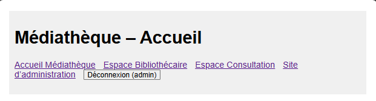  
    > L'accès au menu **Espace Bibliothécaire** génère un refus d'accès.  
  Cet affichage est maintenu pour permettre de constater le fonctionnement ; le menu sera masqué pour une situation 
  opérationnelle.
- la consultation des supports (médias) consultables.
  - 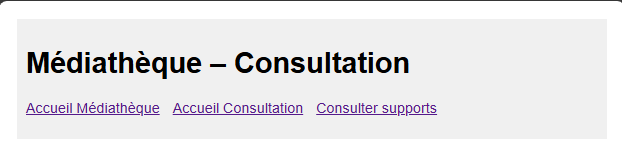

##### 4.4.4.2 Menus accessibles pour BibGestion (GESTION) et BibAdmin (ADMIN)
Les rôles ADMIN et GESTION sont des rôles de Bibliothécaire de la médiathèque. L'application qui leur est dédiée est le 
site **bibliothecaire**. Il leur est possible d'accéder à :
- l'accueil de la médiathèque.
  - 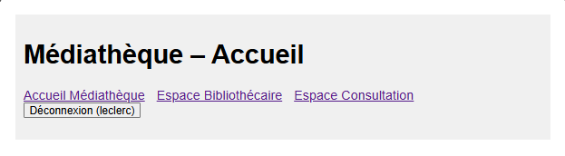
- la gestion de la bibliothèque.
  - Pour un Bibliothecaire gestionnaire (GESTION)
    - 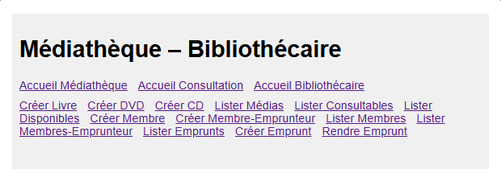
  - Pour un Bibliothécaire administrateur (ADMIN) fonctionnel
    - 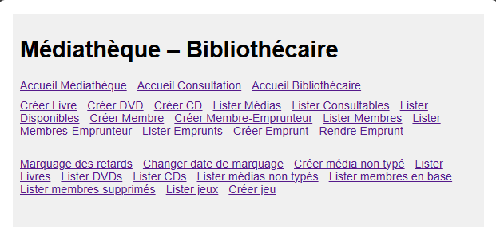
- la consultation des supports (médias) consultables.
  - 

##### 4.4.4.3 menus accessibles  pour MEMBRE (anonyme)
Le rôle de MEMBRE (ou anonyme) est le rôle par défaut si l'utilisateur ne se connecte pas. Il lui est possible d'accéder 
à :
- l'accueil de la médiathèque.
  - 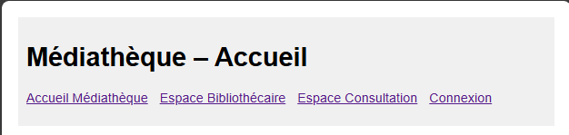
    > L'accès au menu **Espace Bibliothécaire** génère un refus d'accès.  
  Cet affichage est maintenu pour permettre de constater le fonctionnement ; le menu sera masqué pour une situation 
  opérationnelle.
- la consultation des supports (médias) consultables.
  - 

---

## 5. Qualité du code et stratégie de tests

### 5.1 Logs et monitorage

La qualité du code passe par une traçabilité rigoureuse des actions critiques. Le projet Médiathèque intègre une 
configuration avancée du module `LOGGING` de Django, permettant de journaliser les événements techniques et métier dans 
deux fichiers distincts :

- `mediatheque.log` : journal des événements en production.
- `mediatheque_test.log` : journal des événements déclenchés lors des tests.

La configuration inclut :
- des handlers console et fichier,
- une détection automatique du mode test,
- des balises explicites (`[LOGIN]`, `[LOGOUT]`, `[ACCESS_GRANTED]`, `[ACCESS_DENIED]`, `[EmpruntCreate]`, etc.),
- une rotation des fichiers prévue pour les livraisons futures.

Les logs sont utilisés comme **outil de validation** dans les tests fonctionnels, notamment les UC‑LOGS (`T‑LOG‑01` à 
`T‑LOG‑48`), qui vérifient que chaque action métier déclenche bien une trace identifiable (trace **Particulière**).

---

#### 5.1.1 Tableau des fonctions tracées par logs

Le tableau ci-dessous recense les fonctions de l’application qui déclenchent une trace métier ou technique.  
Il distingue les fonctions de **gestion** (demandées dans le sujet) et les fonctions **techniques** (nécessaires à la 
cohérence du projet).  
La colonne “Logs” indique si une balise spécifique est attendue (`P`) ou si la trace est implicite via l’URL.

✅ = log intégré et validé dans les tests UC‑LOGS.

| Id | Application    | Fonction                         |    Entité    | Route                                              | Fonction  | Logs |   Etat    |
|----|----------------|----------------------------------|:------------:|----------------------------------------------------|:---------:|:----:|:---------:|
| 1  | médiathèque    | accueil médiathèque              |   __app__    | accounts:accueil                                   |           |      |           |
| 2  | médiathèque    | espace bibliothécaire            |   __app__    | bibliothecaire:accueil                             |           |      |           |
| 3  | médiathèque    | espace consultation              |   __app__    | consultation:accueil                               |           |      |           |
| 4  | médiathèque    | espace administration            |   __app__    | admin:index                                        |           |      |           |
| 5  | médiathèque    | connexion                        |     User     | accounts:login                                     |  Gestion  |  P   | ✅ intégré |
| 6  | médiathèque    | déconnexion                      |     User     | accounts:logout                                    |  Gestion  |  P   | ✅ intégré |
| 7  | bibliothecaire | accueil médiathèque              |   __app__    | accounts:accueil                                   |           |      |           |
| 8  | bibliothecaire | accueil bibliothécaire           |   __app__    | bibliothecaire:accueil                             |           |      |           |
| 9  | bibliothecaire | accueil consultation             |   __app__    | consultation:accueil                               |           |      |           |
| 10 | bibliothecaire | changer date marquage            |  __system__  | bibliothecaire:rejeu_reset_retard_session          | Technique |  P   | ✅ intégré |
| 11 | bibliothecaire | créer média                      |    Media     | bibliothecaire:media_create                        | Technique |  P   | ✅ intégré |
| 12 | bibliothecaire | lister consultables              |    Media     | bibliothecaire:media_list_consultables             |           |      |           |
| 13 | bibliothecaire | lister disponibles               |    Media     | bibliothecaire:media_list_disponibles              |           |      |           |
| 14 | bibliothecaire | lister médias                    |    Media     | bibliothecaire:media_list                          |           |      |           |
| 15 | bibliothecaire | lister médias non typés          |    Media     | bibliothecaire:media_list_by_type ?type=NON_DEFINI |           |      |           |
| 16 | bibliothecaire | modifier un média                |    Media     | bibliothecaire:media_update                        | Technique |  P   | ✅ intégré |
| 17 | bibliothecaire | détailler un média               |    Media     | bibliothecaire:media_detail                        |           |      |           |
| 18 | bibliothecaire | créer Livre                      |    Livre     | bibliothecaire:media_create_livre                  |  Gestion  |  P   | ✅ intégré |
| 19 | bibliothecaire | lister Livres                    |    Livre     | bibliothecaire:media_list_by_type ?type=LIVRE      |           |      |           |
| 20 | bibliothecaire | modifier un média en Livre       |    Livre     | bibliothecaire:media_typage_livre                  | Technique |  P   | ✅ intégré |
| 21 | bibliothecaire | modifier un Livre                |    Livre     | bibliothecaire:media_update_livre                  |  Gestion  |  P   | ✅ intégré |
| 22 | bibliothecaire | détailler un membre              |    Livre     | bibliothecaire:membre_detail                       |           |      |           |
| 23 | bibliothecaire | créer DVD                        |     Dvd      | bibliothecaire:media_create_dvd                    |  Gestion  |  P   | ✅ intégré |
| 24 | bibliothecaire | lister DVD                       |     Dvd      | bibliothecaire:media_list_by_type ?type=DVD        |           |      |           |
| 25 | bibliothecaire | modifier un média en DVD         |     Dvd      | bibliothecaire:media_typage_dvd                    |           |      |           |
| 26 | bibliothecaire | modifier un DVD                  |     Dvd      | bibliothecaire:media_update_dvd                    |           |      |           |
| 27 | bibliothecaire | créer CD                         |      Cd      | bibliothecaire:media_create_cd                     |  Gestion  |  P   | ✅ intégré |
| 28 | bibliothecaire | lister CD                        |      Cd      | bibliothecaire:media_list_by_type ?type=CD         |           |      |           |
| 29 | bibliothecaire | modifier un média en CD          |      Cd      | bibliothecaire:media_typage_cd                     |           |      |           |
| 30 | bibliothecaire | modifier un CD                   |      Cd      | bibliothecaire:media_update_cd                     |           |      |           |
| 31 | bibliothecaire | créer membre                     |    Membre    | bibliothecaire:membre_create                       |  Gestion  |  P   | ✅ intégré |
| 32 | bibliothecaire | créer emprunteur                 |    Membre    | bibliothecaire:membre_create_emprunteur            |  Gestion  |  P   | ✅ intégré |
| 33 | bibliothecaire | lister membres en gestion        |    Membre    | bibliothecaire:membre_list_gestion                 |           |      |           |
| 34 | bibliothecaire | lister membres emprunteurs       |    Membre    | bibliothecaire:membre_list_emprunteurs             |           |      |           |
| 35 | bibliothecaire | lister membres supprimés         |    Membre    | bibliothecaire:membre_list_archives                |           |      |           |
| 36 | bibliothecaire | lister membres                   |    Membre    | bibliothecaire:membre_list                         |           |      |           |
| 37 | bibliothecaire | modifier un membre               |    Membre    | bibliothecaire:membre_update                       |  Gestion  |  P   | ✅ intégré |
| 38 | bibliothecaire | activer membre emprunteur        |    Membre    | bibliothecaire:membre_activate_emprunteur          |  Gestion  |  P   | ✅ intégré |
| 39 | bibliothecaire | marquage des retards             |   Emprunt    | bibliothecaire:emprunt_retard                      |           |      |           |
| 40 | bibliothecaire | lister emprunts                  |   Emprunt    | bibliothecaire:emprunt_list                        |           |      |           |
| 41 | bibliothecaire | créer emprunt                    |   Emprunt    | bibliothecaire:emprunt_create                      |  Gestion  |  P   | ✅ intégré |
| 42 | bibliothecaire | rendre emprunt                   |   Emprunt    | bibliothecaire:emprunt_rendre                      |  Gestion  |  P   | ✅ intégré |
| 43 | bibliothecaire | emprunter un média               |   Emprunt    | bibliothecaire:media_emprunter                     |  Gestion  |  P   | ✅ intégré |
| 44 | bibliothecaire | rendre un  média                 |   Emprunt    | bibliothecaire:media_rendre                        |  Gestion  |  P   | ✅ intégré |
| 45 | bibliothecaire | créer un emprunt pour un membre  |   Emprunt    | bibliothecaire:membre_emprunter                    |  Gestion  |  P   | ✅ intégré |
| 46 | bibliothecaire | rendre un emprunt pour un membre |   Emprunt    | bibliothecaire:membre_rendre                       |  Gestion  |  P   | ✅ intégré |
| 47 | bibliothecaire | lister jeux                      | JeuDePlateau | bibliothecaire:jeu_list                            |           |      |           |
| 48 | bibliothecaire | créer jeux                       | JeuDePlateau | bibliothecaire:jeu_create                          | Technique |  P   | ✅ intégré |
| 49 | bibliothecaire | détailler un jeu                 | JeuDePlateau | bibliothecaire:jeu_detail                          |           |      |           |
| 50 | consultation   | accueil médiathèque              |   __app__    | accounts:accueil                                   |           |      |           |
| 51 | consultation   | accueil consultation             |   __app__    | consultation:accueil                               |           |      |           |
| 52 | consultation   | consulter supports               |   Support    | consultation:supports                              |           |      |           |

> Tableau est trié avec l'ordre de tri suivant :
>  - Application: médiathèque, bibliothecaire, consultation.
>  - Entité (au sein de chaque application): __app__, __system__, User, Media, Livre, Dvd, Cd, Membre, Emprunt, 
  JeuDePlateau, Support.

> La colonne :
>  - **Fonction** précise si la fonction est de gestion (demandée dans le sujet) ou technique (nécessaire pour la 
> cohérence technique).
>  - **Logs** précise si la trace doit être particulière (P) ou si elle est tracée par l'URl (vide).

---

### 5.2 Tests unitaires Django

Chaque fonctionnalité métier est couverte par au moins un test unitaire.  
Les tests sont organisés par blocs (`accounts`, `bibliothecaire`, `consultation`) et par type (`tests.py`, `tests_blocs`, 
`tests_uc_logs.py`).  
Les tests UC‑LOGS ont été ajoutés dans le fichier `test_uc_logs.py` et couvrent les 21 balises métier attendues (P) pour 
les 52 fonctions recensées..

- **198 tests validés** au total.  
- Couverture exhaustive des cas critiques (connexion, création, modification, retour, activation…).  
- Utilisation de fixtures et de créations dynamiques pour garantir la validité métier.

---

### 5.3 Exécution automatisée des tests

Les tests sont exécutables via la commande Django standard :

```bash
python manage.py test
```

Le fichier `devReport.md` permettant de visualiser les résultats des tests et des traces est obtenu avec une redirection 
des sorties de la console à partir de la commande Django :

```bash
python manage.py test > devReport.md 2>&1 -v 2 
```

La configuration détecte automatiquement le mode test et bascule sur le fichier `mediatheque_test.log`.  
Les logs sont lus en fin de test pour valider la présence des balises attendues.  

---

## 6. Base de données et données de test

Cette section présente la configuration de la base de données, les migrations effectuées à partir des modèles Django, 
les jeux de données utilisés pour les tests, ainsi que des exemples d’insertion et de requêtes de vérification.

---

### 6.1 Schéma des modèles et migration

La base de données utilisée est une base SQLite, configurée dans le fichier `settings.py` du projet Django.  
Les modèles sont définis dans les fichiers `models.py` des applications `bibliothecaire` et `consultation`.

Les migrations ont été générées et appliquées via les commandes suivantes :

```bash
python manage.py makemigrations
python manage.py migrate
```

Le schéma relationnel repose sur une hiérarchie orientée objet, avec héritage multi-table :

```text
Support
├── Media
│   ├── Livre
│   ├── Dvd
│   └── Cd
└── JeuDePlateau

Utilisateur
├── Membre
└── Bibliothecaire

Emprunt
```

Chaque entité possède ses propres champs, propriétés et méthodes métier.  
Les relations sont gérées par des clés étrangères (`ForeignKey`) et des héritages Django (`models.Model`, 
`models.AbstractBaseUser`, etc.).

---

### 6.2 Jeu de données via fixtures ou script

Des jeux de données ont été préparés pour les tests fonctionnels et les démonstrations.  
Ils sont stockés dans le dossier `/fixtures/` et organisés par thème :

| Fichier fixture             | Contenu chargé                                  |
|-----------------------------|-------------------------------------------------|
| `membres_test.json`         | Membres de test (statuts variés)                |
| `medias_test.json`          | Livres, DVDs, CDs, jeux de plateau              |
| `emprunts_test.json`        | Emprunts en cours, retours, retards             |
| `jeux_test.json`            | Jeux de plateau                                 |
| `/scenarii/scenar_01/`      | Scénarios de fichiers json gestion des emprunts |
| `users_test.json`           | Comptes utilisateurs pour l’authentification    |
| `bibliothecaires_test.json` | Bibliothécaire (BibGestion et BibAdmin)         |
| `superuser.json`            | SuperUser de la base                            |

Les fixtures sont chargées avec la commande :

```bash
python manage.py loaddata membres.json medias.json emprunts.json
```

> 📌 Ces données permettent de valider les cas d’usage métier, de simuler des scénarios réalistes, et de garantir la 
> reproductibilité des tests.
>
> 📌 Ces fixtures sont regroupés pour créer des scénarios dans le dossier `/fixtures/scenarii/`. Le scénario `scenar_01` 
> permet de définir une **situation initiale à partir d'une base vide** en créant un utilisateur (`superuser`) des données 
> _membres-médias_ et des _emprunts_.
>
> > 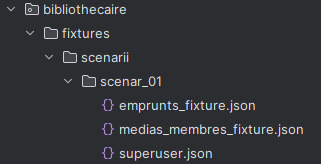
> > 
> > Les fixtures du scénario sont chargés avec la commande :
> >
> > ```bash
> > python manage.py loaddata scenarii/scenar_01/medias_membres_fixture.json scenarii/scenar_01/emprunts_fixture.json
> > ```
>

---

### 6.3 Exemple d’insertion et requêtes de vérification

Voici un exemple d’insertion manuelle d’un membre et d’un média via le shell Django :

```python
from bibliothecaire.models import Membre, Livre, StatutMembre

membre = Membre.objects.create(name="Alice", statut=StatutMembre.EMPRUNTEUR)
print(membre)
livre = Livre.objects.create(name="Merlin", theme="Conte", disponible=True, consultable=True, media_type="LIVRE", auteur="Légende", resume="Enchanteur")
print(livre)
media=livre.media_ptr
print(media)
```

Création d’un emprunt :

```python
from bibliothecaire.models import Emprunt

print("Création de l'emprunt :")
emprunt = Emprunt.objects.create(emprunteur=membre, media=media)
media.disponible = False
print("Etats après la création de l'emprunt :")
print(emprunt)
print(membre)
print(media)
Print("Rendu de l'emprunt :")
emprunt.enregistrer_retour()
print("Etats après le rendu de l'emprunt")
print(emprunt)
print(membre)
print(media)

```

Requête de vérification :

```python
# Vérifier si le membre peut emprunter
membre.peut_emprunter()  # → True ou False selon les règles métier

# Vérifier si le média est empruntable
media.est_empruntable   # → True ou False

# Vérifier si l'emprunt est en retard
emprunt.est_en_retard   # → True ou False
```

---

## 7. Mode d’installation et d’exécution

### 7.1 Prérequis

- Python 3.13.7
- pip 25.2
- Environnement virtuel (`venv`)
- Django 5.2.6

Ces versions précises garantissent la reproductibilité et la compatibilité du projet.

### 7.2 Commandes pas à pas

Cette procédure est destinée à toute personne souhaitant tester le projet localement à partir du dépôt GitHub. L'annexe 
D présente une vue complète des commandes à mener pour l'installation.

Elle permet de :

- Cloner le dépôt contenant le projet
- Activer l’environnement virtuel préconfiguré
- Lancer l’application Django en local
- Configurer l'éditeur (EDI PyCharm ou Visual Studio Code) 

> ℹ️ **Nom du dépôt** : `CEF_POO-Django_Gestion-Mediatheque_Test-version`  
> Ce dépôt contient l’ensemble du projet, y compris le code source, la documentation et les livrables.

> 📁 **Dossier `works/`** : contient le code source et l’environnement virtuel  
> └── `mediatheque/` : dossier du projet Django (avec `manage.py`, `db.sqlite3`, etc.)  
> └── `venv/` : environnement virtuel Python contenant Django et les dépendances

> ⚠️ **Port utilisé** : le serveur Django est lancé sur le port `8900`, car le port `8000` est occupé par Apache sur le 
> poste de développement.

#### 7.2.1 📦 Étapes communes

1. Cloner le dépôt GitHub :

   ```bash
   git clone https://github.com/MonLucCo/CEF_POO-Django_Gestion-Mediatheque_Test-version.git
   cd CEF_POO-Django_Gestion-Mediatheque_Test-version
   ```

2. Se placer dans le dossier de travail :

   ```bash
   cd works
   ```

#### 7.2.2 📦 Étapes spécifiques à un système d'exploitation

1. 🪟 Sous Windows

    ```bash
    # Activer l’environnement virtuel
    venv\Scripts\activate
    
    # Vérifier que Django est bien installé
    python -m django --version
    
    # Se placer dans le projet Django
    cd mediatheque
    
    # Lancer le serveur
    python manage.py runserver
    ```

2. 🐧 Sous Unix/macOS

    ```bash
    # Activer l’environnement virtuel
    rapport venv/bin/activate
    
    # Vérifier que Django est bien installé
    python3 -m django --version
    
    # Se placer dans le projet Django
    cd mediatheque
    
    # Lancer le serveur
    python3 manage.py runserver
    ```

> ✅ Une fois le serveur lancé, l’application est accessible à l’adresse : [http://127.0.0.1:8000](http://127.0.0.1:8000)

> ℹ️ **Note** : Si le port 8000 est déjà utilisé (par exemple par Apache), vous pouvez spécifier un autre port lors du 
> lancement :  
> `python manage.py runserver 127.0.0.1:8900`  
> L’application sera alors accessible via [http://127.0.0.1:8900](http://127.0.0.1:8900)


#### 7.2.3 📦 Étapes spécifiques à la configuration de l'environnement de développement (EDI)

Il est nécessaire de configurer l'EDI lors de l'utilisation d'un environnement virtuel pour que l'interpréteur Python 
fonctionne correctement.
Cette configuration ne concerne que l'interpréteur de l'EDI et permet notamment :
- l'exécution directe des scripts Django (`manage.py`)
- l'autocomplétion des modules installés
- la reconnaissance des templates et des blocs dans les fichiers `.html`.

### 7.3 URL d'accès et description des interfaces

Une fois le serveur lancé, l’URL d’accès est :

- [http://127.0.0.1:8900](http://127.0.0.1:8900)
- [http://127.0.0.1:8900/accueil/](http://127.0.0.1:8900/accueil/).

La page d’accueil affiche le contenu du template `accueil.html`, situé dans `accounts/templates/accounts/`. 


Ce fichier doit être personnalisé pour refléter l’identité visuelle du projet ou proposer des liens vers les 
applications _métier_.

#### 7.3.1 Interface minimale après initialisation

La première version de l’interface est volontairement épurée. Elle permet de valider :

- Le bon fonctionnement du routage
- La résolution correcte du template
- L’affichage du contenu HTML statique

|                          |
|:------------------------------------------------------------------------------------------------------------------:|
| *Figure 1 – Affichage (version initiale - Issue #2) du template `accueil.html` après lancement du serveur Django.* |

> Cette capture montre l’état initial de l’interface après exécution de `python manage.py runserver`.

#### 7.3.2 Interface enrichie (à venir)

Les prochaines issues (#3 et #4) introduiront :

- Des liens vers les applications métier
- Des blocs dynamiques selon le rôle utilisateur
- Une navigation cohérente entre les vues

#### 7.3.3 Interface métier (prévision)

L’interface finale proposera :

- Une page d’accueil personnalisée selon le profil (bibliothécaire ou membre)
- Des accès sécurisés via authentification (issue #5)
- Une navigation entre les modules fonctionnels

---

## 8. Démarche de travail et traçabilité

### 8.1 Traçabilité du développement : GitHub et main-courante technique

La traçabilité du projet repose sur un double dispositif :

- **GitHub** : utilisé pour la gestion des issues (#1 à #7, #12), des branches de développement (`update-technical`, 
- `update-report`, etc.), des commits et des Pull Requests.  
  Chaque étape du projet est associée à une issue dédiée, assurant une traçabilité fine des tâches réalisées.

- **Main-courante technique (`devMC.md`)** : document interne structurant les travaux de développement.  
  Elle a été initialement rédigée en index (bloc H-11), puis enrichie au fil du développement pour suivre les décisions 
techniques, les difficultés rencontrées et les arbitrages méthodologiques.  
  Elle complète GitHub en apportant une vision métier, pédagogique et réflexive du développement fonctionnel.

> 📌 Cette approche combinée permet de documenter à la fois les actions techniques (via GitHub) et les choix 
> structurants (via la main-courante), tout en assurant une cohérence entre le code, les tests et la documentation.

---

#### 8.1.1 Workflow GitHub

Le projet utilise GitHub pour assurer la traçabilité du développement et la séparation entre les tâches techniques et la 
rédaction du rapport.

Le workflow adopté repose sur les principes suivants :
- Une branche principale : `main`
- Des branches de travail nommées selon le schéma :  
  - `MonLucCo/issue[n]/update-technical` pour les développements techniques  
  - `MonLucCo/issue[n]/update-report` pour la rédaction du rapport
  - `MonLucCo/isue[n]/[dénomination-spécifique]` pour des tâches spécifiques
- Chaque issue GitHub (#1 à #7, #12) correspond à une étape du projet
- Les branches sont fusionnées via des `Pull Requests` (PR), puis supprimées une fois validées

> ℹ️ **Note** : Ce workflow n’a pas été appliqué dès le début du projet.  
> Lors du traitement de l’issue #1, l’organisation des branches a évolué progressivement, en parallèle de la prise en 
> main de l’interface de l’EDI PyCharm.  
> Certaines premières branches ne respectent pas entièrement la convention de nommage, ce qui reflète une phase 
> d’apprentissage et d’ajustement.

Ce processus garantit une traçabilité claire entre les tâches, les commits, les issues et les livrables, tout en 
facilitant les revues de code et la rédaction du rapport.

> ⚠️ **Remarque** : Une branche dédiée à la mise à jour documentaire a été créée pour l’issue #12 : 
> `MonLucCo/issue12/update-documentation`. Cette branche regroupe les modifications du README 
> `/docs/developpement`, du plan du rapport et des titres d’issues. Elle illustre l’importance d’un travail préparatoire 
> structuré avant le développement technique.

---

#### 8.1.2 Principe de la main-courante technique

La main-courante technique (`devMC.md`) constitue un document structurant du projet, conçu pour assurer la traçabilité 
fine des développements réalisés dans le cadre des issues #1 à #3. Elle devient un document transverse et commun à 
tout le projet pour les issues restantes (Issues #4 à issue #7).

Elle a été initialement rédigée sous forme **indexée**, avec des blocs numérotés (`H-01` à `H-11`) correspondant aux 
étapes clés du développement fonctionnel de l’application `bibliothecaire`.  
Chaque bloc indexé documente une action technique, une décision structurante ou une difficulté rencontrée, en lien 
direct avec les fichiers du projet et les tests associés.

À partir de l’issue #3, la main-courante a évolué pour devenir un **document de suivi technique généralisé**, couvrant :

- les entités métier (`Membre`, `Media`, `Emprunt`, `Retour`)
- les vues et formulaires associés
- les transitions métier et les règles d’usage
- les tests unitaires et fonctionnels
- les fixtures et scenarii de validation
- les difficultés techniques et les arbitrages méthodologiques

> 📌 Ce document est maintenu dans le dossier `/docs/developpement/dev-docs/` et mis à jour à chaque étape du 
> développement.  
> Il complète les commits GitHub en apportant une vision métier, pédagogique et réflexive du projet.

La main-courante permet ainsi :
- de **formaliser les choix techniques** au fil du développement
- de **documenter les écarts et les ajustements** par rapport au sujet initial
- de **préparer la rédaction du rapport** en structurant les sections techniques
- de **faciliter la relecture et l’évaluation** du projet par un tiers

Elle constitue un outil central de traçabilité, complémentaire au workflow GitHub, et sera poursuivie jusqu’à la clôture 
de l’issue #7.

---

### 8.2 Table de traçabilité – Issues, fichiers, tests et livrables

Cette table synthétise la correspondance entre les **issues GitHub**, les **fichiers développés**, les **tests 
réalisés** et les **documents livrés**.  
Elle permet de visualiser rapidement l’état d’avancement, la couverture fonctionnelle et la cohérence entre les 
artefacts du projet.

| Issue GitHub | Objectif fonctionnel                     | Fichiers principaux développés                      | Tests associés                         | Livrables documentés                                       |
|--------------|------------------------------------------|-----------------------------------------------------|----------------------------------------|------------------------------------------------------------|
| #1           | Préparation de l’environnement           | `venv/`, `requirements.txt`, `README-tech.md`       | —                                      | `rapport-projet.md`, `README-tech.md`                      |
| #2           | Initialisation du projet Django          | `manage.py`, `settings.py`, `urls.py`, `accounts/`  | Test de lancement projet               | `devMC.md`, `rapport-projet.md`                            |
| #3           | Application fonctionnelle bibliothécaire | `models.py`, `views.py`, `forms.py`, `templates/`   | `tests_blocs/`, shell Django, fixtures | `devMC.md`, `devTests.md`, `Analyse_Fonctionnalites.md`    |
| #4           | Application fonctionnelle consultation   | `views.py`, `templates/consultation/`               | À venir                                | `README-fonct.md` (prévision)                              |
| #5           | Authentification et sécurité             | `accounts/models.py`, `login.html`, `middleware.py` | À venir                                | `README-auth.md` (prévision)                               |
| #6           | Tests et validation                      | `tests_blocs/`, `fixtures/*.json`, `devReport.txt`  | `python manage.py test`                | `devTests.md`, `devFixtures.md`                            |
| #7           | Rapport final et livraison               | `rapport-projet.md`, `rapport-projet.pdf`           | —                                      | `rapport-projet.md`, `rapport-projet.pdf`                  |
| #12          | Réorganisation documentaire              | `README-tech.md`, `devMC.md`, `plan-rapport.md`     | —                                      | `devMC.md`, `README-tech.md`, `Analyse_Fonctionnalites.md` |

> 📌 Chaque ligne correspond à une unité de travail traçable dans GitHub, associée à des fichiers techniques, des tests 
> et des documents de synthèse.  
> Cette table permet de vérifier la cohérence entre les développements, les validations et la documentation livrée.

---

### 8.3 Difficultés rencontrées et leçons apprises

Au cours du projet, plusieurs difficultés majeures ont été rencontrées. Elles ont permis de clarifier la méthodologie, 
d’améliorer la configuration technique et de renforcer la cohérence documentaire.  
Le détail complet des difficultés et des décisions associées est conservé dans **l’Annexe F – Main‑courante technique**.  

Ce projet a été mené dans une démarche complète documentaire, technique et de recherche pour :
- réaliser le sujet demandé de gestion d'une médiathèque (ensemble des fonctionnalités primordiales).
- apprendre et maîtriser le framework Django (recherche documentaire et réalisation de fonctionnalités complémentaires).
- préparer la mise en place d'un projet complet à soutenir (organisation, documentation technique et versionnage GitHub).
- disposer d'une ressource technique complète pour de futurs développements.

L'annexe F constitue une **recopie intégrale** d'une partie de la main-courante qui peut servir de support pour suivre 
les difficultés, les successions de points de blocage avec une historisation très fine. Les sections ci-après n'expriment 
qu'une synthèse très succincte d'un projet très riche en difficulté et en sources d'apprentissage.

---

#### 8.3.1 Plan de développement et organisation
La première difficulté est apparue lors de l’issue #2, avec une incohérence dans le plan initial.  
La réorganisation des issues (#12) a permis de distinguer clairement :
- une couche centrale d’authentification (`mediatheque`),
- deux applications métier (`bibliothecaire` et `consultation`).

Cette clarification a facilité la planification, la cohérence du code et la rédaction du rapport.

---

#### 8.3.2 Configuration de l’EDI
Une difficulté est survenue lors du développement de l’application `accounts`, avec des modules Django non reconnus 
dans l’éditeur (PyCharm).  
La résolution a nécessité une meilleure configuration de l’EDI pour pointer vers l’environnement virtuel Python.  
Cela a permis de bénéficier pleinement de l’autocomplétion, de la navigation dans les templates et des suggestions de 
code.

---

#### 8.3.3 Résolution des templates
Une erreur 404 a révélé une mauvaise organisation des dossiers `templates`.  
L’adoption de la convention `app/templates/app/template.html` a résolu le problème et assuré une résolution fiable des 
templates par Django.  
Cette étape a renforcé la compréhension des bonnes pratiques et la robustesse de l’architecture.

---

#### 8.3.4 Authentification et sécurité
La mise en place des rôles et des accès restreints a nécessité plusieurs ajustements :
- création d’une classe de tests commune (`LoginRequiredTestCase`),
- distinction entre login technique et login via les vues réelles,
- gestion des refus d’accès avec une page dédiée `403.html`.

Ces choix ont permis de valider les UC‑SECURITE et d’assurer une traçabilité fiable.

---

#### 8.3.5 Gestion des logs
L’intégration des logs applicatifs a soulevé deux points :
- la nécessité de séparer les fichiers opérationnels (`mediatheque.log`) et de tests (`mediatheque_test.log`),
- l’importance de passer par les vraies vues pour déclencher les écritures.

Les UC‑LOGS ont confirmé la validité de cette approche. Les niveaux supérieurs (rotation, segmentation, supervision) sont 
documentés, mais non livrés.

---

> 📌 Pour le détail complet des difficultés, des décisions et des arbitrages techniques, voir **Annexe F – Main‑courante 
> technique et difficultés**.
> 
> En résumé, ces difficultés ont constitué autant de jalons d’apprentissage que de validations techniques.  
> 
> Elles ont permis de renforcer la cohérence du projet, d’améliorer la qualité du code et de la documentation, et de 
me préparer à de futurs projets qui nécessiteront une soutenance structurée.  
> La main‑courante (Annexe F) conserve le détail exhaustif, tandis que cette section met en avant les enseignements clés.

---

## 9. Conclusion et perspectives

### 9.1 Bilan des compétences acquises

Le projet Médiathèque a permis de consolider plusieurs compétences techniques et méthodologiques :

- **Programmation orientée objet (POO)** : mise en place d’une hiérarchie claire des classes (Media, Livre, DVD, CD, 
- JeuDePlateau) et séparation en modules Django (`models.py`, `views.py`, `urls.py`, `tests.py`).
- **Architecture Django** : structuration des applications (`accounts`, `bibliothecaire`, `consultation`), gestion des 
- rôles et des permissions, intégration des logs.
- **Traçabilité et qualité logicielle** : configuration avancée du module `LOGGING`, séparation des journaux 
- (`mediatheque.log` / `mediatheque_test.log`), validation par 198 tests automatisés.
- **Tests unitaires et fonctionnels** : couverture exhaustive des cas critiques (connexion, création, modification, 
- emprunt, retour, activation), intégration des UC‑LOGS et UC‑SECURITE.
- **Documentation et transmission** : rédaction structurée du rapport, mise en place des annexes (logs, diagrammes, 
- arborescence), harmonisation des fichiers techniques (`devReport.md`, `devTests.md`, `devAFBib.md`, `devMC.md`).

### 9.2 Améliorations futures

Plusieurs pistes d’évolution ont été identifiées pour enrichir et pérenniser le projet :

- **Webservices et API REST** : ouverture des fonctionnalités de la médiathèque à des clients externes (applications 
mobiles, intégrations tierces).
- **Asynchronisme et performance** : optimisation des emprunts et retours via des tâches asynchrones (Celery, Django 
Channels).
- **Interface utilisateur (UI/UX)** : amélioration de l’ergonomie des menus, ajout de tableaux de bord pour les 
bibliothécaires, personnalisation des vues pour les membres.
- **Internationalisation (i18n)** : traduction des interfaces et adaptation aux contextes multilingues.
- **Supervision et monitoring** : intégration avec des solutions de supervision (ELK, Graylog, Sentry) pour une 
traçabilité en production.
- **Sécurité renforcée** : gestion fine des rôles et permissions, audit des accès, rotation des logs et politique de 
conservation.

### 9.3 Bilan sur la démarche et le recul acquis

Lorsque j’ai commencé ce projet, je n’avais aucune connaissance préalable de Python, ni de Django. J’ai abordé chaque 
étape avec une logique exploratoire, en m’appuyant sur la documentation, les erreurs rencontrées et les ajustements 
progressifs.  

Les premières implémentations étaient souvent verbeuses, parfois redondantes, mais elles m’ont permis de comprendre en 
profondeur les mécanismes du framework. Pour arriver à mieux comprendre les points abordés et pouvoir en retirer un 
profit durable, ces travaux me conduisaient fréquemment à largement dépasser le périmètre du sujet proposé. Le résultat 
se traduit dans les deux profils de Bibliothécaire pour lesquels le `BibGestion` correspond au périmètre du sujet et 
`BibAdmin` à l'ensemble de tous les sujets abordés. 

Au fil du développement, j’ai acquis une vision plus structurée : j’ai appris à isoler les responsabilités, à anticiper 
les effets de bord, à formaliser les règles métier dans des méthodes dédiées, et à concevoir des tests fonctionnels qui 
valident non seulement le comportement technique, mais aussi les intentions métier. J’ai également pris conscience de 
l’importance de la documentation, non comme une trace passive, mais comme un outil actif de transmission, de 
clarification et de synthèse.  

Ce recul m’a permis de simplifier des blocs de code, de rendre les vues plus lisibles, de structurer les tests par 
usage métier, et de mieux distinguer ce qui relève de la logique technique, de l’UX, ou du cycle de vie fonctionnel. 
Aujourd’hui, je suis capable de relire mes premières contributions avec un regard critique, non pour les rejeter, mais 
pour mesurer le chemin parcouru.  

Ce projet a été pour moi un véritable terrain d’apprentissage, de structuration et de montée en compétence. Il m’a 
permis de passer d’une approche intuitive à une démarche architecturale, où chaque choix est motivé, documenté et validé.

---

### 9.4 Synthèse générale et conclusion

Le projet Médiathèque atteint son objectif pédagogique : démontrer la mise en œuvre d’une application Django complète, 
robuste et traçable.  
La validation des **198 tests** et l’intégration des **UC‑LOGS** garantissent la qualité et la fiabilité du code.  
La documentation produite (rapport, annexes, matrices d’accès et de logs) assure une transmission claire et exploitable 
pour la soutenance et pour de futurs contributeurs.  

Ce socle technique et documentaire ouvre la voie à la **livraison finale**, ainsi qu'à une évolution vers une 
application professionnelle, extensible et maintenable.

---

## Annexes

- [Annexe A – Extraits de code clés](rapport-projet_annexe-a.md)
- [Annexe B - Logs d’exécution et de tests](rapport-projet_annexe-b.md)
- [Annexe C - Diagrammes (UML, séquence)](rapport-projet_annexe-c.md)
- [Annexe D – Arborescence du projet](rapport-projet_annexe-d.md)
- [Annexe E - Installation Projet et configuration de l'EDI](rapport-projet_annexe-e.md)
- [Annexe F – Main‑courante technique et difficultés](rapport-projet_annexe-f.md)
