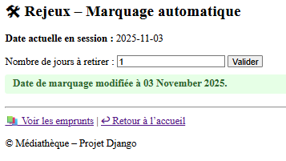
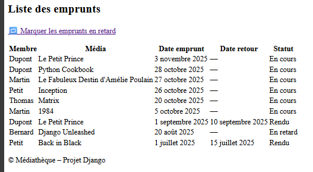
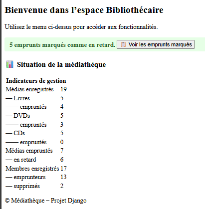
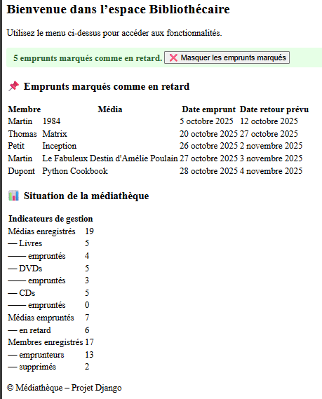

# 📘 Analyse des fonctionnalités – Bibliothécaire

📁 `/docs/developpement/dev-docs/devAFBib.md`  
📌 Version : index J-1 (issue #4 – Bloc 4 - task 1)

---

## Sommaire

- [1. Objectif du document](#1-objectif-du-document)
- [2. Synthèse des fonctions demandées](#2-synthèse-des-fonctions-demandées)
- [3. Description des fonctionnalités](#3-description-des-fonctionnalités)
  - [3.1 Médias – Fonctionnalités associées directement](#31-médias--fonctionnalités-associées-directement)
    - [3.1.1 Fonctionnalités primordiales – Cas d’usage MEDIA-UC-LIST et MEDIA-UC-CREATE](#311-fonctionnalités-primordiales--cas-dusage-media-uc-list-et-media-uc-create)
      - [3.1.1.1 Cas d’usage MEDIA-UC-LIST – Affichage de la liste des médias](#3111-cas-dusage-media-uc-list--affichage-de-la-liste-des-médias)
      - [3.1.1.2 Cas d’usage MEDIA-UC-CREATE – Création d’un média](#3112-cas-dusage-uc-create--création-dun-média)
    - [3.1.2 Fonctionnalités souhaitables – Cas d’usage MEDIA-UC-UPDATE et MEDIA-UC-TYPAGE](#312-fonctionnalités-souhaitables--cas-dusage-media-uc-update-et-media-uc-typage)
      - [3.1.2.1 Cas d’usage MEDIA-UC-UPDATE et MEDIA-UC-TYPAGE – Mise à jour et transformation](#3121-cas-dusage-uc-update-et-uc-typage--mise-à-jour-et-transformation-dun-média)
      - [3.1.2.2 Cas d’usage MEDIA-UC-DELETE – Masquer un média](#3122-cas-dusage-uc-delete--masquer-un-média-sans-suppression-physique)
  - [3.2 Membres – Fonctionnalités associées directement](#32-membres--fonctionnalités-associées-directement)
    - [3.2.1 Fonctionnalités primordiales – Cas d’usage MEMBRE-UC-LIST, MEMBRE-UC-CREATE, MEMBRE-UC-UPDATE et MEMBRE-UC-DELETE](#321-fonctionnalités-primordiales--cas-dusage-membre-uc-list-membre-uc-create-membre-uc-update-et-membre-uc-delete)
      - [3.2.1.1 Cas d’usage MEMBRE-UC-LIST – Affichage de la liste des membres](#3211-cas-dusage-membre-uc-list--affichage-de-la-liste-des-membres)
      - [3.2.1.2 Cas d’usage MEMBRE-UC-CREATE – Création d’un membre](#3212-cas-dusage-membre-uc-create--création-dun-membre)
      - [3.2.1.3 Cas d’usage MEMBRE-UC-UPDATE – Mise à jour d’un membre](#3213-cas-dusage-membre-uc-update--mise-à-jour-dun-membre)
      - [3.2.1.4 Cas d’usage MEMBRE-UC-DELETE – Suppression logique d’un membre](#3214-cas-dusage-membre-uc-delete--suppression-logique-dun-membre)
    - [3.2.2 Fonctionnalités souhaitables – Cas d’usage MEMBRE-UC-HISTORIQUE et MEMBRE-UC-ARCHIVE](#322-fonctionnalités-souhaitables--cas-dusage-membre-uc-historique-et-membre-uc-archive)
  - [3.3 Emprunts – Fonctionnalités associées directement](#33-emprunts--fonctionnalités-associées-directement)
    - [3.3.1 Fonctionnalités primordiales – Cas d’usage EMPRUNT-UC-CREATE, EMPRUNT-UC-RETOUR et EMPRUNT-UC-RETARD](#331-fonctionnalités-primordiales--cas-dusage-emprunt-uc-create-emprunt-uc-retour-et-emprunt-uc-retard)
      - [3.3.1.1 Cas d’usage EMPRUNT-UC-RETARD – Marquage automatique des emprunts en retard](#3311-cas-dusage-emprunt-uc-retard--marquage-des-emprunts-en-retard)
      - [3.3.1.2 Cas d’usage EMPRUNT-UC-CREATE – Création d’un emprunt](#3312-cas-dusage-emprunt-uc-create--création-dun-emprunt)
      - [3.3.1.3 Cas d’usage EMPRUNT-UC-RETOUR – Retour d’un média emprunté](#3313-cas-dusage-emprunt-uc-retour--retour-dun-média-emprunté)
    - [3.3.2 Fonctionnalités souhaitables – Cas d’usage EMPRUNT-UC-ARCHIVE](#332-fonctionnalités-souhaitables--cas-dusage-emprunt-uc-archive)
  - [3.4 Méthodes métier par entité](#34-méthodes-métier-par-entité)
    - [3.4.1 Entité : Media](#341-entité--media)
    - [3.4.2 Entité : Livre / Dvd / Cd](#342-entité--livre--dvd--cd)
    - [3.4.3 Entité : Membre](#343-entité--membre)
    - [3.4.4 Entité : Emprunt](#344-entité--emprunt)
    - [3.4.5 Entité : JeuDePlateau](#345-entité--jeudeplateau)
- [4. Liaison technique](#4-liaison-technique)
  - [4.1 Application Bibliothecaire](#41-application-bibliothecaire)
    - [4.1.1 Medias](#411-medias)
    - [4.1.2 Membres](#412-membres)
    - [4.1.3 Emprunts](#413-emprunts)
    - [4.1.4 Jeux](#414-jeux)
  - [4.2 Application Consultation](#42-application-consultation)
  - [4.3 Application Mediatheque](#43-application-mediatheque)
    - [4.3.1 Rôle principal](#431-rôle-principal)
    - [4.3.2 Fonctionnalités prévues (issue #5)](#432-fonctionnalités-prévues-issue-5)
    - [4.3.3 Impacts techniques](#433-impacts-techniques)
  - [4.4 Application Administration](#44-application-administration)
    - [4.4.1 Rôle principal](#441-rôle-principal)
    - [4.4.2 Fonctionnalités actuelles](#442-fonctionnalités-actuelles)
    - [4.4.3 Fonctionnalités prévues (issues #5 et #6)](#443-fonctionnalités-prévues-issues-5-et-6)
    - [4.4.4 Impacts techniques](#444-impacts-techniques)
- [5. Liens documentaires](#5-liens-documentaires)

---

## 1. Objectif du document

Ce document formalise les cas d’usage fonctionnels liés au profil bibliothécaire, en cohérence avec les exigences du 
sujet et les choix techniques validés dans les documents :

- Analyse :
  - des fonctionnalités : [`Analyse_Fonctionnalités.md`](../../fonctionnel/Analyse_Fonctionnalites.md)
    - de Bibliothécaire : [devAFBib.md](devAFBib.md)
    - de Consultation
  - de modélisation : 
    - Correction des erreurs : [`Modelisation_correction-erreurs-suite-tests-unitaires.md`](assets/technique/Modelisation_correction-erreurs-suite-tests-unitaires.md)
    - Cycle de vie (Life Cycle) :
      - Entités de Bibliothecaire : [devALCBib.md](devALCBib.md)
        - Medias   : [devALCBibMedias.md](assets/technique/devALCBibMedias.md)
        - Membres  : [devALCBibMembres.md](assets/technique/devALCBibMembres.md)
        - Emprunts : [devALCBibEmprunts.md](assets/technique/devALCBibEmprunts.md)
    - Entités de Consultation :
      - Support et JeuDePlateau
- Plan de tests : [`devTests.md`](devTests.md)  
- Organisation : [`README-fonct.md`](../../fonctionnel/README-fonct.md)

Il permet de :
- Définir les fonctionnalités minimales et souhaitables
- Identifier les vues, formulaires et templates à développer
- Structurer les tests fonctionnels à venir (`T-VUE-*`, `T-FORM-*`)
- Préparer l’intégration des contraintes métier et des filtres

---

## 2. Synthèse des fonctions demandées

| Entité       | UC                   | Description métier                         | Statut         | Avancement technique |
|--------------|----------------------|--------------------------------------------|----------------|----------------------|
| Media        | MEDIA-UC-LIST        | Affichage filtré des médias                | ✅ Demandée     | 🟢 Implémenté        |
| Media        | MEDIA-UC-CREATE      | Création d’un média typé ou non typé       | ✅ Demandée     | 🟢 Implémenté        |
| Media        | MEDIA-UC-UPDATE      | Modification d’un média                    | 🔸 Souhaitable | 🟢 Implémenté        |
| Media        | MEDIA-UC-TYPAGE      | Transformation en sous-type                | 🔸 Souhaitable | 🟢 Implémenté        |
| Media        | MEDIA-UC-ROLLBACK    | Rollback d'un typage en cours              | 🔸 Souhaitable | 🟢 Implémenté        |
| Media        | MEDIA-UC-DELETE      | Suppression logique d'un média             | 🔸 Souhaitable | ⚪ À définir          |
| Membre       | MEMBRE-UC-LIST       | Affichage de la liste des membres          | ✅ Demandée     | 🟢 Implémenté        |
| Membre       | MEMBRE-UC-CREATE     | Création d’un membre                       | ✅ Demandée     | 🟢 Implémenté        |
| Membre       | MEMBRE-UC-UPDATE     | Mise à jour d’un membre                    | ✅ Demandée     | 🟢 Implémenté        |
| Membre       | MEMBRE-UC-DELETE     | Suppression logique d’un membre            | ✅ Demandée     | 🟢 Implémenté        |
| Membre       | MEMBRE-UC-HISTORIQUE | Consultation des emprunts passés           | 🔸 Souhaitable | ⚪ À définir          |
| Emprunt      | EMPRUNT-UC-CREATE    | Création d’un emprunt                      | ✅ Demandée     | 🟢 Implémenté        |
| Emprunt      | EMPRUNT-UC-RETOUR    | Enregistrement du retour                   | ✅ Demandée     | 🟡 Implémenté        |
| Emprunt      | EMPRUNT-UC-RETARD    | Détection et marquage du retard            | ✅ Demandée     | 🟢 Implémenté        |
| Emprunt      | EMPRUNT-UC-ARCHIVE   | Archivage d’un emprunt                     | 🔸 Souhaitable | ⚪ À définir          |
| JeuDePlateau | JEU-UC-CREATE        | Création d'un jeu de plateau               | ✅ Demandée     | 🟢 Implémenté        |
| JeuDePlateau | JEU-UC-UPDATE        | Modification d'un jeu de plateau           | 🔸 Souhaitable | 🟢 Implémenté        |
| JeuDePlateau | JEU-UC-LIST          | Affichage des jeux de plateau              | 🔸 Souhaitable | 🟢 Implémenté        |
| Support      | SUPPORT-UC-CONSULTE  | Consultation des supports (Jeux et Medias) | ✅ Demandée     | 🟢 Implémenté        |

> 🔹 L’interface doit rester **basique**, sans mise en forme avancée : un designer Web prendra le relai.  
> 🔹 Les vues doivent être **fonctionnelles, testables et extensibles**.
> 
> Légende : 🟢 = implémenté ; 🟡 = en cours ; ⚪ = non commencé

---

## 3. Description des fonctionnalités

### 3.1 Médias – Fonctionnalités associées directement

#### 3.1.1 Fonctionnalités primordiales – Cas d’usage MEDIA-UC-LIST et MEDIA-UC-CREATE

- Reprise intégrale des sections 3.1 et 3.2 de la version G-10 :
  - UC-LIST-01 à UC-LIST-04 → renommés MEDIA-UC-LIST-01 à 04
  - UC-CREATE-01 à UC-CREATE-04 → renommés MEDIA-UC-CREATE-01 à 04

##### 3.1.1.1 Cas d’usage MEDIA-UC-LIST – Affichage de la liste des médias

###### 🎯 Objectif métier  
Permettre au bibliothécaire de consulter les médias du catalogue selon des critères utiles à la gestion.

###### 🧩 Cas d’usage

| ID (MEDIA-*) | Description métier                            | Filtrage appliqué                                         | Avancement   |
|--------------|-----------------------------------------------|-----------------------------------------------------------|--------------|
| UC-LIST-01   | Afficher tous les médias consultables         | `Media.objects.filter(consultable=True)`                  | ✅ Implémenté |
| UC-LIST-02   | Afficher tous les médias disponibles          | `Media.objects.filter(consultable=True, disponible=True)` | ✅ Implémenté |
| UC-LIST-03   | Afficher les médias par type (Livre, Dvd, Cd) | `Media.objects.filter(media_type='LIVRE')` (ou autre)     | ✅ Implémenté |
| UC-LIST-04   | Afficher les médias non typés (`NON_DEFINI`)  | `Media.objects.filter(media_type='NON_DEFINI')`           | ✅ Implémenté |                                               |                                                           |              |

> 🔹 La structuration des routes associées à ces cas d’usage a soulevé une difficulté métier importante, documentée dans la 
> [Difficulté 10 – Organisation du routage lié aux médias](devMC.md#910-difficulté-10--organisation-et-clarté-du-routage-lié-aux-médias).  
> 🔹 Chaque UC dispose d’une route dédiée, d’une vue spécifique et d’un bloc de test fonctionnel (`T-FUN-*`).

###### 🧠 Analyse technique associée

- La mise en œuvre des UC-LIST-01 à UC-LIST-03 a nécessité de traiter deux difficultés majeures :
  - [Difficulté 9](devMC.md#99-difficulté-9--interactions-entre-les-tests-unitaires-techniques-et-fonctionnels-métier) : 
  distinction entre tests techniques et fonctionnels.
  - [Difficulté 10](devMC.md#910-difficulté-10--organisation-et-clarté-du-routage-lié-aux-médias) : clarification du 
  routage des vues liées à `Media`.

- La création d’un média non typé (`UC-CREATE-01`) implique la possibilité de le consulter.  
  Une nouvelle UC a donc été ajoutée pour le profil **Bibliothécaire uniquement** :

| ID         | Description métier                           | Filtrage appliqué                               |
|------------|----------------------------------------------|-------------------------------------------------|
| UC-LIST-04 | Afficher les médias non typés (`NON_DEFINI`) | `Media.objects.filter(media_type='NON_DEFINI')` |

> 🔹 Cette UC est exclue de l’application Membre.  
> 🔹 Elle permet au bibliothécaire de retrouver les médias en attente de typage ou de complétion.

###### 🔧 Impacts techniques

- Vue : `MediaListView` avec surcharge de `get_queryset()`  
- Template : `media_list.html` avec blocs conditionnels  
- Tests : `T-VUE-01`, `T-VUE-02`, `T-VUE-06`

---

##### 3.1.1.2 Cas d’usage UC-CREATE – Création d’un média

###### 🎯 Objectif métier  
Permettre au bibliothécaire d’ajouter un nouveau média au catalogue, avec ou sans typage immédiat.

###### 🧩 Cas d’usage

| ID (MEDIA-*) | Description métier                                    | Formulaire utilisé | Avancement              |
|--------------|-------------------------------------------------------|--------------------|-------------------------|
| UC-CREATE-01 | Ajouter un média non typé (`media_type='NON_DEFINI'`) | `MediaForm`        | ✅ Formulaire implémenté |
| UC-CREATE-02 | Ajouter un Livre                                      | `LivreForm`        | ✅ Formulaire implémenté |
| UC-CREATE-03 | Ajouter un Dvd                                        | `DvdForm`          | ✅ Formulaire implémenté |
| UC-CREATE-04 | Ajouter un Cd                                         | `CdForm`           | ✅ Formulaire implémenté |

> 🔸 Les vues `CreateView` typées ne sont pas encore développées.  
> 🔸 Les formulaires spécifiques sont à créer et à valider via `full_clean()`.  
> 📌 Aucun test `T-FORM-*` encore défini.

###### 🧠 Analyse technique associée

- Le modèle `Media` repose sur une **structure en héritage multi-table**, imposée par l’ORM Django.  
  Chaque entité typée (`Livre`, `Dvd`, `Cd`) est liée à une instance `Media` via une clé primaire identique (`pk`).

- Cette organisation impose une **création en deux temps** :
  1. Création de l’objet `Media` (UC-CREATE-01)
  2. Création de l’objet typé (`Livre`, `Dvd`, `Cd`) selon `media_type` (UC-CREATE-02 à UC-CREATE-04)

> 🔹 Cette segmentation est **techniquement impérative**, non considérée comme une difficulté.  
> 🔹 Elle est conforme aux pratiques des ORM modernes pour gérer l’héritage.

- Particularité métier du champ `consultable` :
  - Un média **non typé** est **non consultable** par défaut.
  - Un média **typé** est selon les besoins métier :
    - en situation d'**attente** : **disponible par défaut** et **non consultable par défaut**
    - en situation **empruntable** : **disponible par défaut** et **consultable par saisie**


> 🔹 Cette logique permet de distinguer les médias en attente (non typés) des médias prêts à être empruntés ou consultés.

- La mise en œuvre des UC-CREATE a nécessité de traiter une difficulté majeure liée au formulaire :
  - [Difficulté 11](devMC.md#911-difficulté-11--visualisation-des-contraintes-du-formulaire) : visualisation des 
  contraintes dans le formulaire (fonctionnalités vs Design UX/UI).

###### 🔧 Impacts techniques

- Vues : `MediaCreateView`, `LivreCreateView`, etc.  
- Templates : `media_form.html` + templates typés si besoin  
- Tests : `T-VUE-06`, `T-FORM-01`, `T-FORM-02` à prévoir

---

#### 3.1.2 Fonctionnalités souhaitables – Cas d’usage MEDIA-UC-UPDATE et MEDIA-UC-TYPAGE

- Reprise intégrale de la section 3.3.1 de la version G-10 :
  - UC-UPDATE-01 à 02 → renommés MEDIA-UC-UPDATE-01 à 02
  - UC-TYPAGE-01 à 04 → renommés MEDIA-UC-TYPAGE-01 à 04

| ID (MEDIA-*) | Description métier                           | Statut         | Vue cible         | Avancement     |
|--------------|----------------------------------------------|----------------|-------------------|----------------|
| UC-UPDATE-*  | Modifier un média typé ou non typé           | 🔸 Souhaitable | `MediaUpdateView` | ✅ Implémenté   |
| UC-DELETE-*  | Masquer un média (sans suppression physique) | 🔸 Souhaitable | `MediaDeleteView` | ❌ Non commencé |

> Ces cas d’usage _souhaitable_ ont pour vocation de compléter les cas d'usage de _création d'un média_ pour une 
> expérience utilisateur (UX) cohérente.

##### 3.1.2.1 Cas d’usage UC-UPDATE et UC-TYPAGE – Mise à jour et transformation d’un média

###### 🎯 Objectif métier :

Permettre au bibliothécaire de modifier un média existant, qu’il soit typé ou non, et de transformer un média non typé en un sous-type réel (`Livre`, `Dvd`, `Cd`).  
La logique métier impose une distinction entre mise à jour classique, typage différé et annulation de typage.

###### 🧩 Cas d’usage
    
| ID (MEDIA-*) | Description métier                                     | Vue utilisée            | Formulaire utilisé | Avancement     |
|--------------|--------------------------------------------------------|-------------------------|--------------------|----------------|
| UC-UPDATE-01 | Modifier un média typé (`Livre`, `Dvd`, `Cd`)          | `LivreUpdateView`, etc. | `LivreForm`, etc.  | ✅ Vue en place |
| UC-UPDATE-02 | Modifier un média non typé (`media_type='NON_DEFINI'`) | `MediaUpdateView`       | `MediaForm`        | ✅ Vue en place |
| UC-TYPAGE-01 | Typer un média en `Livre`                              | `MediaTypageLivreView`  | `LivreForm`        | ✅ Vue en place |
| UC-TYPAGE-02 | Typer un média en `Dvd`                                | `MediaTypageDvdView`    | `DvdForm`          | ✅ Vue en place |
| UC-TYPAGE-03 | Typer un média en `Cd`                                 | `MediaTypageCdView`     | `CdForm`           | ✅ Vue en place |
| UC-TYPAGE-04 | Annuler un typage en cours                             | `MediaCancelTypingView` | —                  | ✅ Vue en place |

> 🔹 Le typage est déclenché automatiquement depuis `MediaUpdateView` si le champ `media_type` est modifié.  
> 🔹 L’annulation du typage supprime le sous-type et réinitialise le champ `media_type` à `'NON_DEFINI'`.

###### 🧠 Analyse technique associée

- Le typage est réalisé via une méthode `mutate_to_typed()` dans le modèle `Media`, garantissant une création atomique du sous-type.
- Les champs spécifiques sont appliqués dynamiquement via `get_specific_fields()` dans chaque sous-type (`Livre`, `Dvd`, `Cd`).
- Le routage est explicite pour chaque cas :
  - `/ajouter/<type>` → création typée
  - `/modifier/` → mise à jour non typée
  - `/<type>/modifier/` → mise à jour typée
  - `/modifier/<type>` → typage
  - `/annuler_typage/` → rollback

    > 🔹 Cette segmentation permet une traçabilité claire, une maintenance facilitée et une UX cohérente.

##### 3.1.2.2 Cas d’usage UC-DELETE – Masquer un média (sans suppression physique)

Cette fonctionnalité sera développée ultérieurement, car elle nécessite de prendre en considération la situation 
d'emprunt pour effectuer la modification du média.

Cette UC sera intégrée dans une future étape, en cohérence avec les transitions métier définies dans l'analyse du cycle 
de vie de l'entité `Media` [devALCBibMedias.md](assets/technique/devALCBibMedias.md).

---

### 3.2 Membres – Fonctionnalités associées directement

#### 3.2.1 Fonctionnalités primordiales – Cas d’usage MEMBRE-UC-LIST, MEMBRE-UC-CREATE, MEMBRE-UC-UPDATE et MEMBRE-UC-DELETE

Ces fonctionnalités sont développées à partir des vues `MembreListView`, `MembreCreateView`, etc.
La structure attendue :
  - MEMBRE-UC-LIST : affichage filtré par statut
  - MEMBRE-UC-CREATE : initialisation des données du membre 
  - MEMBRE-UC-UPDATE : actualisation des données du membre
  - MEMBRE-UC-DELETE : suppression logique du membre

##### 3.2.1.1 Cas d’usage MEMBRE-UC-LIST – Affichage de la liste des membres

###### 🎯 Objectif métier  
Permettre au bibliothécaire de consulter les membres de la médiathèque selon des critères utiles à la gestion :
- en gestion : les membres abonnés et non-abonnés, soit les membres qui ne sont pas archivés (hors gestion).
- abonné : les membres qui peuvent emprunter.
- hors gestion : les membres supprimés (logiquement, car pas de suppression physique pour permettre une historisation 
des emprunts). 

###### 🧩 Cas d’usage

| ID (MEMBRE-*) | Description métier                   | Filtrage appliqué                          | Avancement     |
|---------------|--------------------------------------|--------------------------------------------|----------------|
| UC-LIST-01    | Afficher tous les membres de la base | `Membre.objects.all()`                     | ✅ Implémenté |
| UC-LIST-02    | Afficher tous les membres en gestion | `Membre.objects.exclude(statut=ARCHIVE)`   | ✅ Implémenté |
| UC-LIST-03    | Afficher tous les membres abonnés    | `Membre.objects.filter(statut=EMPRUNTEUR)` | ✅ Implémenté |
| UC-LIST-04    | Afficher tous les membres supprimés  | `Membre.objects.filter(statut=ARCHIVE)`    | ✅ Implémenté |

> Avancement : ⚪ À développer ou ✅ Implémenté

###### 🧠 Analyse technique associée

- Chaque fonction est identifiée avec une route unique

###### 🔧 Impacts techniques

- Vue : `MembreListView` avec surcharge de `get_queryset()`  
- Template : `media_list.html` avec blocs conditionnels  
- Tests : `T-NAV-xx`, `T-ENT-xx`, `T-VUE-xx`, `T-FUN-xx` définis dans `test_uc_list_membre.py`.

---

##### 3.2.1.2 Cas d’usage MEMBRE-UC-CREATE – Création d’un membre

###### 🎯 Objectif métier  
Permettre au bibliothécaire de créer un nouveau membre à partir des seules _informations générales_ de l’utilisateur.  
Le champ `statut` n’est pas saisissable : il est défini par le contexte d’appel (via la navigation ou une commande métier).  
La création d’un membre abonné (emprunteur) se fait via un lien spécifique dans la navigation ou une commande de mise à jour.

La donnée du compte est générée automatiquement à la création, selon une logique métier non modifiable ensuite :
- `compte = <année>_<nom_tronqué>_<compteur>`
  - `année` : année courante (format AAAA)
  - `nom_tronqué` : 30 premiers caractères du champ `Utilisateur.name`
  - `compteur` : nombre d’occurrences existantes en base pour ce préfixe + 1

> 🔹 Le champ `compte` est unique, non modifiable, et sert d’identifiant fonctionnel.  
> 🔹 Le champ `statut` est initialisé à `MEMBRE` par défaut, sauf appel explicite à la commande de création d’un emprunteur.

###### 🧩 Cas d’usage

| ID (MEMBRE-*) | Description métier                               | Initialisation appliquée           | Avancement   |
|---------------|--------------------------------------------------|------------------------------------|--------------|
| UC-CREATE-01  | Créer un membre standard (non abonné)            | `statut = StatutMembre.MEMBRE`     | ✅ Implémenté |
| UC-CREATE-02  | Créer un membre abonné (emprunteur) via commande | `statut = StatutMembre.EMPRUNTEUR` | ✅ Implémenté |

###### 🧠 Analyse technique associée

- Chaque fonction est identifiée avec une route unique.
- Le champ `statut` est exclu du formulaire, mais initialisé dans la vue selon le contexte.
- Le champ `compte` est généré dynamiquement à partir du nom et de l’année, avec recherche du compteur en base.
- La vue `MembreCreateView` est déclinée en deux variantes :
  - `MembreCreateView` → création standard
  - `MembreCreateEmprunteurView` → création abonné

###### 🔧 Impacts techniques

- Vue : `MembreCreateView`, `MembreCreateEmprunteurView`  
- Template : `membre_form.html` (sans champ `statut`)  
- Tests : `T-NAV-xx`, `T-ENT-xx`, `T-FORM-xx`, `T-VUE-xx`, `T-FUN-xx` définis dans `test_uc_create_membre.py`

---

##### 3.2.1.3 Cas d’usage MEMBRE-UC-UPDATE – Mise à jour d’un membre

###### 🎯 Objectif métier  
Permettre au bibliothécaire de modifier les informations générales d’un membre ou d’activer son statut d’emprunteur.  
La modification du statut est déclenchée par une commande explicite (lien d’activation), et non par saisie directe.

###### 🧩 Cas d’usage

| ID (MEMBRE-*) | Description métier                                | Action métier appliquée                 | Avancement   |
|---------------|---------------------------------------------------|-----------------------------------------|--------------|
| UC-UPDATE-01  | Modifier les informations générales du membre     | Mise à jour du champ `Utilisateur.name` | ✅ Implémenté |
| UC-UPDATE-02  | Activer le statut emprunteur d’un membre standard | `statut = StatutMembre.EMPRUNTEUR`      | ✅ Implémenté |

###### 🧠 Analyse technique associée

- Chaque fonction est identifiée avec une route unique.
- Le formulaire `MembreForm` expose uniquement les champs généraux (`name`, etc.).
- La commande d’activation du statut emprunteur est une vue dédiée (`MembreActivateEmprunteurView`) qui modifie le champ `statut`.

###### 🔧 Impacts techniques

- Vue : `MembreUpdateView`, `MembreActivateEmprunteurView`  
- Template : `membre_form.html`, `membre_detail.html` et `membre_activation_emprunteur.html` avec lien d’activation  
- Tests : `T-NAV-xx`, `T-ENT-xx`, `T-FORM-xx`, `T-VUE-xx`, `T-FUN-xx` à définir dans `test_uc_update_membre.py`

---

##### 3.2.1.4 Cas d’usage MEMBRE-UC-DELETE – Suppression logique d’un membre

###### 🎯 Objectif métier

Permettre au bibliothécaire de retirer un membre de la gestion active, de manière irréversible, en cohérence avec les 
exigences d’historisation des emprunts.  
La suppression est réalisée par une transition métier : le champ `statut` est modifié en `ARCHIVE`.  
Cette opération est autorisée uniquement si le membre **a rendu tous ses emprunts**.

    > 🔹 La suppression physique est interdite pour garantir la traçabilité.  
    > 🔹 Le membre supprimé est exclu des vues de gestion (`UC-LIST-02`) et des vues emprunteurs (`UC-LIST-03`).  
    > 🔹 Il reste accessible via la vue `UC-LIST-04` (membres archivés).  
    > 🔹 Une **validation explicite** est requise avant exécution, pour éviter toute suppression accidentelle.

###### 🧩 Cas d’usage

| ID (MEMBRE-*) | Description métier               | Condition métier               | Transition appliquée            | Avancement   |
|---------------|----------------------------------|--------------------------------|---------------------------------|--------------|
| UC-DELETE-01  | Supprimer un membre sans emprunt | `membre.emprunts.count() == 0` | `statut = StatutMembre.ARCHIVE` | ✅ Implémenté |

###### 🧠 Analyse technique associée

- La suppression est une transition métier, non une opération de base de données.
- Le champ `statut` est modifié dans une vue dédiée (`MembreSupprimeView`), après validation.
- La vérification des emprunts est effectuée via une méthode métier (`peut_etre_supprime()` ou équivalent).
- Le membre reste en base, mais est exclu des vues actives.

###### 🔧 Impacts techniques

- Vue : `MembreDeleteView` avec validation et transition vers `ARCHIVE`  
- Template : `membre_detail.html` avec lien de suppression et confirmation dans `membre_supprime_confirm.html` 
- Tests : `T-NAV-xx`, `T-ENT-xx`, `T-FORM-xx`, `T-VUE-xx`, `T-FUN-xx` à définir dans `test_uc_delete_membre.py`

---

#### 3.2.2 Fonctionnalités souhaitables – Cas d’usage MEMBRE-UC-HISTORIQUE et MEMBRE-UC-ARCHIVE

- À définir dans une version ultérieure
  - Historique d'un membre :
    - vue des emprunts passés (rendus).
    - vue des emprunts en cours (non rendus).

---

### 3.3 Emprunts – Fonctionnalités associées directement

> 🎯 Objectif métier
>
>> Un emprunt est une transaction entre un membre et un média typé, enregistrée avec :
>> - une date d’emprunt (automatique, le jour de l'emprunt)
>> - une date de retour (automatique, le jour du rendu)
>> - un statut métier (`EN_COURS`, `RENDU`, `RETARD`)
>
>> La création d’un emprunt est conditionnée par :
>> - le statut du membre (`EMPRUNTEUR`)
>> - le nombre d’emprunts en cours (inférieur au nombre maximal d'emprunts : Membre.MAX_EMPRUNTS = 3)
>> - l’absence de retard
>> - la disponibilité du média (Livre, DVD ou CD)
>
>> Le retour d’un emprunt déclenche :
>> - la mise à jour du statut de l'emprunt (`statut = StatutEmprunt.RENDU`)
>> - la libération du média (`disponible = True`)
>
>> Le retard est détecté automatiquement si la date de retour est dépassée.
>> Cette activation est déclenchée une fois par jour, à la première connexion du bibliothécaire.
>> Le calcul du retard de l'emprunt est calculée automatiquement avec la date du jour `date.today()` :
>> - RETARD si ( Emprunt.date_retour_prevu < date.today() )
>> - La propriété Emprunt.date_retour_prevu = Emprunt.date_emprunt + Emprunt.DELAI_EMPRUNT
>> - La variable Emprunt.DELAI_EMPRUNT fixé à 7 jours

#### 3.3.1 Fonctionnalités primordiales – Cas d’usage EMPRUNT-UC-CREATE, EMPRUNT-UC-RETOUR et EMPRUNT-UC-RETARD

Ces fonctionnalités sont développées à partir des vues `EmpruntCreateView`, `EmpruntRetourView`, etc.
La structure attendue :
- EMPRUNT-UC-RETARD : marquage automatique (DDM ou tâche planifiée)
- EMPRUNT-UC-CREATE : création avec vérification `peut_emprunter()`
- EMPRUNT-UC-RETOUR : mise à jour du statut et du média

##### 3.3.1.1 Cas d’usage EMPRUNT-UC-RETARD – Marquage des emprunts en retard

###### 🎯 Objectif métier  
Permettre au système de détecter les emprunts dont la date de retour est dépassée, et de les marquer comme `RETARD`.  
Cette opération est déclenchée automatiquement une fois par jour à la première connexion d’un bibliothécaire, ou 
manuellement via une commande dédiée.

###### 🧩 Cas d’usage

| ID (EMPRUNT-*) | Description métier                    | Condition métier                   | Transition appliquée      | Déclenchement         | Avancement   |
|----------------|---------------------------------------|------------------------------------|---------------------------|-----------------------|--------------|
| UC-RETARD-01   | Marquer les emprunts en retard        | `date_retour_prevu < date.today()` | `Emprunt.statut = RETARD` | Automatique ou manuel | ✅ Implémenté |

###### 🧠 Analyse technique associée

- La méthode `Emprunt.marquer_retards()` parcourt tous les emprunts `EN_COURS` en comparant leur `date_retour_prevu` à 
la date du jour.
- Si la date (de retour prévu) est dépassée, le statut est mis à jour en `RETARD`.
- Cette méthode est appelée :
  - automatiquement à la première connexion du bibliothécaire (via session `retard_last_check_date`)
  - manuellement via un bouton dans l'interface
- Le marquage des retards est essentiel pour garantir la validité métier de `peut_emprunter()`.

---

###### 📦 Dictionnaire retourné par `Emprunt.marquer_retard()`

La méthode `Emprunt.marquer_retard()` retourne un dictionnaire structuré, directement exploitable dans la vue 
`EmpruntRetardView` et le template `emprunt_retard_result.html`. Ce dictionnaire contient :

| Clé                   | Type             | Description métier                                                                                                                 |
|-----------------------|------------------|------------------------------------------------------------------------------------------------------------------------------------|
| `date_du_jour`        | `date`           | Date d’exécution du marquage (généralement `date.today()`)                                                                         |
| `date_seuil_retard`   | `date`           | Date limite avant laquelle un emprunt est considéré en retard (`date_du_jour - DELAI_EMPRUNT`)                                     |
| `emprunts_en_cours`   | `list[Emprunt]`  | Liste complète des emprunts avec statut `EN_COURS` analysés                                                                        |
| `emprunts_marques`    | `list[Emprunt]`  | Liste des emprunts effectivement marqués comme `RETARD`, triés par `date_retour_prevu`                                             |
| `date_premier_retard` | `date` ou `None` | Date de retour prévue la plus ancienne parmi les emprunts marqués                                                                  |
| `date_dernier_retard` | `date` ou `None` | Date de retour prévue la plus récente parmi les emprunts marqués                                                                   |
| `message`             | `dict`           | Message UX structuré avec : • `tag` : niveau du message (`success`, `warning`) • `text` : contenu textuel affiché dans l’interface |

> 🔹 Le tri des emprunts marqués est effectué en ordre croissant de `date_retour_prevu`, pour prioriser les retards les 
> plus anciens.  
> 🔹 Si aucun emprunt n’est marqué, `emprunts_marques` est vide et les dates `date_premier_retard` / `date_dernier_retard` 
> sont `None`.  
> 🔹 Le message UX est injecté dans le système `messages` de Django avec le tag correspondant (`success` ou `warning`).

> 🔧 Exemple de message UX
>
> ```python
> message = {
>     "tag": "success",
>     "text": "3 emprunts marqués comme en retard."
> }
> ```
>
> Ou, si aucun emprunt n’est concerné :
>
> ```python
> message = {
>     "tag": "warning",
>     "text": "Aucun emprunt marqué comme en retard"
> }
> ```

> 🔹 Le template affiche ce message avec le style CSS correspondant (`.success`, `.warning`) et, si des emprunts sont 
> marqués, une table détaillée suivie d’un résumé :
> _« Les retards sont marqués entre le 12 octobre 2025 et le 4 novembre 2025. »_
>

###### 📷 Marquage Automatique - Exemple d'UX obtenus avec le scenario **scenar_01**
>
>> **Exemple 1 :**
>>> - Contexte et objectif :
>>>   - Le 5 novembre, je veux tester le déroulement **quotidien automatique** du marquage des retards en utilisant les 
>>>   données du scenario **scenar_01**.
>> 
>>> - Etape 1 : s'assurer que la date du dernier marquage est la veille (action de debug - préparation du rejeu)
>>>   - 
>>> - Etape 2 : recharger les données du scenario **scenar_01** et liste de situation des emprunts
>>>   - 
>>> - Etape 3 : aller à l'accueil de l'application du Bibliothécaire et constater le marquage quotidien des retards
>>>   - 
>>> - Etape 4 : visualiser dans la page d'accueil la liste des derniers emprunts constatés en retard
>>>   - 
>>> - Etape 5 : lister la situation des emprunts
>>>   - 
>

###### 📷 Marquage Manuel - Exemple d'UX obtenus avec le scenario **scenar_01**
>
>> **Exemple 2 :**
>>> - Contexte et objectif :
>>>   - Le 5 novembre, je veux tester le déroulement **manuel** du marquage des retards en utilisant les données du scenario 
>>>   **scenar_01**.
>> 
>>> - Etape 1 : recharger les données du scenario **scenar_01** et liste de situation des emprunts
>>>   - 
>>> - Etape 2 : activer le marquage manuel des emprunts en retard
>>>   - 
>>> - Etape 3 : lister la situation des emprunts
>>>   - 
>

---

###### 🔧 Impacts techniques

- Méthode : `Emprunt.marquer_retard()`  
- Vue automatique : `AccueilBibliothecaireView`  
  - déclenchement quotidien via `retard_last_check_date`  
  - stockage UX en session : `retard_message`, `emprunts_marques_ids`, `affiche_table`  
  - affichage conditionnel via POST (`toggle_table`)  
- Vue manuelle : `EmpruntRetardView`  
  - déclenchement immédiat  
  - injection directe du message et des emprunts dans le contexte  
- Template : `accueil.html`  
  - bouton POST pour afficher/masquer le tableau  
  - affichage UX persistant sans paramètre GET
  - affichage UX des indicateurs de gestion (méthodes de classe des entités `Media`, `Livre`, `Dvd`, `Cd`, `Membre` et 
  `Emprunt`)
- Table : `emprunt_retard_marque_table.html`  
  - affichage des emprunts marqués (nom, média, dates)  
- UX illustrée :  
  - ✅ marquage automatique ([UX exemple 1 : étape 3 et étape 4](#-marquage-automatique---exemple-dux-obtenus-avec-le-scenario-scenar_01))  
  - ✅ marquage manuel ([UX image exemple 2 : étape 2](#-marquage-manuel---exemple-dux-obtenus-avec-le-scenario-scenar_01))
- Tests : `T-FUN-xx` à définir dans `test_uc_retard_emprunt.py`

---

##### 3.3.1.2 Cas d’usage EMPRUNT-UC-CREATE – Création d’un emprunt

###### 🎯 Objectif métier  
Permettre au bibliothécaire de créer un emprunt pour un membre emprunteur, en associant un média disponible et consultable.  
La création est déclenchée à partir d’un membre, ce qui permet de vérifier immédiatement sa capacité à emprunter 
(`peut_emprunter()`), avant toute sélection technique du média.

Permettre au bibliothécaire d’enregistrer un emprunt entre un membre et un média typé, en respectant les règles métier 
suivantes :
- Le membre doit être abonné (`statut = EMPRUNTEUR`)
- Le membre ne doit pas avoir atteint le quota d’emprunts (`MAX_EMPRUNTS = 3`)
- Le membre ne doit pas avoir de retard (`nb_retards = 0`)
- Le média doit être typé et disponible (`is_typed() and is_disponible`)

Trois parcours UX sont proposés pour couvrir les usages métier :
- Créer un emprunt avec un membre éligible et un média disponible.
- Avec un média disponible, créer un emprunt pour un membre éligible.
- Avec un membre éligible, créer un emprunt pour un média disponible.

###### 🧩 Cas d’usage

| ID (EMPRUNT-*) | Description métier                                                      | Déclenchement UX                  | Validation métier appliquée              | Avancement   |
|----------------|-------------------------------------------------------------------------|-----------------------------------|------------------------------------------|--------------|
| UC-CREATE-01   | Créer un emprunt via formulaire global                                  | Vue `EmpruntCreateView`           | Validation complète dans la vue          | ✅ Implémenté |
| UC-CREATE-02   | Créer un emprunt depuis la fiche membre (sélection du média disponible) | Vue `EmpruntCreateFromMembreView` | Validation implicite via choix du média  | ✅ Implémenté |
| UC-CREATE-03   | Créer un emprunt depuis la fiche média (sélection du membre emprunteur) | Vue `EmpruntCreateFromMediaView`  | Validation implicite via choix du membre | ✅ Implémenté |

> 🔹 Ces trois UC partagent la même logique métier (`peut_emprunter()` + `is_disponible`) mais diffèrent par leur 
> parcours UX.  
> 🔹 Chaque UC doit être testée indépendamment pour garantir la robustesse des transitions et des validations.

###### 🧠 Analyse technique associée

- Le modèle `Emprunt` encapsule les règles métier via :
  - `Emprunt.DELAI_EMPRUNT = 7` jours.
  - `Emprunt.date_retour_prevu` calculée dynamiquement.
  - `Membre.peut_emprunter()` : validation croisée du statut, quota et retard.
  - `Media.peut_etre_emprunte()` : validation du typage et de la disponibilité.

- Les vues `EmpruntCreateView`, `EmpruntCreateFromMembreView` et `EmpruntCreateFromMediaView` doivent :
  - préremplir les champs selon le contexte.
  - afficher les listes filtrées (`membres_emprunteurs`, `medias_disponibles`).
  - gérer les erreurs métier via `messages.error`, et les confirmations via `messages.success`.

- Le formulaire `EmpruntForm` est partagé entre les trois vues, avec des champs conditionnels selon le contexte.
  - liste de choix des membres triée par `name` puis `compte`
  - les médias par `name` puis priorité métier (`CD > DVD > LIVRE > NON_DEFINI`).

- La validation métier est effectuée dans `EmpruntCreateView`, avec :
  - accumulation des messages d’erreur via `messages.error`.
  - un message de validation via `messages.success`.

- Les messages sont affichées dans le template :
  - `emprunt_form.html`, avec les erreurs métier et la persistance des sélections en cas d’échec.
  - `emprunt_list.html`, avec l'information de succès en cas de validation.

- La logique métier repose sur :
  - `Membre.peut_emprunter()` pour valider le membre.
  - `Media.est_empruntable` pour valider le média.

- À la validation de la création de l'emprunt :
  - un objet `Emprunt` est créé.
  - le média est marqué `Media.disponible = False`.
  - un message de succès est créé vis `messages`.

> 🔹 L’état du membre (`peut_emprunter`, `is_retard`, etc.) est calculé dynamiquement via des propriétés métier. 
> Aucune actualisation explicite n’est requise.

###### 🔧 Impacts techniques

- Vues (selon le parcourt UX) :
  - `EmpruntCreateView` (formulaire global).
  - `EmpruntCreateFromMembreView` (membre prérempli).
  - `EmpruntCreateFromMediaView` (média prérempli).

- Formulaire :
  - `EmpruntForm` avec champs `emprunteur`, `media`
  - validation métier.

- Templates :
  - `emprunt_form.html` (formulaire principal de création).
  - `emprunt_list.html` (formulaire de visualisation du résultat)
  - `media_detail.html` et `membre_detail.html` : ajout du lien “Créer emprunt”.

- Méthodes métier :
  - `Membre.peut_emprunter()`.
  - `Media.est_empruntable`.
  - `Emprunt.__str__()` pour affichage clair.

- Tests : `T-NAV-xx`, `T-ENT-xx`, `T-VUE-xx`, `T-FORM-xx`, `T-FUN-xx` dans `test_uc_create_emprunt.py`.

---

##### 3.3.1.3 Cas d’usage EMPRUNT-UC-RETOUR – Retour d’un média emprunté

###### 🎯 Objectif métier  
Permettre au bibliothécaire d’enregistrer le retour d’un média emprunté, en mettant à jour :
- la date de retour (`date_retour = date.today()`)
- le statut de l’emprunt (`statut = RENDU`)
- la disponibilité du média (`media.disponible = True`)

Trois parcours UX sont proposés pour couvrir les usages métier :
- enregistrer la rentrée d'un emprunt.
- enregistrer le rendu d'un membre emprunteur.
- enregistrer le retour d'un média.

###### 🧩 Cas d’usage

| ID (EMPRUNT-*) | Description métier                                       | Déclenchement UX                  | Validation métier appliquée           | Avancement     |
|----------------|----------------------------------------------------------|-----------------------------------|---------------------------------------|----------------|
| UC-RETOUR-01   | Enregistrer le retour via la liste des emprunts en cours | Vue `EmpruntRendreView`           | Validation complète dans la vue       | ⚪ À développer |
| UC-RETOUR-02   | Enregistrer le retour depuis la fiche membre emprunteur  | Vue `EmpruntRendreFromMembreView` | Validation implicite via choix média  | ⚪ À développer |
| UC-RETOUR-03   | Enregistrer le retour depuis la fiche média emprunté     | Vue `EmpruntRendreFromMediaView`  | Validation implicite via choix membre | ⚪ À développer |

> 🔹 Ces trois UC partagent la même logique métier (`enregistrer_retour()`), mais diffèrent par leur parcours UX.  
> 🔹 Chaque UC doit être testée indépendamment pour garantir la robustesse des transitions et des validations.

###### 🧠 Analyse technique associée

- Le modèle `Emprunt` encapsule la logique métier via :
  - `Emprunt.enregistrer_retour()` : méthode centrale pour le retour.
  - Mise à jour du statut, de la date, et de la disponibilité du média.
  - Vérification de la cohérence logique entre l’état du média et celui de l’emprunt avant enregistrement du retour.
  
- Les vues `EmpruntRendreView`, `EmpruntRendreFromMembreView`, `EmpruntRendreFromMediaView` doivent :
  - préremplir les champs selon le contexte.
  - afficher les listes filtrées (`emprunt.est_a_rendre`, `membre.emprunts`, `media.emprunts`).
  - gérer les erreurs métier via `messages.error`, et les confirmations via `messages.success`.

- Le formulaire est minimal et sans saisie libre. Il est suivi d'une confirmation (`EmpruntRetourConfirmView`) pour 
validation.
  - À la validation :
    - le statut de l’emprunt passe à `RENDU`.
    - le média est libéré (`disponible = True`).
  - Un message de confirmation est affiché.
  - > L’état du membre (`nb_emprunts_en_cours`, `nb_retards`, etc.) est calculé dynamiquement via des propriétés métier. 
    > Aucune actualisation explicite n’est requise.

**La vue `EmpruntRetourConfirmView` repose sur une architecture spécifique :**
  - `FormView` : pour un formulaire statique, sans champs éditables.
  - `SingleObjectMixin` : pour accéder à l’objet `Emprunt` via `get_object()` et `self.object`.

Ce choix permet :
- d’afficher les données métier dans le template (`media`, `emprunteur`, `date_emprunt`).
- d’exécuter la logique métier (`enregistrer_retour()`) dans `form_valid()`.
- de rediriger selon le contexte UX (`get_success_url()`).

Le mixin `EmpruntRetourContextMixin` a été supprimé car il était redondant :
- les données injectées (`media`, `emprunteur`, etc.) sont déjà accessibles via `self.object`.
- le calcul de l’URL de retour est effectué dans la vue, pas dans le mixin.

Cette structuration garantit :
- une séparation claire des responsabilités.
- une extensibilité pour les futurs UC (suppression, archivage, etc.).
- une cohérence UX sans URL visible (`?origine=...`).

> 🔹 Voir [Difficulté 25](devMC.md#925-difficulté-25--choix-du-modèle-de-vue-pour-une-confirmation-métier-liée-à-un-objet) 
> dans la main-courante pour le raisonnement complet.

###### 🔧 Impacts techniques

- Vues :
  - `EmpruntRetourView` (formulaire global).
  - `EmpruntRetourFromMembreView` (membre prérempli).
  - `EmpruntRetourFromMediaView` (média prérempli).

- Templates :
  - `emprunt_retour_form.html` (formulaire principal).
  - `media_detail.html` et `membre_detail.html` : ajout du lien “Enregistrer retour”.

- Méthodes métier :
  - `Emprunt.enregistrer_retour()`, `Media.rendre_disponible()`.
  - `Emprunt.__str__()` pour affichage clair.

- Tests : `T-NAV-xx`, `T-ENT-xx`, `T-VUE-xx`, `T-FORM-xx`, `T-FUN-xx` dans `test_uc_retour_emprunt.py`.

---

#### 3.3.2 Fonctionnalités souhaitables – Cas d’usage EMPRUNT-UC-ARCHIVE

- À définir dans une version ultérieure
  - Historique des emprunts rendus :
    - vue pour un membre particulier.
    - vue pour tous les membres emprunteurs.
    - vue pour un média particulier

---

### 3.4 Méthodes métier par entité

Cette section recense les méthodes métier définies dans les modèles `Media`, `Membre` et `Emprunt`, en lien direct avec 
les UC décrites précédemment.  
Elles permettent de centraliser la logique métier, de simplifier les vues, et de garantir une architecture modulaire et 
testable.
Elles sont utilisées dans les vues, les formulaires, les templates et les tests fonctionnels pour garantir la cohérence 
métier.

> 🔹 Ces méthodes sont exploitées dans les vues métier, les transitions d’état, les formulaires et les tests fonctionnels.
> 
> 🔹 Elles garantissent la cohérence métier et facilitent la traçabilité des actions dans l’application.
> 
> 🔹 Les méthodes métier sont non modifiantes sur les UC existantes (antérieur à l'index de développement H-9), 
> conformément à la décision [D-03](devMC.md#103-décision-3-d-03--gel-de-la-première-version-avant-_refactorisation_-métier)
>
> 🔹 Elles sont documentées dans les UC correspondantes et dans la [main-courante](devMC.md#921-difficulté-21--formalisation-des-méthodes-métier-et-transitions-détat) 
> (section 9.21).

---

#### 3.4.1 Entité : Media

**Entité**
- Hérite de `Support(models.Model)`.

**Propriétés**
- `is_disponible` → True si le média est disponible.
- `is_consultable` → True si le média est consultable.
- `est_empruntable` → True si le média est empruntable (éligible à un emprunt).
- `est_archivable` → True si le média est archivable (peut être supprimé de la gestion).
- `est_emprunte` → True si le média est emprunté.
- `est_archive` → True si le média est retiré de la gestion (archive).

**Méthodes**
- `count_total()` → **Méthode de classe**, Retourne le nombre total d'enregistrements.
- `count_consultables()` → **Méthode de classe**, Retourne le nombre total d'enregistrements `consultable=true`.
- `count_empruntes()` → **Méthode de classe**, Retourne le nombre d'emprunts actifs (_en cours_ et _en retard_).
- `count_retards()` → **Méthode de classe**, Retourne le nombre d'emprunts actifs en retard.
- `is_typed()` → True si un sous-type réel est instancié (`Livre`, `Dvd`, `Cd`).
- `is_typage_incomplete()` → True si `media_type` est défini mais aucun sous-type instancié.
- `get_real_instance()` → Retourne l’instance réelle du sous-type si elle existe, sinon l’objet `Media` lui-même.
- `mutate_to_typed()` → Crée dynamiquement le sous-type à partir du champ `media_type`.
- `get_update_url_name()` → Retourne le nom de route Django pour la mise à jour selon le type.
- `get_typage_url_name()` → Retourne le nom de route Django pour le typage selon le type.
- `get_emprunt_actif()` → Retourne l'emprunt actif (EN_COURS ou RETARD) associé à ce média. Si aucun emprunt, retourne `None`.
- `rendre_disponible(force=False)` → Rend le média disponible s’il est typé. Si déjà disponible, ne fait rien sauf si 
`force=True`.

---

#### 3.4.2 Entité : Livre / Dvd / Cd

**Entité**
- Hérite de `Media`.

**Propriétés**
- `is_disponible` → True si le média est disponible.
- `is_consultable` → True si le média est consultable.
- `is_empruntable` → True si le média est empruntable (éligible à un emprunt).
- `is_archivable` → True si le média est archivable (peut être supprimé de la gestion).
- `is_emprunte` → True si le média est emprunté.
- `is_archive` → True si le média est retiré de la gestion (archive).

**Méthodes**
- `count_total()` → **Méthode de classe**, Retourne le nombre total d'enregistrements.
- `count_consultables()` → **Méthode de classe**, Retourne le nombre total d'enregistrements `consultable=true`.
- `count_empruntes()` → **Méthode de classe**, Retourne le nombre d'emprunts actifs.
- `count_retards()` → **Méthode de classe**, Retourne le nombre d'emprunts actifs en retard.
- `get_specific_fields()` → Retourne la liste des champs spécifiques à chaque sous-type :
  - `Livre` → `['auteur', 'nb_page', 'resume']`.
  - `Dvd` → `['realisateur', 'duree', 'histoire']`.
  - `Cd` → `['artiste', 'nb_piste', 'duree_ecoute']`.

---

#### 3.4.3 Entité : Membre

**Entité**
- Hérite de `Utilisateur(models.Model)`.

**Propriétés**
- `is_membre` → True si le membre est standard (`MEMBRE`).
- `is_emprunteur` → True si le membre est abonné (`EMPRUNTEUR`).
- `is_supprime` → True si le membre est supprimé (`ARCHIVE`)
- `is_retard` → True si le nombre de retards dépasse `MAX_RETARDS`.
- `is_max_emprunt` → True si le nombre d’emprunts en cours atteint `MAX_EMPRUNTS`.
- `is_min_emprunt` → True si aucun emprunt en cours.
- `nb_emprunts_en_cours` → Nombre d’emprunts actifs (`EN_COURS` ou `RETARD`).
- `nb_retards` → Nombre d’emprunts en retard

**Méthodes**
- `count_total()` → **Méthode de classe**, Retourne le nombre total d'enregistrements.
- `count_emprunteur()` → **Méthode de classe**, Retourne le nombre total de membres-emprunteurs.
- `generer_compte(nom_utilisateur)` → **Méthode de classe**, génère un identifiant unique basé sur le nom et l’année.
- `peut_emprunter()` → Retourne True si le membre est autorisé à emprunter selon les règles métier.
- `peut_etre_supprime()` → Retourne True si le membre peut être supprimé logiquement.
- `activer_emprunteur()` → Active le statut emprunteur si le membre est standard.
- `supprimer_membre_emprunteur()` → Supprime logiquement le membre (statut = `ARCHIVE`).
- `get_emprunts_actifs()` → Retourne les emprunts actifs (EN_COURS ou RETARD) associés à ce membre. Si aucun emprunt, retourne `None`.

---

#### 3.4.4 Entité : Emprunt

**Entité**
- Hérite de `models.Model`.

**Propriétés**
- `date_retour_prevu` → Date prévue du retour (calculée dynamiquement avec `DELAI_EMPRUNT`).
- `est_en_retard` → True si l’emprunt est en retard par rapport à `date_retour_prevu`.
- `est_a_rendre` → True si l’emprunt est à rendre.

**Méthodes**
- `count_total()` → **Méthode de classe**, Retourne le nombre total d'enregistrements.
- `count_en_cours()` → **Méthode de classe**, Retourne le nombre total d'emprunts non-rendus et dans les délais (en cours).
- `count_en_retard()` → **Méthode de classe**, Retourne le nombre total d'emprunts non-rendus et hors délais (en retard).
- `enregistrer_retour()` → Retourne True si : média rendu disponible vérifié, puis met à jour la date, le statut, et la 
disponibilité.
- `marquer_retard()` → **Méthode de classe**, parcourt les emprunts en cours et marque ceux en retard.

---

#### 3.4.5 Entité : JeuDePlateau

**Entité**
- Hérite de `Support`.

**Propriétés**
- `is_consultable` → True si le jeu est consultable.

**Méthodes**
- `count_total()` → **Méthode de classe**, Retourne le nombre total d'enregistrements.
- `count_consultables()` → **Méthode de classe**, Retourne le nombre total d'enregistrements `consultable=true`.

---

## 4. Liaison technique

### 4.1 Application Bibliothecaire

#### 4.1.1 Medias

| Élément            | Source technique                                                                                                           | Caractéristique fonctionnelle                                                              |
|--------------------|----------------------------------------------------------------------------------------------------------------------------|--------------------------------------------------------------------------------------------|
| Modèle             | `Media`, `Livre`, `Dvd`, `Cd`                                                                                              | Héritage multi-table, typage différé, cycle de vie métier                                  |
| Vue                | `MediaListView`, `MediaDetailView`, `MediaCreateView`, `MediaUpdateView`, `MediaTypage<Type>View`, `MediaCancelTypingView` | Filtrage par type, typage différé, rollback, mise à jour conditionnelle                    |
| Template           | `media_list.html`, `media_detail.html`, `media_form.html`                                                                  | Affichage conditionnel selon `media_type`, blocs typés, formulaire générique et spécialisé |
| Formulaire         | `MediaForm`, `LivreForm`, `DvdForm`, `CdForm`                                                                              | Champs spécifiques par type, logique métier sur `consultable` et `disponible`              |
| Tests techniques   | `test_vues_media_list.py`, `test_vues_media_detail.py`, `test_entites_media.py`                                            | Tests de routage, affichage, typage, rollback, cycle de vie                                |
| Tests fonctionnels | `test_uc_list_media.py`, `test_uc_create_media.py`, `test_uc_typage_media.py`                                              | UC-LIST, UC-CREATE, UC-TYPAGE, UC-UPDATE, UC-ROLLBACK                                      |

> 🔹 Les UC primordiales à couvrir sont :  
> - `MEDIA-UC-LIST` : liste des médias  
> - `MEDIA-UC-CREATE` : création d’un média  

> 🔹 Les contraintes métier sont intégrées dans le modèle typé par héritage du média :
> - Un _média non typé_ n'est pas consultable, ni empruntable.
> - Un _média typé_ (`Livre`, `Dvd`, `Cd`) peut être empruntable, s'il est consultable.
> - Le bibliothécaire peut :
>   - gérer la _consultabilité_ et l'_empruntabilité_ d'un média typé.
>   - créer un média (typé ou sans type) et transformer un _media non typé_ en _média typé_.

> 🔹 Les vues sont conçues pour être testables, extensibles et compatibles avec les transitions métier définies dans
> `Analyse_LifeCycle_Medias.md`.

---

#### 4.1.2 Membres

| Élément    | Source technique                                                                                                                 | Caractéristique fonctionnelle                                                                   |
|------------|----------------------------------------------------------------------------------------------------------------------------------|-------------------------------------------------------------------------------------------------|
| Modèle     | `Membre`                                                                                                                         | Statut métier (`MEMBRE`, `EMPRUNTEUR`, `ARCHIVE`), génération de compte, logique de suppression |
| Vue        | `MembreListView`, `MembreDetailView`, `MembreCreateView`, `MembreUpdateView`, `MembreDeleteView`, `MembreActivateEmprunteurView` | Filtrage par statut, création conditionnelle, activation emprunteur, suppression logique        |
| Template   | `membre_list.html`, `membre_detail.html`, `membre_form.html`, `membre_activate_emprunteur.html`, `membre_supprime_confirm.html`  | Affichage conditionnel des actions, confirmation de suppression, stylisation des messages       |
| Formulaire | `MembreForm`                                                                                                                     | Champs généraux uniquement, exclusion du champ `statut`, génération automatique du `compte`     |
| Tests      | `test_uc_list_membre.py`, `test_uc_create_membre.py`, `test_uc_update_membre.py`, `test_uc_delete_membre.py`                     | Tests de filtrage, création, activation, suppression, affichage conditionnel                    |

> 🔹 Les UC primordiales à couvrir sont :  
> - `MEMBRE-UC-LIST` : liste des membres  
> - `MEMBRE-UC-CREATE` : création d’un membre  
> - `MEMBRE-UC-UPDATE` : modification d’un membre  
> - `MEMBRE-UC-DELETE` : suppression (logique, de la gestion) d’un membre 

> 🔹 Les contraintes métier sont intégrées dans les méthodes du modèle `Membre` et dans les vues :
> - Un _membre standard_ ne peut pas emprunter et un _membre-emprunteur_ peut emprunter.
> - Le bibliothécaire peut gérer les différentes situations d'un membre (standard, emprunteur, supprimé) et ses changements 
> états.

> 🔹 Les vues sont conçues pour être testables, extensibles et compatibles avec les transitions métier définies dans
> `Analyse_LifeCycle_Medias.md`.

---

#### 4.1.3 Emprunts

| Élément            | Source technique                                                                    | Caractéristique fonctionnelle                                                                                               |
|--------------------|-------------------------------------------------------------------------------------|-----------------------------------------------------------------------------------------------------------------------------|
| Modèle             | `Emprunt`                                                                           | Transaction entre un membre et un média, avec date d’emprunt, date de retour, statut métier (`EN_COURS`, `RENDU`, `RETARD`) |
| Vue                | `EmpruntCreateView`, `EmpruntRetourView`, `EmpruntListView`                         | Création conditionnée par `peut_emprunter()`, retour avec mise à jour du média, filtrage par statut                         |
| Template           | `emprunt_form.html`, `emprunt_retour_form.html`, `emprunt_list.html`                | Formulaires dédiés à la création et au retour, affichage des emprunts en cours ou rendus                                    |
| Formulaire         | `EmpruntForm`, `RetourForm`                                                         | Validation métier : média disponible, membre autorisé, date de retour calculée automatiquement                              |
| Tests techniques   | `test_entites_emprunt.py`, `test_vues_emprunt.py`                                   | Tests de création, retour, statut, contraintes métier                                                                       |
| Tests fonctionnels | `test_uc_create_emprunt.py`, `test_uc_retour_emprunt.py`, `test_uc_list_emprunt.py` | UC-CREATE, UC-RETOUR, UC-RETARD, UC-LIST                                                                                    |

> 🔹 Les UC primordiales à couvrir sont :  
> - `EMPRUNT-UC-CREATE` : création d’un emprunt  
> - `EMPRUNT-UC-RETOUR` : enregistrement du retour  
> - `EMPRUNT-UC-RETARD` : détection et marquage du retard

> 🔹 Les contraintes métier sont intégrées dans les méthodes du modèle `Emprunt` et dans les vues :
> - Un membre ne peut pas emprunter s’il a ≥ 3 emprunts en cours
> - Un emprunt est en retard si la date de retour dépasse 7 jours
> - Les jeux de plateau ne sont pas empruntables

> 🔹 Les vues sont conçues pour être testables, extensibles et compatibles avec les transitions métier définies dans
> `Analyse_LifeCycle_Emprunts.md`.

---

#### 4.1.4 Jeux

Les fonctionnalités liées aux **Jeux de plateau** sont introduites dans l’issue #4 et concernent principalement la 
gestion par le bibliothécaire.  
Elles reprennent les cas d’usage définis dans la synthèse (section 2) :

- **JEU-UC-CREATE** : Création d’un jeu de plateau via un formulaire dédié (`JeuDePlateauForm`).  
  - Vue : `JeuCreateView`  
  - Template : `jeu_form.html`  
  - Route : `/bibliothecaire/jeux/nouveau/`  
  - Résultat attendu : ajout d’un jeu avec ses attributs spécifiques (`categorie`, `duree_partie`, `nb_joueur_min`, 
  `nb_joueur_max`, `age_min`, etc.).

- **JEU-UC-UPDATE** : Modification d’un jeu existant.  
  - Vue : `JeuUpdateView`  
  - Template : `jeu_form.html` (prérempli)  
  - Route : `/bibliothecaire/jeux/<pk>/modifier/`  
  - Résultat attendu : mise à jour des informations du jeu.

- **JEU-UC-LIST** : Affichage de la liste des jeux de plateau.  
  - Vue : `JeuListView`  
  - Template : `jeu_list.html`  
  - Route : `/bibliothecaire/jeux/`  
  - Résultat attendu : tableau des jeux avec un lien vers le détail.

- **JEU-UC-DETAIL** : Consultation du détail d’un jeu.  
  - Vue : `JeuDetailView`  
  - Template : `jeu_detail.html`  
  - Route : `/bibliothecaire/jeux/<pk>/`  
  - Résultat attendu : fiche détaillée du jeu avec liens vers “Retour à la liste” et “Modifier”.

> 🔹 Ces fonctionnalités sont considérées comme **souhaitables** dans le sujet, mais elles ont été intégrées pour 
> compléter la gestion des supports.  
> 🔹 Les tests associés sont définis dans `T-NAV-28` à `T-NAV-31` et `T-FUN-42` à `T-FUN-45`.

---

### 4.2 Application Consultation

L’application **Consultation** est destinée aux membres de la médiathèque.  
Elle propose uniquement des fonctionnalités de lecture, sans création ni modification, conformément au sujet.

- **AccueilConsultationView** :  
  - Vue : `TemplateView`  
  - Template : `accueil.html`  
  - Route : `/consultation/`  
  - Résultat attendu : page d’accueil avec un message explicatif et un bouton CTA “Voir les supports consultables”.

- **SupportListView** :  
  - Vue : `FormView` avec `SupportFilterForm`  
  - Template : `supports_list.html`  
  - Routes :  
    - `/consultation/supports/` → tous les supports consultables  
    - `/consultation/supports/medias/` → uniquement les médias consultables  
    - `/consultation/supports/jeux/` → uniquement les jeux consultables  
    - `/consultation/supports/medias/disponibles` → uniquement les médias disponibles  
    - `/consultation/supports/vide` → cas technique de liste vide (test UX)  
  - Résultat attendu : affichage du tableau filtré des supports, avec persistance du filtre dans le formulaire.

> 🔹 Ces fonctionnalités couvrent le cas d’usage **SUPPORT-UC-CONSULTE**.  
> 🔹 Les tests associés sont définis dans `T-NAV-32` à `T-NAV-37` et `T-FUN-46` à `T-FUN-51`.  
> 🔹 La fonction de détail des supports n’est pas implémentée, car non demandée dans le sujet. Elle est mentionnée comme 
> piste d’amélioration UX.

---

### 4.3 Application Mediatheque

> 🔹 Cette section est une **préparation** : elle sera finalisée dans l’issue #5 avec l’implémentation effective des 
> vues, des templates et des tests associés.

L’application **Médiathèque** constitue le point d’entrée global du projet.  
Elle assure la cohérence entre les différentes sous‑applications (`accounts`, `bibliothecaire`, `consultation`) et 
fournit les mécanismes transversaux nécessaires au bon fonctionnement.

#### 4.3.1 Rôle principal
- Centraliser la configuration des routes (`ROOT_URLCONF`) et l’inclusion des sous‑applications.
- Gérer l’authentification et les comptes utilisateurs via l’application `accounts`.
- Offrir une page d’accueil générale permettant de choisir entre les profils **Bibliothécaire** et **Consultation**.
- Servir de socle pour les évolutions futures (issue #5) : gestion des permissions, navigation unifiée, intégration des 
logs.

#### 4.3.2 Fonctionnalités prévues (issue #5)
- **Accueil global** : une vue `HomeView` avec un template `home.html` proposant les accès directs :
  - `/bibliothecaire/` → application Bibliothécaire
  - `/consultation/` → application Consultation
- **Gestion des comptes** :
  - Création et authentification des utilisateurs (via `accounts`).
  - Attribution des rôles (bibliothécaire vs membre).
- **Permissions et sécurité** :
  - Vérification des droits d’accès aux sous‑applications.
  - Redirection automatique selon le profil connecté.
- **Logs et traçabilité** :
  - Mise en place d’un système de journalisation des actions (connexion, création, modification).
  - Stockage des événements dans une base dédiée ou via le middleware Django.

#### 4.3.3 Impacts techniques
- **URLs** : fichier `mediatheque/urls.py` incluant les sous‑applications avec namespace (`bibliothecaire`, 
`consultation`).
- **Templates** : ajout d’un `home.html` minimaliste, extensible par un designer web.
- **Tests** :
  - `T-NAV-*` pour vérifier l’accès aux sous‑applications depuis l’accueil.
  - `T-FUN-*` pour valider la logique de permissions et de redirection.
- **Évolutivité** :
  - Issue #5 assurera la finalisation des fonctionnalités transversales.
  - Les tests seront enrichis pour couvrir l’authentification et la sécurité.

---

### 4.4 Application Administration

> 🔹 Cette section est une **préparation** : elle sera enrichie et finalisée dans les issues #5 et #6, avec l’ajout des 
> tests `T-ADM-*` et la documentation des personnalisations apportées.

L’application **Administration** correspond au site d’administration Django intégré au projet.  
Elle est utilisée principalement par les développeurs et les bibliothécaires pour gérer les données de manière 
technique, en complément des vues fonctionnelles des applications `Bibliothecaire` et `Consultation`.

#### 4.4.1 Rôle principal
- Fournir une interface générique pour manipuler toutes les entités du projet (`Media`, `Livre`, `Dvd`, `Cd`, 
`JeuDePlateau`, `Membre`, `Emprunt`, `Support`).
- Permettre la création, la modification et la suppression des objets directement en base.
- Servir de support technique pour les tests et validations rapides.
- Garantir une visibilité complète sur les données persistées.

#### 4.4.2 Fonctionnalités actuelles
- Enregistrement des modèles dans `admin.py` pour chaque application.
- Accès aux données via `/admin/`.
- Gestion CRUD basique (Create, Read, Update, Delete) pour toutes les entités.
- Utilisation des filtres et recherches standards de l’admin Django.

#### 4.4.3 Fonctionnalités prévues (issues #5 et #6)
- **Issue #5** :  
  - Amélioration de l’administration des membres et des emprunts.  
  - Ajout de filtres personnalisés (statut du membre, retard des emprunts).  
  - Mise en place de champs en lecture seule pour garantir la cohérence métier (ex. : `compte` d’un membre, 
  `date_emprunt` d’un emprunt).  
  - Ajout de sections regroupées pour faciliter la navigation (ex. : “Supports”, “Membres”, “Emprunts”).

- **Issue #6** :  
  - Finalisation de l’UX côté administration.  
  - Personnalisation des pages de liste et de détail (affichage conditionnel, colonnes supplémentaires).  
  - Ajout de messages explicites pour les transitions métier (ex. : emprunt en retard, membre archivé).  
  - Intégration de la logique de permissions pour restreindre certaines actions aux profils administrateurs.

#### 4.4.4 Impacts techniques
- **admin.py** : surcharge des classes `ModelAdmin` pour chaque entité.  
- **Tests** : ajout de cas `T-ADM-*` pour vérifier la présence des modèles, la cohérence des filtres et la bonne 
configuration des champs.  
- **Évolutivité** : les issues #5 et #6 permettront de transformer l’administration Django en un outil métier plus 
adapté, tout en conservant sa simplicité technique.

---

## 5. Liens documentaires

- analyse du cycle de vie 
  - des entités de Bibliothécaire : [`devALCBib.md`](devALCBib.md)
  - de l'entité `Media` : [`devALCBibMedias.md`](assets/technique/devALCBibMedias.md)
  - de l'entité `Membre` : [`devALCBibMembres.md`](assets/technique/devALCBibMembres.md)
  - de l'entité `Emprunt` : [`devALCBibEmprunts.md`](assets/technique/devALCBibEmprunts.md)
- plan de tests du projet : [`devTests.md`](devTests.md)
