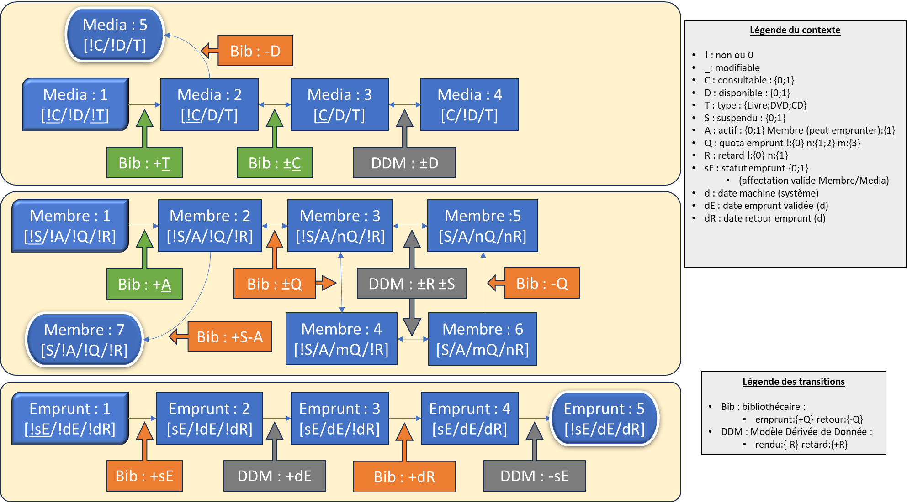
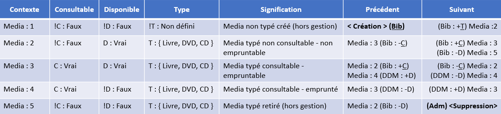
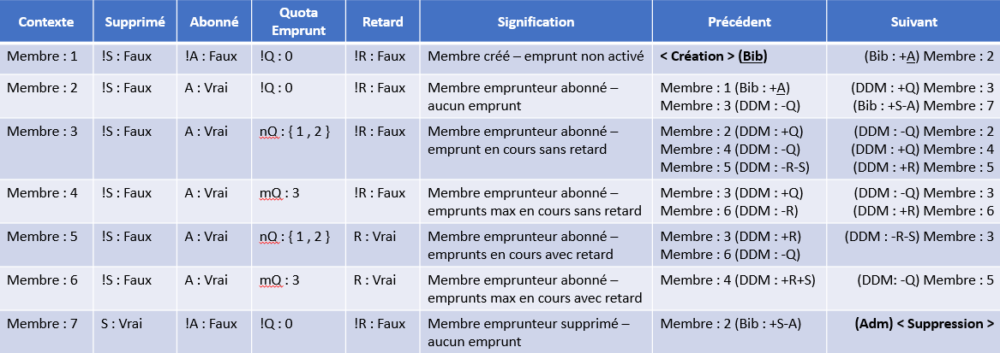
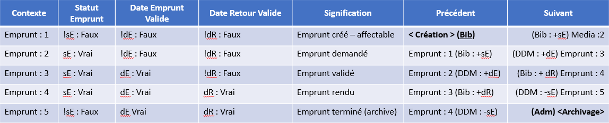

# 🔄 Analyse du cycle de vie métier – Profil Bibliothécaire

📁 `/docs/fonctionnel/Analyse_LifeCycle_Bibliothecaire.md`  
📌 Version : index H-3  
🧩 Sujet : synthèse des états métier et des interactions entre les entités `Media`, `Membre`, et `Emprunt` dans le 
cadre du profil Bibliothécaire.

---

## 🧭 Sommaire

1. [Objectif du document](#1-objectif-du-document)  
2. [Schémas de référence](#2-schémas-de-référence)  
3. [Vecteurs de contexte](#3-vecteurs-de-contexte)  
   - [3.1 Media](#31-media)  
   - [3.2 Membre](#32-membre)  
   - [3.3 Emprunt](#33-emprunt)  
4. [Typologie des transitions](#4-typologie-des-transitions)  
5. [Interactions entre entités](#5-interactions-entre-entités)  
6. [Règles DDM – Cycle métier du profil Bibliothécaire](#6-règles-ddm--cycle-métier-du-profil-bibliothécaire)  
7. [Références croisées](#7-références-croisées)  

---

## 1. Objectif du document

Ce document formalise les **états métier**, **vecteurs de contexte**, et **transitions** des principales entités 
manipulées par le profil Bibliothécaire.  
Il constitue une synthèse transversale des documents spécialisés :
- [`Analyse_LifeCycle_Medias.md`](Analyse_LifeCycle_Medias.md)
- [`Analyse_LifeCycle_Membres.md`](Analyse_LifeCycle_Membres.md)
- [`Analyse_LifeCycle_Emprunts.md`](Analyse_LifeCycle_Emprunts.md)

---

## 2. Schémas de référence

Le cycle de vie métier du profil Bibliothécaire pour les entités `Media`, `Membre` et `Emprunt` a été développée avec 
les notions métier clés indiquées dans le tableau suivant avec leurs définitions opérationnelles et des mots-clés utiles 
pour approfondir les recherches.

| Notion métier                       | Définition opérationnelle                                                                 | Mots-clés de recherche recommandés                   |
|-------------------------------------|-------------------------------------------------------------------------------------------|------------------------------------------------------|
| **État**                            | Situation stable ou transitoire d’une entité métier (`Media`, `Membre`, `Emprunt`)        | `django model state`, `état métier`, `FSM`           |
| **Transition**                      | Passage d’un état à un autre, déclenché par une action ou une condition                   | `django transition`, `state change`, `FSM`           |
| **Vecteur de contexte**             | Ensemble structuré de composantes métier décrivant l’état d’une entité à un instant donné | `domain model`, `context vector`, `DDD entity`       |
| **Machine d’état (FSM)**            | Abstraction permettant de modéliser les états et transitions d’un système                 | `finite state machine`, `statechart`, `FSM`          |
| **DDM (Modèle Dérivé des Données)** | Ensemble de règles qui évaluent automatiquement des états ou transitions                  | `computed field`, `derived state`, `django property` |

La figure suivante constitue le socle visuel du cycle de vie du profil Bibliothécaire.

Elles présentent :
- Les états stables et initiaux des entités
- Les transitions typées (saisie, fonction métier, DDM)
- Les vecteurs de contexte codés
- Les interactions croisées entre `Media`, `Membre`, et `Emprunt`

> 🔸 Les couleurs des transitions :  
> 🟩 Verte = saisie utilisateur  
> 🟧 Orange = fonction métier  
> ⬜ Grise = calcul automatisé (DDM)

> 🔸 Les formes des états :  
> ◼ Rectangle = état stable  
> ◿ Rectangle arrondi = état initial  
> ⬭ Ovoïde bordé = état final ou masqué

La recherche de la cohérence du cycle de vie de chaque entité s'est traduite par l'identification d'une représentation 
simplifiée dans un tableau spécifique à chaque entité avec sa situation amont et aval de chaque état.

**Pour l'entité Media :**

**Pour l'entité Membre :**

**Pour l'entité Emprunt :**

---

## 3. Vecteurs de contexte

### 3.1 Media

| Composante | Signification métier | Type    | Valeurs typiques |
|------------|----------------------|---------|-----------------|
| `C`        | consultable          | booléen | `!C`, `C`       |
| `D`        | disponible           | booléen | `!D`, `D`       |
| `T`        | typé                 | booléen | `!T`, `T`       |

> 🔸 `!C` et `!D` indiquent un état non consultable ou non disponible.  
> 🔸 `!T` désigne un média non typé (état initial ou hors gestion).  

---

### 3.2 Membre

| Composante | Signification métier       | Type       | Valeurs typiques |
|------------|----------------------------|------------|------------------|
| `S`        | supprimé (archivé)         | booléen    | `!S`, `S`        |
| `A`        | abonné                     | booléen    | `!A`, `A`        |
| `Q`        | quota d’emprunt disponible | entier     | `!Q`, `nQ`, `mQ` |
| `R`        | retour enregistré          | booléen    | `!R`, `R`        |

> 🔸 `!Q` = quota nul (initial), `nQ` = quota intermédiaire (1 ou 2), `mQ` = quota maximal (3).  
> 🔸 `!R` = aucun retour enregistré, `R` = retour effectué.  

---

### 3.3 Emprunt

| Composante | Signification métier                       | Type           | Valeurs typiques |
|------------|--------------------------------------------|----------------|------------------|
| `sE`       | statut d’emprunt valide                    | booléen dérivé | `!sE`, `sE`      |
| `dE`       | date d’emprunt valide                      | booléen dérivé | `!dE`, `dE`      |
| `dR`       | date de retour valide                      | booléen dérivé | `!dR`, `dR`      |

> 🔸 Ces valeurs sont dérivées automatiquement par le `DDM` selon les règles métier.  
> 🔸 Elles ne sont pas saisies, mais calculées à partir du contexte `Media` et `Membre`.  

---

## 4. Typologie des transitions

| Couleur   | Type de transition      | Déclencheur                     |
|-----------|-------------------------|---------------------------------|
| 🟩 Verte  | Saisie utilisateur      | Formulaire ou action directe    |
| 🟧 Orange | Fonction métier         | Vue métier ou logique métier    |
| ⬜ Grise   | Calcul automatisé (DDM) | Condition métier ou état croisé |

---

## 5. Interactions entre entités

### 5.1 Media → Emprunt

- Un média doit être `consultable=True` et `disponible=True` pour être emprunté.
- Les transitions d'un emprunt évoluent séquentiellement sans intervention directe de l'utilisateur.

### 5.2 Emprunt → Membre

- La création d’un emprunt modifie le vecteur `[Q/R]` du membre.
- Le retour d’un emprunt modifie `Q`, et peut lever une suspension (`R`).

### 5.3 Membre → Media

- Un membre suspendu ne peut pas emprunter → bloque la transition.
- Le retour d’un emprunt peut rendre le média `D` et peut débloquer un membre en retard `R`.

---

## 6. Règles DDM – Cycle métier du profil Bibliothécaire

Ce tableau présente les règles de dérivation automatique (DDM) déclenchées par les actions du profil Bibliothécaire ou 
par le système. Chaque règle modifie une ou plusieurs composantes du vecteur de contexte d’une entité (`Media`, `Membre`, `Emprunt`).

| ID DDM | Action déclencheuse (métier)    | Entité  | Condition métier simplifiée          | Effet sur le vecteur de contexte                          |
|--------|---------------------------------|---------|--------------------------------------|-----------------------------------------------------------|
| DDM_01 | Retrait d’un média              | Media   | Média typé consultable et disponible | `Disponible -> !D` → Média non disponible                 |
| DDM_02 | Création d’un emprunt           | Membre  | Emprunt du Média                     | `Disponible -> !D` → Média non disponible                 |
| DDM_03 | Retour d’un emprunt             | Membre  | Retour en cours                      | `Disponible -> D` → Média disponible                      |
| DDM_04 | Création d’un emprunt           | Membre  | Emprunt défini                       | `Quota -> nQ` ou `Q -> mQ` → quota actualisé              |
| DDM_05 | Retour d’un emprunt             | Membre  | Emprunt rendu défini                 | `Quota -> nQ` ou `Q -> mQ` → quota actualisé              |
| DDM_06 | Activation système quotidienne  | Membre  | Retard constaté sur emprunt en cours | `Retard -> R` → retard constaté                           |
| DDM_07 | Retour enregistré               | Membre  | Aucun retard en cours                | `Retard -> !R` → membre débloqué                          |
| DDM_08 | Suppression d’un membre         | Membre  | Action de suppression validée        | `Supprimé -> !S`, `Actif -> !A` → membre retiré (archivé) |
| DDM_09 | Création d’un emprunt           | Emprunt | Membre et média éligibles            | `statut Emprunt -> sE` → emprunt activé                   |
| DDM_10 | Validation de la date d’emprunt | Emprunt | Emprunt activé                       | `date Emprunt -> dE` → date enregistrée                   |
| DDM_11 | Enregistrement du retour        | Emprunt | retour d'emprunt activé              | `date Retour -> dR` → date de retour enregistrée          |
| DDM_12 | Archivage de l’emprunt          | Emprunt | Retour effectué                      | `statut EmpruntE -> !sE` → emprunt terminé                |

> Les règles s'appuient sur un vecteur de contexte unique à dix composantes : 
> - Consultable : {C ; !C}
> - Disponible : {D ; !D}
> - Typé : {T ; !T}
> - Supprimé : {S ; !S}
> - Abonné : {A ; !A}
> - Quota : {!Q ; nQ ; mQ}
> - Retard : {R ; !R}
> - statut Emprunt : {sE ; !sE}
> - date Emprunt : {dE ; !dE}
> - date retour : {dR ; !dR}.
> 
> Les symboles `!`, `n`, `m` sont utilisés pour exprimer les valeurs logiques ou bornées des vecteurs de contexte.  

| Action métier déclenchée    | Origine     | DDM déclenchées (enchaînement)             |
|-----------------------------|-------------|--------------------------------------------|
| 📕 Retirer un média         | Utilisateur | DDM_01                                     |
| 👤 Supprimer un membre      | Utilisateur | DDM_08                                     |
| 📗 Créer un emprunt         | Utilisateur | DDM_09 → DDM_10 → DDM_04 → DDM_02          |
| 📘 Rentrer un emprunt       | Utilisateur | DDM_11 → DDM_12 → DDM_05 → DDM_03 → DDM_07 |
| ⏰ Actualisation quotidienne | Système     | DDM_06                                     |

---

## 7. Références croisées

- [`Analyse_LifeCycle_Medias.md`](Analyse_LifeCycle_Medias.md)
- [`Analyse_LifeCycle_Membres.md`](Analyse_LifeCycle_Membres.md) **à créer**
- [`Analyse_LifeCycle_Emprunts.md`](Analyse_LifeCycle_Emprunts.md) **à créer**
- [`Analyse_Fonctionnalites_Bibliothecaire.md`](Analyse_Fonctionnalites_Bibliothecaire.md)
- [`tests-plan.md`](tests-plan.md)

---

